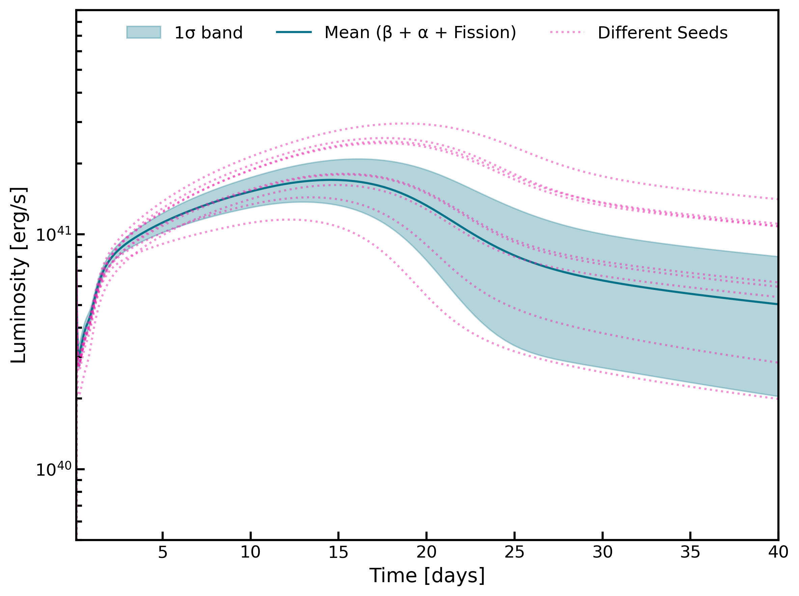
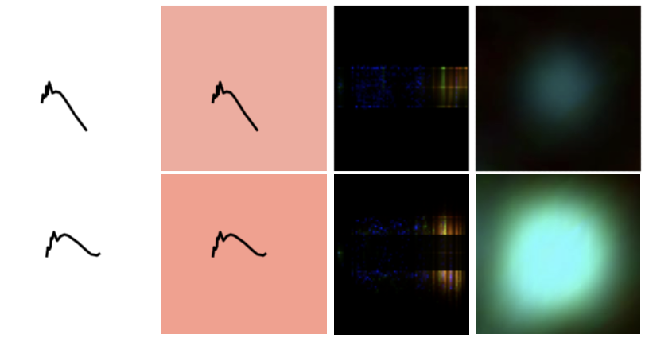
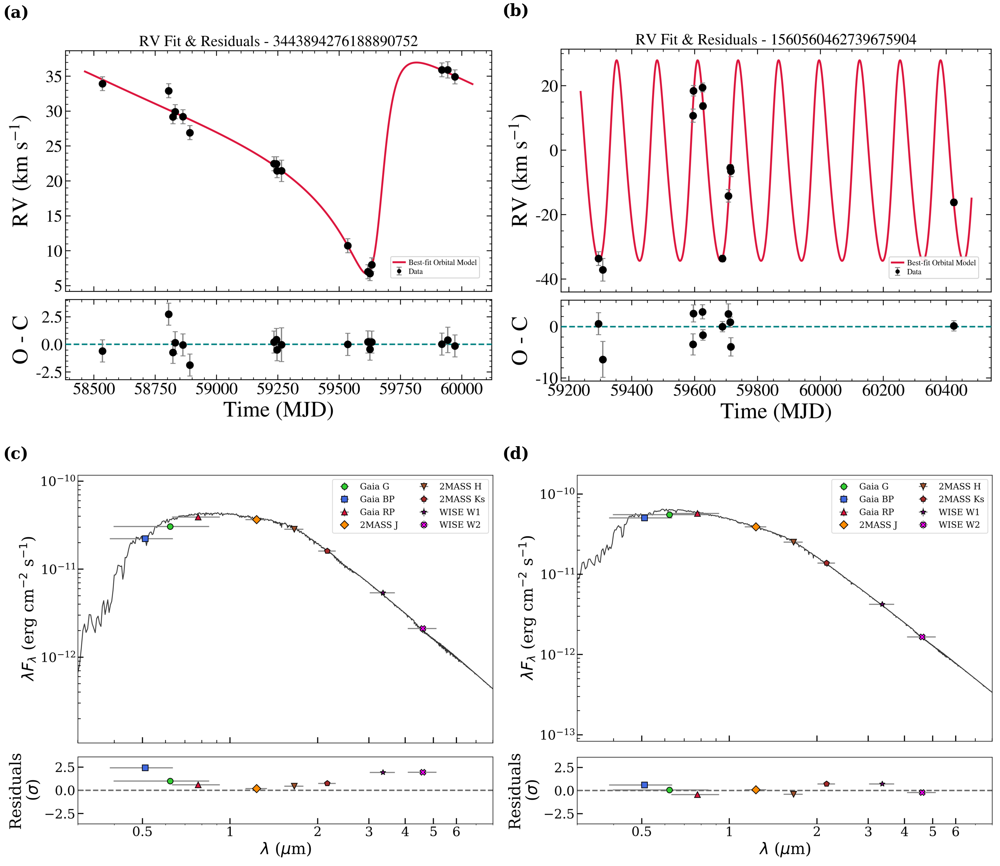
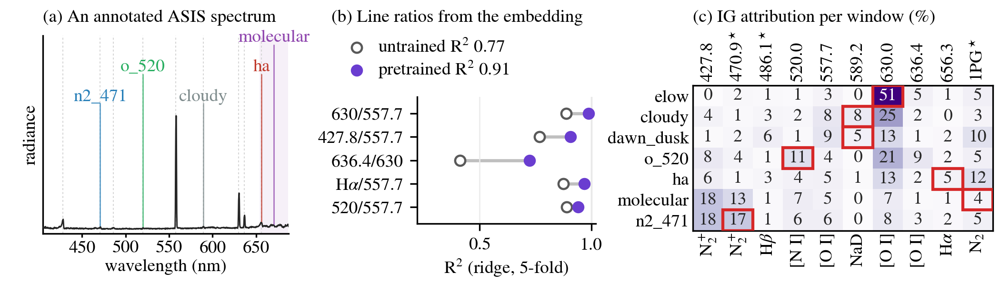

# arXiv Digest — 2026-09-28

- **Interest file used:** interests/2026.10.md (fallback — no 2026.09.md exists yet; 2026.10.md is the earliest available interest file, since no prior-month file exists either)
- **Categories pulled:** astro-ph.CO, astro-ph.EP, astro-ph.GA, astro-ph.HE, astro-ph.IM, astro-ph.SR, cs.LG, stat.ML, physics.data-an, hep-ph
- **Papers scanned:** 303 (64 astro-ph new/cross + 239 from extras)
- **After first filter:** 38 candidates reviewed with full text
- **Final selected:** 20 papers across 4 tiers

---

## Tier 1 — Highly relevant

### [Diffuse Star Clusters in the Halo of M82 Resolved with JWST](http://arxiv.org/abs/2609.30373v1)

Deepthi S. Prabhu, David J. Sand, Burcin Mutlu-Pakdil et al.

**Primary category:** astro-ph.GA

Using archival JWST/NIRCam imaging, the authors resolve individual stars in **four newly discovered diffuse star clusters** in the halo of the nearby starburst galaxy M82. **PARSEC isochrone** fitting to their color-magnitude diagrams indicates predominantly old (~10 Gyr) populations, one metal-poor ([M/H]~−2) and three more metal-rich ([M/H]~−0.8), with half-light radii of **5.4–10.5 pc** — more extended than typical globular clusters — and the faintest object approaching the size-luminosity regime of Milky Way ultra-faint satellites. Found by visual inspection alone, the discovery suggests such systems are underrepresented in existing catalogs and that JWST archival imaging is well suited to a systematic search for the diffuse population that **blurs the boundary between star clusters and dwarf galaxies**.

*Half-light radius versus absolute magnitude for the four new M82 diffuse clusters alongside Milky Way globular clusters, ultra-faint satellites, and dwarf galaxies, showing the new systems sitting in the sparsely sampled zone where star clusters and dwarf galaxies become hard to distinguish.*

---

### [Uncertainty-Aware Machine Learning for β-Decay Half-Lives and Its Impact on r-Process Kilonova Light Curves](http://arxiv.org/abs/2609.30408v1)

Mengke Li, Flora Wang, Jonathan Engel et al.

**Primary category:** astro-ph.HE | also: nucl-th

The authors train a **Mixture Density Network** on NUBASE2020 β-decay half-lives with physics-informed input features (Q-value, pairing terms, shell-closure indicators) that directly parameterizes **aleatoric uncertainty** rather than producing a point estimate, reaching an RMSE of **0.597** versus >0.8 for standard theoretical global models. **SHAP** analysis confirms the network recovers known nuclear physics (Q-value scaling, odd-even staggering, shell effects), and propagating MDN-sampled half-life ensembles through r-process and kilonova radiative-transfer calculations shows that both intrinsic and epistemic uncertainty shift the third r-process abundance peak and substantially broaden the predicted **bolometric kilonova light curve**, especially at late times when fission dominates the heating.

*Simulated kilonova bolometric light curves with 1σ uncertainty bands propagated from the network's β-decay half-life predictions, showing how nuclear-physics uncertainty broadens late-time luminosity forecasts once fission takes over as the dominant heating source.*

---

### [Stellar Pulsation Unifies AGB Classification, Model Atmosphere, and JAGB Luminosity Puzzles](http://arxiv.org/abs/2609.30551v1)

Caroline D. Huang, Massimo Marengo, Antonio Capodagli et al.

Combining SPHEREx spectroscopy of LMC AGB stars with JWST/NIRCam photometry of the M101 SN Ia host, the authors show that **stellar pulsation** unifies three separate AGB puzzles: photometric C/O classification boundaries that must be redrawn per environment, **hydrostatic model atmosphere grids** that are systematically too blue in H2O-sensitive bands, and J-region (JAGB) luminosities that vary within and between galaxies. They introduce a water-absorption index that chemically classifies variable AGB stars and find variable O-rich stars in M101 are up to **~0.7 mag redder** than LMC counterparts — meaning color windows that isolate C-rich stars cleanly in the LMC are **33–68% oxygen-rich-contaminated** in the higher-metallicity M101. This directly challenges the assumed metallicity-independence of the **JAGB standard-candle method** used for H0 measurements.

**Primary category:** astro-ph.GA | also: astro-ph.SR

---

### [Chemo-Dynamical Confirmation of the Typhon Stream as a Disrupted Dwarf Galaxy](http://arxiv.org/abs/2609.30615v1)

João V. Nogueira-Santos, Guilherme Limberg, Silvia Rossi et al.

Combining Gaia astrometry with SEGUE, LAMOST, DESI, and Gaia RVS/XP spectroscopy, the authors expand the known membership of the **Typhon stellar stream** from ~10 to **107 candidates**, including three members beyond 55 kpc that confirm its unusually large apocenter is intrinsic rather than an observational artifact. They measure a resolved metallicity dispersion of **σ[Fe/H] = 0.26 dex**, statistically distinguishing Typhon from a mono-metallic globular cluster and supporting a **dwarf-galaxy progenitor** with stellar mass 10⁶–10⁷ M☉, comparable to Sculptor. Typhon's extreme eccentricity (e≈0.86–0.88) — the highest of any known dwarf-galaxy stream in the halo — indicates a markedly more recent accretion, helping resolve a tension with cosmological simulations that predict many more such high-eccentricity disrupted dwarfs should exist.

**Primary category:** astro-ph.GA

*Metallicity dispersion versus absolute magnitude for Milky Way globular clusters and dwarf spheroidals, with Typhon falling clearly in the dwarf-galaxy locus rather than among the tight, near-zero-dispersion globular clusters — the key diagnostic establishing its dwarf-galaxy origin.*

---

### [A Permutation-Invariant Set Transformer for the Neutron-Star Equation of State](http://arxiv.org/abs/2609.31081v1)

Márcio Ferreira, Valéria Carvalho, Michał Bejger et al.

The authors build a **permutation-invariant Set Transformer** that reconstructs the dense-matter equation of state — pressure or sound speed versus density — from variable-size, unordered sets of neutron-star mass-radius and tidal-deformability measurements, with nothing in the architecture prescribing which star informs which density. The model produces **well-calibrated, heteroscedastic uncertainties** that grow appropriately where no stable star can probe the density, and a Jacobian-based **sensitivity analysis** shows the learned star-to-density mapping is physically interpretable, with predictions at a given density driven mainly by stars whose central density is nearby — demonstrating that **stellar compactness is a more universal probe coordinate than mass**.

**Primary category:** nucl-th | also: astro-ph.HE

*Jacobian sensitivity maps showing which observed stars drive the model's pressure prediction at each density, demonstrating a physically sensible, density-local mapping rather than an opaque one.*

---

### [DLYSO: A CNN Ensemble for Image-Based Classification of Young Stellar Objects](http://arxiv.org/abs/2609.31109v1)

G. Marton, M. Madarász, J. Roquette et al.

The NEMESIS team builds **DLYSO**, an ensemble of CNN classifiers trained to identify young stellar objects directly from **image representations** — SED plots, ZTF variability maps, and AllWISE RGB cutouts — rather than hand-engineered photometric features. All four image modalities reach **F1 scores near or above 90%** (best individual model: 96.8 on plain SEDs), and majority-vote ensembling across models further reduces false positives. Applying the classifier to ~90 literature YSO compilations (3.9 million candidate sources) yields the **NEMESIS General YSO catalogue of 274,408 high-reliability YSOs**, the largest homogeneously classified YSO sample to date, with the pipeline and trained models released open-source.

**Primary category:** astro-ph.SR | also: astro-ph.GA, astro-ph.IM

*The four image-based input representations fed to the CNN ensemble for the same two sources, illustrating how the pipeline turns heterogeneous survey data into a unified computer-vision classification problem.*

---

### [A Comprehensive Study of the Magnetic White Dwarfs in DESI DR1](http://arxiv.org/abs/2609.31565v1)

Adam Moss, Pierre Bergeron, Mukremin Kilic et al.

The authors perform a full model-atmosphere analysis of every magnetic white dwarf in DESI Data Release 1, identifying **833 magnetic systems** and fitting 762 with an offset-dipole magnetic atmosphere model. For 127 objects with sharper or shallower absorption features than the standard dipole predicts, they introduce a **patchy offset-dipole model**, in which the field only opacifies certain regions of the visible stellar disk, and show it reproduces these previously unfittable spectra. Comparing the resulting mass/temperature/field distribution to dynamo theory, they find evidence for **two distinct magnetic-field formation channels** — a core-convective dynamo on the main sequence for most systems, and a dynamo filling the radiative interior on the giant branch for lower-mass objects. At 833 objects this is the **largest single-survey sample of magnetic white dwarfs to date**.

**Primary category:** astro-ph.SR

*Gaia color-magnitude diagram of the DESI DR1 single white dwarf sample with magnetic systems marked in red against solar-mass cooling tracks, showing magnetism heavily concentrated among the higher-mass white dwarfs.*

---

## Tier 2 — Adjacent / useful context

### [Functional PCA Summary Statistics for Robust Simulation-Based Inference of Supernova Cosmology](http://arxiv.org/abs/2609.30312v1)

Moonzarin Reza, Lifan Wang

The authors present the first application of **Functional Principal Component Analysis (FPCA)** light-curve coefficients, rather than SALT2 template parameters, as summary statistics for **simulation-based inference (SBI)** of cosmological parameters from Type Ia supernovae. FPCA-SBI matches SALT2-SBI and explicit-likelihood MCMC in-domain but is **more robust under mismatched survey systematics**, with roughly half the out-of-domain bias when nuisance-parameter priors are shifted between training and test sets. Applied to a spectroscopically confirmed **DES Year 5 supernova sample** after training only on simulated LSST-like light curves, the method recovers Ωm and ΩΛ consistent with the DES collaboration's own values to within 0.12σ and 0.23σ.

**Primary category:** astro-ph.IM | also: astro-ph.CO

---

### [VENOM: A 3,314-Parameter State-Space Model Replaces Optimal Filtering for Photon Energy Estimation](http://arxiv.org/abs/2609.30382v1)

Benjamin A. Mazin

The author presents VENOM, a **selective state-space model** (Mamba-based) with only **3,314 parameters** that replaces the hand-designed coordinate transform and Wiener optimal filter conventionally used to estimate photon energies from microwave kinetic inductance detector timestreams, learning the full mapping directly from raw data. VENOM improves the mean energy **resolving power by 5%** on a published InHf detector dataset (reaching R=42.4, the highest ever recorded for a UVOIR MKID) and by **66%** on a PtSi detector dataset. The unexpectedly large PtSi gain is not explained by known phonon-escape limits, and the author speculates it may reflect previously unmodeled pulse-shape variation with photon absorption depth.

**Primary category:** astro-ph.IM

*Per-wavelength energy resolving power for VENOM versus the published optimal-filter baseline on InHf and PtSi detectors, showing the same compact learned model consistently beating hand-tuned per-wavelength filters, most dramatically on PtSi.*

---

### [A Bayesian Search for Dormant Compact-Object Binaries with Gaia and LAMOST](http://arxiv.org/abs/2609.30764v1)

Junxing Zhou, Wei-Min Gu

Combining Gaia DR3 RUWE-selected astrometric excess with multi-epoch LAMOST DR13 spectroscopy, the authors hunt for dormant compact objects in long-period, non-interacting binaries. Bayesian Keplerian fitting yields orbital solutions for **19 single-lined binary candidates** with periods of ~30–1500 days, with SED fitting against MIST isochrones constraining the visible primaries. Two systems have **minimum companion masses exceeding 1 solar mass** with no detectable secondary light, making them the strongest massive-white-dwarf/neutron-star candidates in the sample.

**Primary category:** astro-ph.SR | also: astro-ph.GA

*Radial-velocity orbital fits and multi-wavelength SED fits for the two highest-priority compact-object candidates, showing single-star atmospheres with no sign of a luminous companion despite companion masses above 1 solar mass.*

---

### [The Inner Circumgalactic Medium of Low-Mass z~2.3 Star-Forming Galaxies](http://arxiv.org/abs/2609.30834v1)

Evan Haze Nunez-Cravin, Charles C. Steidel, Gwen C. Rudie et al.

Using KCWI, MOSFIRE, and HIRES, the team presents the first detailed look at the inner CGM (within 0.75 virial radii) of two **low-mass (M* ≤ 10⁹ M☉), z~2.3** star-forming galaxies. Voigt-profile decomposition of quasar sightline absorption finds no low-ionization metal absorption but ubiquitous intermediate- and high-ion detections, kinematically complex gas spread over >300 km/s, and **no unambiguously unbound gas** in either halo. The result places this low-mass z~2.3 CGM as intermediate in kinematic complexity and unbound-gas fraction between low-mass z~0.3 dwarfs and massive z~2.3 galaxies, tracing how the **baryon cycle changes with stellar mass**.

**Primary category:** astro-ph.GA

*Line-of-sight velocities of every CGM metal absorber compared to each galaxy's escape velocity, showing that none of the detected gas is unambiguously unbound from either low-mass halo.*

---

### [A Variational Autoencoder Ensemble for Pixel-Level Gamma-Ray Signal/Background Separation](http://arxiv.org/abs/2609.30917v1)

Scarlet Betterman, Emmanuel Moulin, Martin White

The authors introduce an **ensemble of convolutional variational autoencoders** that separates very-high-energy gamma-ray signal from cosmic-ray background at the **pixel level**, with no prior assumption on the number of signal components or which region is background-dominated. Tested on toy point-source mixtures, a mock Galactic-center dark-matter scenario, and real **H.E.S.S. public data** (Crab Nebula, MSH 15-52), the model reconstructs denoised spatial and spectral distributions with good fidelity even at low signal-to-background ratios. The 10-model ensemble spread doubles as a **calibrated per-pixel uncertainty estimate**, narrowing where reconstruction is confident and widening on harder observations.

**Primary category:** astro-ph.HE

---

### [Differentiable, GPU-Accelerated Gravitational-Waveform Surrogates in JAX](http://arxiv.org/abs/2609.31118v1)

Adriano Frattale Mascioli, Lorenzo Piccari, Saulo Albuquerque et al.

The authors re-implement the machine-learning gravitational-waveform surrogates `mlgw` and `mlgw-bns` as fully **differentiable, JAX-native packages**, gaining JIT compilation, vectorized batching, GPU execution, and automatic differentiation while preserving the original PCA+neural-network training pipeline. The JAX version is **~17x faster than the original on CPU and ~2 orders of magnitude faster on GPU**, with waveform mismatch against a target SEOBNRv5HM surrogate unchanged. Connecting these surrogates to JAX-native nested samplers, they demonstrate full Bayesian parameter estimation of GW150914 and GW170817 in **12–17 minutes on a single GPU**, consistent with LVK posteriors, with automatic differentiation opening the door to gradient-based inference.

**Primary category:** gr-qc | also: astro-ph.IM

---

### [Self-Supervised Masked-Autoencoder Spectra Reveal What Physicists Already Measure — and Where Astronomical Foundation Models Don't Transfer](http://arxiv.org/abs/2609.31206v1)

Matthieu Le Lain, Gaël Cessateur, Sébastien Lefèvre

The authors pretrain a 1D Vision Transformer with a **masked-autoencoder** objective on 223,000 unlabelled auroral emission spectra, then show the frozen representation recovers the same line-intensity-ratio diagnostics physicists hand-compute (R²=0.91 vs. **0.77 for an untrained control**). Fine-tuned, the model beats the prior supervised classifier (**macro-AP 88.5 vs. 77.8**) and gains the most when labels are scarce; Integrated-Gradients attribution shows it exploits the full physical emission system rather than the single line an annotator checks. Testing whether existing **astronomical spectral foundation models** transfer to this unrelated domain, they find transfer tracks wavelength-window overlap rather than physical similarity of the sources.

**Primary category:** cs.LG | also: physics.space-ph

*The frozen self-supervised embedding recovering expert line-ratio diagnostics far better than an untrained control, alongside Integrated-Gradients attribution revealing which spectral windows the fine-tuned classifier actually relies on per class.*

---

### [Physics Systematics on Solar-Analog Ages Ahead of PLATO](http://arxiv.org/abs/2609.31503v1)

Saniya Khan, Gaël Buldgen, Jérôme Bétrisey et al.

Re-fitting six asteroseismically modeled Kepler/K2 solar analogs while systematically swapping in non-standard input physics — **OPLIB versus OPAL opacities**, different nuclear reaction rates, and turbulent diffusion calibrated to lithium depletion — the authors show these choices shift inferred stellar mass by up to 2.5% and inferred age by 10–14% at worst. The resulting mass and radius systematics comfortably satisfy PLATO's precision requirements for all six stars, but the mission's 10% age requirement is met for only two-thirds of the sample, flagging **age as the parameter most vulnerable to modelling-physics systematics** ahead of PLATO's 2027 launch.

**Primary category:** astro-ph.SR | also: astro-ph.EP

---

## Tier 3 — Outside my area but notable

### [Hierarchical Triples Reproduce the Mass and Spin Distributions of LIGO-Virgo-KAGRA Binary Black Hole Mergers](http://arxiv.org/abs/2609.30378v1)

Jakob Stegmann, Aleksandra Olejak

Using population synthesis coupled to secular three-body dynamics, the authors simulate **3.2×10⁸ hierarchical stellar triples** to test whether tertiary perturbations on a black-hole-forming inner binary can explain the puzzling mass and spin distributions of observed binary black hole mergers. The triple-formation channel reproduces the **sharp primary-mass peak near 10 solar masses**, an equal-mass-favoring mass ratio distribution, and the skewed effective-spin distribution — including its characteristic fraction of **over 10% negative-spin systems** — that neither purely isolated-binary nor purely dynamical-cluster channels have reproduced together. This is presented as the **first formation model to simultaneously match** all of these features of the low-mass merger population.

**Primary category:** astro-ph.HE | also: astro-ph.SR

*Six-panel comparison of predicted mass, mass-ratio, and spin distributions from the triples model against the population inferred from gravitational-wave data, showing the model reproducing both the ~10-solar-mass peak and the skewed effective-spin distribution simultaneously.*

---

### [SN Helios: A Multiply Imaged Type II Supernova Opening Time-Delay Cosmography Beyond z=3](http://arxiv.org/abs/2609.30440v1)

Seiji Fujimoto, Conor Larison, Justin D. R. Pierel et al. (Gautham Narayan, co-author)

Using JWST/NIRCam imaging and NIRSpec prism spectroscopy, the team discovers and spectroscopically confirms **SN Helios**, a strongly lensed, multiply imaged Type II supernova at **z=3.34** behind galaxy cluster RXC J0018.5+1626, identified via a broad, resolved Hα P-Cygni profile establishing a hydrogen-rich photosphere. Independent cluster lens models agree the observed image is magnified by μ≈10–20 and predict a second image will arrive within **2–6 years**, making this the first spectroscopically confirmed multiply imaged supernova beyond z=2 with a forecastable reappearance — opening **time-delay H0 cosmography** to z>3 for the first time.

**Primary category:** astro-ph.GA | also: astro-ph.CO

*JWST/NIRCam discovery imaging of SN Helios, showing the transient appear between 2024 and 2026 and marking the region where independent lens models predict its next image will emerge — the basis for a future time-delay H0 measurement.*

---

### [A Tidal Disruption Event in a Quasar at Redshift 7.19](http://arxiv.org/abs/2609.30441v1)

S. Fujimoto, Q. Fei, G. B. Brammer et al.

Combining two decades of archival HST/Spitzer imaging with new JWST observations, the authors report a long-lived nuclear transient in GNz7q, a **z=7.19** red quasar hosting a ~3×10⁷ M☉ black hole, which faded smoothly by **Δm≈1.1 mag** over ~2 rest-frame years with a wavelength-coherent decline placing it above the **99.9th percentile** of the SDSS quasar variability distribution. A panchromatic model with a canonical t^(−5/3) fallback decline reproduces the light curve, consistent with the **tidal disruption** of a few-solar-mass star, while delayed JWST/MIRI mid-infrared emission indicates a sub-parsec dust echo of the flare — the first TDE identified in a quasar during the epoch of reionization.

**Primary category:** astro-ph.GA | also: astro-ph.HE

*Two decades of HST/Spitzer/JWST photometry showing GNz7q's coherent ~1.1 mag fade and its extreme amplitude relative to the SDSS quasar variability distribution — the signature pointing to a tidal disruption rather than routine AGN variability.*

---

### [Gaussian Splatting as a Differentiable Orbital Basis for Scaling DFT](http://arxiv.org/abs/2609.31483v1)

Andrés Guzmán-Cordero, Cindy Zhang, Majdi Hassan et al.

The authors introduce GS-DFT, which represents molecular orbitals as a cloud of **floating anisotropic Gaussian "splats"** whose positions, shapes, and mixing coefficients are optimized directly by gradient descent to minimize the DFT energy — 3D Gaussian splatting with the photometric rendering loss swapped for variational quantum-mechanical energy minimization. A new **adaptive density-fitting scheme** cuts the memory cost of two-electron integral evaluation and lets the optimized basis match the accuracy of the largest conventional atom-centered basis sets with a fraction of the parameters. The method scales to systems of up to **2,742 atoms (10,406 electrons)** on a single four-GPU node with no modifications, including a ~10,000-electron protein that would be memory-prohibitive for standard basis-set DFT codes.

**Primary category:** physics.chem-ph | also: cs.LG

*Diagram of GS-DFT's method — molecular orbitals expanded as a cloud of optimizable Gaussian splats — alongside scaling curves showing GS-DFT beating a traditional Gaussian-type-orbital basis in error per parameter and memory footprint on the same molecule.*

---

## Tier 4 — Meta-research about the field

### [FOTO: Figure-Level Semantic Search for Astronomy](http://arxiv.org/abs/2609.30536v1)

Hurum Maksora Tohfa, Francisco Villaescusa-Navarro

FOTO is a figure-level semantic search tool indexing **482,750 captions** from 53,839 peer-reviewed astro-ph papers, embedding each figure's title and caption with a lightweight, **locally-run 110M-parameter open model** and reserving an LLM only to verify a short retrieved list rather than to generate references. Held to the harder figure-level criterion, FOTO recovers the target figure for **29–79%** of queries at recall@20, versus 6–20% for Pathfinder and 8–16% for Semantic Scholar on the easier paper-level task, and the free local embedder beats the paid API it replaced. LLM reranking of the shortlist raises recall@1 from 0.667 to 0.875 on detailed queries, and **open-weight judge models match or beat a frontier model**, letting the authors plan to host the tool for free.

**Primary category:** astro-ph.IM
