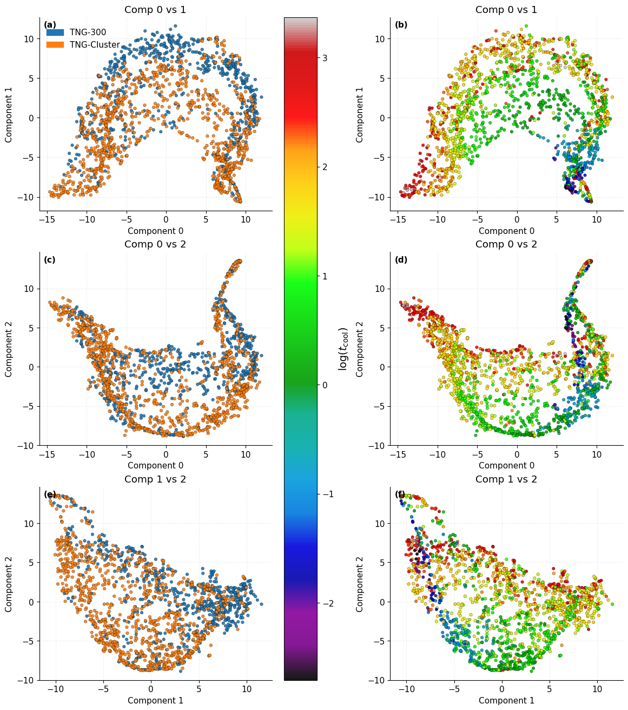
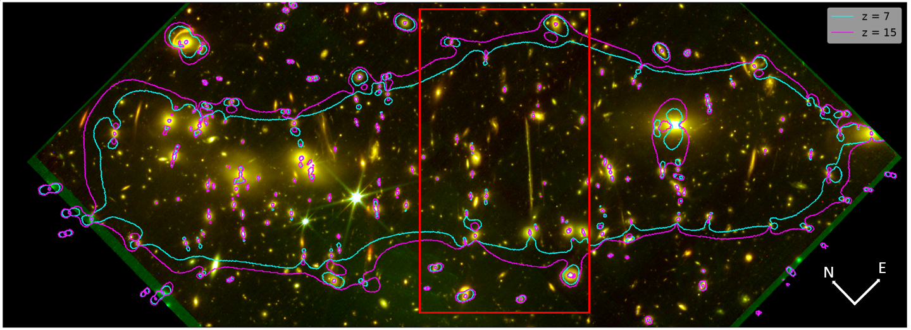
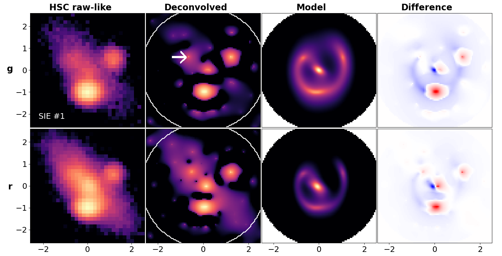
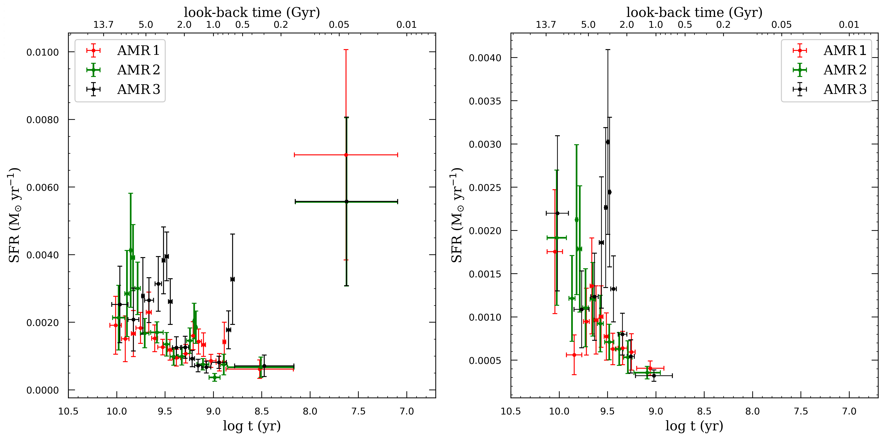
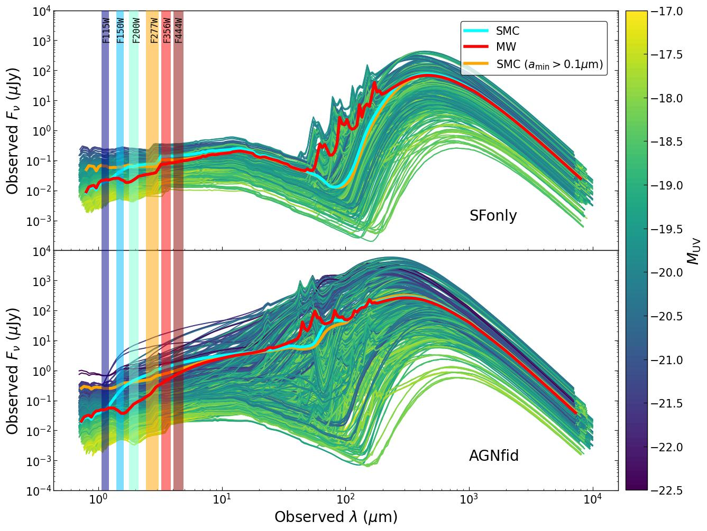

# arXiv Digest — 2026-09-29

- **Interest file used:** interests/2026.10.md (fallback — no interests/2026.09.md exists yet, and no prior-month file exists either; only a later-month file was available, so the earliest available file was used)
- **Categories pulled:** astro-ph.CO, astro-ph.EP, astro-ph.GA, astro-ph.HE, astro-ph.IM, astro-ph.SR, cs.LG, stat.ML, physics.data-an, hep-ph
- **Papers scanned:** 547 unique (162 astro-ph new/cross + 168 stat.ML/physics.data-an/hep-ph + 250 of 1,012 available cs.LG papers, capped by arXiv API request-size limits)
- **After first filter:** 21 candidates reviewed with full text
- **Final selected:** 20 papers across 4 tiers

---

## Tier 1 — Highly relevant

### [Cool Embeddings: Predicting Galaxy Cluster Cooling Times in IllustrisTNG and TNG-Cluster with AstroCLIP](http://arxiv.org/abs/2609.32582v1)

R. Karam, C. L. Rhea, J. Hlavacek-Larrondo et al.
**Primary category:** astro-ph.GA | also: astro-ph.CO

The authors apply **AstroCLIP**, a contrastive vision-language foundation model pretrained on optical galaxy images and spectra, to mock **Chandra X-ray images** of galaxy clusters from IllustrisTNG (TNG300 and TNG-Cluster), testing whether its embeddings transfer across both observational modality and physical scale to predict the central cooling time $t_{\mathrm{cool},0}$. They show the embedding space separates clusters by cooling state (SCC/WCC/NCC) but not by halo mass, and introduce a **dot-product kNN-attention** regressor that retrieves semantically similar clusters and reweights their cooling times, achieving **RMSE = 0.23–0.24 in $\log(t_{\mathrm{cool},0})$**, beating an MLP/ResNet/CNN baseline and generalizing well out-of-distribution (**RMSE 0.50 vs. 0.73** for a fine-tuned CNN).

*t-SNE projections of the AstroCLIP embeddings for TNG300 and TNG-Cluster clusters, colored by simulation (left) and by $\log(t_{\rm cool})$ (right); clusters with similar cooling times cluster together in embedding space, showing the foundation model captures physically meaningful thermodynamic structure despite being trained only on optical galaxy images.*

---

## Tier 2 — Adjacent / useful context

### [The AURORA Survey: Determining the Production Mechanism for OI λ8449 Emission in Star-forming Galaxies at Cosmic Noon](http://arxiv.org/abs/2609.32045v1)

Leonardo Clarke, Alice E. Shapley, Zhiwei Shao et al.
**Primary category:** astro-ph.GA

Using deep JWST/NIRSpec spectra of **58 star-forming galaxies at 1.3<z<4.8** from the AURORA survey, the authors identify the production mechanism of the permitted O I λ8449 line, showing via stacking that it is a ubiquitous feature at **~0.5% the strength of Hα**, consistent with local CHAOS H II regions and DESI galaxies at z<0.16. Testing four candidate mechanisms against detections of the companion O I λ11290 and λ13168 lines, they rule out recombination and Lyβ fluorescence and identify **stellar continuum fluorescence** as the dominant channel. This means O I λ8449/Hα is **not a reliable metallicity indicator** for typical star-forming galaxies, unlike in extreme Lyβ-fluorescence-powered sources such as the lensed "Godzilla" clump in the Sunburst Arc.

### [Galaxy and Halo Assembly Bias in Alternative Dark Matter Models](http://arxiv.org/abs/2609.32086v1)

Yikun Wang, Idit Zehavi, Sergio Contreras et al.
**Primary category:** astro-ph.CO

Using the matched dark-matter-only and hydrodynamical **AIDA-TNG simulation suite**, the authors measure halo and galaxy assembly bias across four dark matter models (CDM, WDM, and constant- and velocity-dependent-cross-section SIDM) with identical TNG baryonic physics. They find concentration-selected halo assembly bias, halo occupancy variations, and the resulting galaxy assembly bias are all nearly identical across the four models at z=0; the largest deviation, for velocity-dependent SIDM, enhances the assembly-bias contribution to galaxy clustering by only **~6%** — small enough to be undetectable with current data. This weak model-dependence persists across galaxy number densities and redshifts, establishing assembly bias as a **robust, largely dark-matter-model-independent baseline** for interpreting galaxy clustering within the TNG framework.

### [Tracing Winds through the Fog: A Comprehensive Survey of LMC's Galactic Outflows with ULLYSES](http://arxiv.org/abs/2609.32137v1)

Suraj Poudel, April Horton, Kathleen A. Barger et al.
**Primary category:** astro-ph.GA

Using UV absorption spectroscopy of **170 OB stars from HST/ULLYSES** combined with HI 21-cm and Hα maps, the authors perform component-by-component Voigt-profile fitting of Si II, O I, and S II to characterize the LMC's nearside stellar-driven wind. Si II column densities decline smoothly, consistent with a ram-pressure-style cloud-acceleration model, and photoionization (Cloudy) modeling of sightlines in the kinematically ambiguous velocity range reveals a physically mixed population of LMC-metallicity, dust-depleted absorbers. They derive a nearside outflow mass of **~1.8×10⁷ M☉**, mass-loss rate of 0.15–0.33 M☉/yr, and a **mass-loading factor η ≈ 0.6–1.3**, with the 30 Doradus and N11 star-forming regions contributing ~10% and ~3% of the total outflow mass.

### [H-alpha Star Formation Rates of the SHIELD Dwarf Galaxies](http://arxiv.org/abs/2609.32159v1)

Madeline Shepley, David G. Gormanous, John J. Salzer et al.
**Primary category:** astro-ph.GA

The authors present narrowband Hα imaging for the complete **SHIELD sample of 82 HI-selected extremely low-mass dwarf galaxies**, detecting Hα emission in **55 (67%)** and deriving SFRs or upper limits for the full sample. Comparing against a companion FUV-SFR study, they confirm Hα systematically underestimates recent SFR below **log(SFR$_{H\alpha}$) ≈ -2.5**, with the divergence setting in near **log(M$_{stellar}$) ≈ 8.0** and becoming essentially uncorrelated with stellar mass below that — evidence for **stochastic/bursty star formation** in the lowest-mass systems. They find specific SFR correlates with gas fraction while raw Hα SFR does not, indicating star-formation efficiency rather than gas supply regulates current activity in this population.

*Log-log plot of (Hα SFR/FUV SFR) vs. stellar mass; above ~10⁸ M☉ the two tracers agree well, but below that threshold the ratio scatters between 1.00 and 0.01 with no correlation to stellar mass — the paper's key evidence for stochastic star formation in the lowest-mass dwarfs.*

### [Observing population III stars in the pristine region](http://arxiv.org/abs/2609.32347v1)

Sung Kei Li, Jose M. Diego, Jose M. Palencia
**Primary category:** astro-ph.CO

The authors propose hunting for individual Population III stars via caustic-crossing events in the **"pristine" region** between merging galaxy clusters, where intracluster light (and thus stellar microlenses) is nearly absent, allowing magnification to approach the cluster-only theoretical limit of μ~10⁶ instead of being capped at ~10⁴ by microlens contamination. They derive a magnification-wall scaling relation and combine it with Pop III isochrones to show stars with initial mass as low as **100 M☉** become detectable at **z ≳ 10** in pristine regions using standard **~29 mag JWST** imaging. They point to the merging cluster El Gordo (z=0.87) as a working example and argue Euclid-selected merging clusters plus JWST follow-up could realistically deliver the first direct Pop III detections.

*JWST RGB image of the merging cluster "El Gordo" with predicted critical curves at source redshifts z=7 and z=15; the marked region is the pristine zone — where intracluster light and stellar microlenses are lowest along the critical curve — proposed as the hunting ground for lensed Population III stars.*

### [GPUPHOT: A Python Framework for High-Performance GPU-Accelerated Photometry and Distributed Astronomical Data Reduction](http://arxiv.org/abs/2609.32375v1)

Samuel Lemes-Perera, Miguel R. Alarcon, Miquel Serra-Ricart et al.
**Primary category:** astro-ph.IM | also: cs.DC

The authors present **GPUPHOT**, an open-source Python framework running four of seven photometric-reduction stages natively on GPU via CuPy, in production at two robotic facilities since 2023. Benchmarked on 19 images across eight NVIDIA GPUs, the H100 reduces the densest 151-megapixel frame end-to-end in **31.9 s**, with GPU source detection **6–15x faster** than the CPU library `sep`, and — after pinning three sources of non-determinism — catalogs agree to the **fourth decimal** across GPU models and hosts. They also trace a 38% median latency regression in the newer CuPy/cuML stack to the RAPIDS allocator silently displacing CuPy's own memory pool at import, a cautionary reproducibility finding for GPU-accelerated scientific pipelines.

*High-level architecture of GPUPHOT: incoming FITS images are ingested through a message broker and processed by containerized GPU workers, with calibrated catalogs and metadata persisted to a PostgreSQL/Q3C database.*

### [Barred Galaxies in MaNGA: Stellar Mass Dependence and Black Hole Growth](http://arxiv.org/abs/2609.33222v1)

Chandan Watts, Sudhanshu Barway
**Primary category:** astro-ph.GA

Using **7,408 MaNGA galaxies (2,641 barred)** spanning dwarf-to-massive stellar masses, the authors find that barred galaxies have systematically **higher median sSFR** than unbarred galaxies across most mass bins (largest offset **+0.439 dex**), with the trend's sign and strength depending on host morphology. A multivariate regression confirms the bar–sSFR link remains significant after controlling for mass, environment, AGN activity, and morphology. They also report that barred galaxies host **systematically lower black hole masses** than unbarred galaxies (**0.30 ± 0.03 dex**, widening among AGN hosts), an offset attributed more to environmental effects than to bars directly suppressing black hole growth.

### [Constraining the galaxy-halo connection at z>10 using the neighbors of UV-bright galaxies](http://arxiv.org/abs/2609.33817v1)

Ivan Nikolić, Charlotte A. Mason
**Primary category:** astro-ph.GA | also: astro-ph.CO

To explain the JWST-observed excess of UV-luminous galaxies at $z>10$ without relying on standard clustering measurements, the authors build a forward-modeling framework using **21cmFAST** simulations to predict the distribution of faint photometric neighbors around bright $z>10$ galaxies under two competing galaxy-halo connection models — a tight "high luminosity" relation versus a **"high stochasticity"** UV-luminosity–halo-mass scatter model. They show **nearest-neighbor separation** is the key discriminating statistic and forecast that **7–15 bright galaxies** imaged within JWST/Roman/Euclid reach would distinguish the models at high significance. Applied to **GN-z11 and JADES-GS-z14-0**, the observed lack of any photometric neighbor within 0.5 arcmin disfavors the uniform-luminosity-boost model and favors the high-stochasticity scenario for explaining their extreme brightness.

*Predicted probability distributions of nearest-neighbor separation for the two competing models around GN-z11 (left) and GS-z14-0 (right), with actual observed photometric candidates overplotted; in both cases the real neighbors sit farther out than the high-luminosity model predicts, favoring the stochastic star-formation scenario.*

### [Improving Lens Modelling from Ground-Based Imaging with Deconvolution](http://arxiv.org/abs/2609.34305v1)

Eric Paic, Kenneth C. Wong, Anupreeta More et al.
**Primary category:** astro-ph.GA | also: astro-ph.IM

The authors apply **STARRED**, a starlet-wavelet deconvolution algorithm, as a preprocessing step before strong-lens mass modelling of ground-based Hyper Suprime-Cam imaging, testing it on seven mock HSC-like lens systems. Deconvolving from $\sim0.6''$ to **$\sim0.15''$** effective resolution before fitting an SIE+shear model recovers the Einstein radius and mass axis ratio to **sub-3% precision** — matching what space-based imaging normally requires. The result is robust to regularization strength and noise-covariance choices, positioning STARRED+Herculens as a practical route to extract precise lensing measurements from the 1000+ HSC-SSP lens candidates ahead of Rubin-LSST.

*Lens modelling of a mock SIE system from left to right — the original HSC-like ground-based data, the STARRED-deconvolved data, the resulting lens model, and the model residuals — with structure only recovered after deconvolution.*

### [A Study on the Evolution of NGC6822. I. Investigating the Star Formation History through Evolved Stellar Populations](http://arxiv.org/abs/2609.34329v1)

Fatemeh Khatamsaz, Mahdi Abdollahi, Atefeh Javadi et al.
**Primary category:** astro-ph.GA | also: astro-ph.SR

The authors reconstruct the star formation history of the isolated Local Group dwarf irregular **NGC 6822** using **329 long-period-variable (AGB) stars**, converting AGB ages/masses via **Padova isochrones** (cross-checked with BaSTI). In the bar region they recover three star-formation episodes peaking at **$t\sim4.7$ Gyr, $\sim1.6$ Gyr, and $\sim48$ Myr**, plus a single **$\sim4.6$ Gyr** episode in the outer region. They argue the coincidence of the ~4–5 Gyr peak with an independently inferred **Milky Way pericentric passage 3–4 Gyr ago** supports a tidal-interaction origin for the burst, despite the galaxy's present isolation.

*The derived star formation history for the bar region (left) and outer region (right) under three different time-varying age–metallicity relations, showing the multiple discrete star-formation episodes — including the ~4.6 Gyr peak linked to a possible past Milky Way encounter — that anchor the paper's central claim.*

### [Toward Resolution Convergence for Star Formation and Galactic Winds in Galaxy Simulations](http://arxiv.org/abs/2609.34336v1)

Xue-Fu Li, Weishan Zhu, Tian-Rui Wang et al.
**Primary category:** astro-ph.GA

The authors run 3D hydrodynamic simulations of an **M82-like starburst galaxy at 4–32 pc resolution** and redesign the star-formation and supernova-feedback sub-grid prescriptions to fix numerical non-convergence: gas accretion is anchored to a **~20 pc GMC-scale control volume** rather than a fixed cell count, and SN energy injection is anchored to the physical **cooling radius** with a resolution-dependent thermal/kinetic energy split. These changes cut resolution-driven scatter in total stellar mass formed from ~60% to **<20%**, and in cool-phase mass outflow rate from >100% to **<40%**, though warm/hot-phase outflow properties remain less converged.

### [KiDS-DR5: Exploring dust transport in dark matter halos of galaxies](http://arxiv.org/abs/2609.34615v1)

Eray Genc, Angus H. Wright, Hendrik Hildebrandt et al.
**Primary category:** astro-ph.GA | also: astro-ph.CO

Combining multiband magnitude-shift measurements with galaxy–galaxy lensing in **KiDS-DR5**, the authors jointly infer the mean halo mass and circumgalactic dust mass of low-redshift galaxies in five stellar-mass bins, after validating the method on the MICE2 simulation. They recover clear scaling relations, $M_{\rm dust}\propto M_{\rm halo}^{0.69}$ and **$M_{\rm dust}\propto M_*^{0.43}$**, that are flatter than predicted by the Dusty-SAGE semi-analytic model, implying that current supernova- and AGN-driven feedback prescriptions may **over-suppress circumgalactic dust** in low-mass halos.

### [Exploring the observed properties of JWST Little Red Dots with cosmological simulations and dust radiative transfer](http://arxiv.org/abs/2609.34903v1)

Saksham Chandna, Fabio Di Mascia, Simona Gallerani et al.
**Primary category:** astro-ph.GA

Using SKIRT dust radiative-transfer post-processing on cosmological zoom-in simulations of a massive $z=6$–9 quasar-host halo, the authors show JWST's "Little Red Dots" need no exotic new physics: the AGN-hosting simulation naturally reproduces the **V-shaped SED**, compact rest-UV morphology, overmassive black holes, and Balmer-break strengths typical of most observed LRDs. Spectral decomposition shows the blue UV continuum is stellar while the red optical continuum comes from a dust-reddened AGN, with **dust geometry and the AGN-to-stellar flux ratio** setting whether a source looks like an LRD or a bluer "Little Blue Dot." The authors conclude LRDs are the generic outcome of massive AGN-host galaxies at this epoch, though the most extreme objects still require extra ingredients like super-Eddington accretion.

*Synthetic rest-UV-to-optical SEDs for the brightest source in the halo, shown separately for the star-formation-only and AGN-hosting simulation suites; the AGN run alone produces the characteristic V-shaped continuum (blue UV, red optical) that defines observed LRDs.*

### [Localized Enhancements of the Primordial Power Spectrum and the Abundance of Early Bright Galaxies](http://arxiv.org/abs/2609.34989v1)

Shaghayegh Yavari, Hamed Kameli, Shant Baghram
**Primary category:** astro-ph.CO

This paper tests whether a **localized Gaussian bump** in the primordial curvature power spectrum, centered at $k_*\sim2$–$4\,h\,{\rm Mpc}^{-1}$, can explain JWST's overabundant bright $z\gtrsim10$ galaxies. Propagating the modified spectrum through Sheth–Tormen excursion-set theory, they find the boosted small-scale power exponentially amplifies the abundance of rare massive halos at high redshift, giving a decisively better fit to observed UV luminosity functions than ΛCDM without extreme star-formation efficiencies. The allowed amplitude is capped at **$A_b\lesssim8\,h\,{\rm Mpc}^{-1}$** by Lyman-α forest constraints, framing the mechanism as a partial, complementary contribution to the JWST galaxy-abundance tension.

### [Diverse Metallicities in Protoclusters at z~3.4 detected by Deep Learning](http://arxiv.org/abs/2609.35471v1)

Yoshihiro Takeda, Nobunari Kashikawa, Kei Ito et al.
**Primary category:** astro-ph.GA

Using protocluster candidates selected by the deep-learning algorithm **PCFNet**, the authors carry out spectroscopic follow-up of four candidate regions at $z\sim3.4$ and spectroscopically confirm **four protoclusters** (galaxy density peaks over 5× the field), with confirmation rates consistent with PCFNet's own predicted purity. SED fitting places members on the star-forming main sequence, with halo masses consistent with progenitors of present-day massive clusters, while [OIII]/Hβ-based metallicities show only marginal (**1.4–2σ**) enhancement in two of the four systems relative to field galaxies — chemical diversity that highlights competing metal-rich gas recycling and metal-poor inflow, and demonstrates PCFNet's viability for mining future wide surveys (Rubin, Roman) for protocluster candidates.

### [The abundance and emission of PAHs from the local to early Universe](http://arxiv.org/abs/2609.35533v1)

Massimiliano Parente, Desika Narayanan, Paul Torrey et al.
**Primary category:** astro-ph.GA | also: astro-ph.CO

This work presents the first large-volume cosmological simulation to self-consistently track **PAH abundance and mid-IR emission** from $z\approx6$ to the present, treating PAHs as the smallest carbonaceous grains produced by shattering of larger grains rather than injected directly by stars. The model naturally reproduces the observed PAH–metallicity relation and the anti-correlation between PAH mass fraction and specific SFR through a purely **top-down formation** pathway, with no photodestruction required, and recovers $q_{\rm PAH}$ from observables to **0.12 dex (a factor of ~1.3) scatter**. It further predicts PAH luminosity peaks **0.7–2.3 Gyr after the SFR peak** but before the PAH mass peak — a testable signature for JWST/MIRI and the proposed PRIMA mission.

---

## Tier 3 — Outside my area but notable

### [Statistical Testing for Multiple Instance Learning via Selective Inference with Applications to Computational Pathology](http://arxiv.org/abs/2609.31712v1)

Noriaki Hashimoto, Shuichi Nishino, Teruyuki Katsuoka et al.
**Primary category:** cs.CV | also: stat.ML

The authors formulate evaluating "important" instances in attention-based multiple instance learning — the standard weakly-supervised architecture for whole-slide pathology classification — as a statistical hypothesis test, addressing the known problem that high attention alone is not evidence of genuine abnormality. Because both the high-attention target instance and its adaptively chosen "normal" reference are selected from the same data, naive p-values are invalid, so they build a **selective inference (SI)** framework using parametric programming to compute valid conditional p-values. On synthetic, MNIST-based, and real **CAMELYON16** whole-slide benchmarks they demonstrate correct **Type-I error control** with substantially higher statistical power than the standard over-conditioning SI baseline; the framework is architecture-general and presented as the first application of selective inference to validate attention-based explanations.

*Overview of the proposed framework — an attention-based MIL model selects a high-attention target instance and an adaptively chosen reference instance, and the selective-inference procedure tests whether the two differ significantly while accounting for both data-dependent selection steps.*

### [Covariant Contrastive Learning for Uncertainty-Aware Anomaly Detection](http://arxiv.org/abs/2609.35755v1)

Shelley Tong, Philip Harris, Gaia Grosso
**Primary category:** hep-ph

The authors introduce a likelihood-based regularization that trains a contrastive neural encoder so its latent space **covaries linearly** with continuous systematic (nuisance) parameters, addressing the problem that an ordinary nonlinear embedding can turn a smooth detector systematic into an arbitrarily complex latent-space distortion that mimics a genuine anomaly. Tested on simulated CMS Level-1 trigger data with a **4D latent space**, the method yields a tractable, analytic background density model that plugs directly into a profile-likelihood test, restoring a correct false-positive rate under $\pm2\sigma$ systematic shifts that would otherwise fake a signal — a general recipe for building **uncertainty-aware, interpretable embedding spaces** for signal-agnostic anomaly detection in any high-dimensional detection pipeline.

---

## Tier 4 — Meta-research about the field

### [Machine learning for the LHC physics program: a 2025-2026 stocktake](http://arxiv.org/abs/2609.32874v1)

Jesse Thaler
**Primary category:** hep-ph | also: cs.LG

This LHCP-2026 plenary write-up is itself a case study in agentic-AI-driven literature synthesis: an AI pipeline ranked and read **103 full papers** from a 569-paper post-May-2025 slice of the HEPML Living Review, produced structured per-paper notes, and synthesized them into six claims about how ML changed LHC physics over 12 months, cross-checked by independent reviewer agents against source PDFs. The headline claim is that HEPML "stopped being a research area that builds tools and became infrastructure the LHC program depends on"; other claims track a **7.08× share-lift** in "AI agents/LLMs" papers (6→47 in one year) and a rising trust/uncertainty-quantification agenda. The appendix candidly documents a caught hallucination in the pipeline's own reading notes and open concerns about authorship, reproducibility, and commercial capture of agentic literature review.
