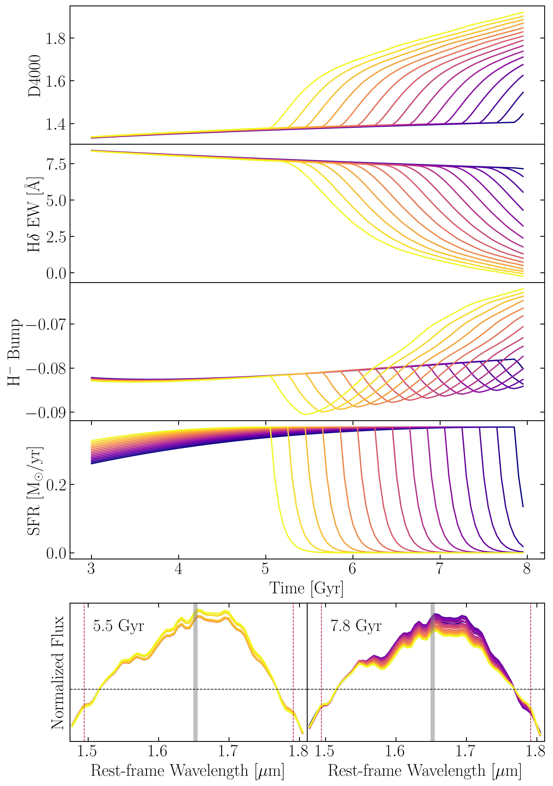

# arXiv Digest — 2026-09-30

- **Interest file used:** interests/2026.10.md (fallback — no 2026.09.md exists yet; 2026.10.md is the earliest available file, since no prior-month file exists either)
- **Categories pulled:** astro-ph.CO, astro-ph.EP, astro-ph.GA, astro-ph.HE, astro-ph.IM, astro-ph.SR, cs.LG, stat.ML, physics.data-an, hep-ph
- **Papers scanned:** 645 unique (107 astro-ph new/cross + 538 from extras, dominated by cs.LG)
- **After first filter:** 171 candidates reviewed with full abstracts; 18 sent to second-pass full-text review
- **Final selected:** 16 papers across 4 tiers

---

## Tier 1 — Highly relevant

### [An Ionized Superstructure at Cosmic Dawn Revealed by a Foundation Model for Astrophysical Research](http://arxiv.org/abs/2609.36656v1)

Minghao Yue, Yongda Zhu, Jiani Ding, Xiaohui Fan et al.
**Primary category:** astro-ph.GA | also: astro-ph.CO

Using **FM-JADES-v1, a self-supervised transformer foundation model** trained on JWST/JADES imaging and photometry, the authors introduce a **population-conditioned outlier search** in the model's embedding space to flag high-redshift galaxies with unusual properties. This surfaced JADES-GS-217704 at $z=7.567$, whose spectrum shows significant flux blueward of Ly$\alpha$ implying a $\sim$200 cMpc **ionized superstructure at $z=6.80\pm0.07$** with $x_{\rm HI}\approx2\times10^{-6}$, far more transparent than the $x_{\rm HI}\approx0.4$ expected at that epoch. Cosmological reionization simulations predict a **probability of only $\approx10^{-5}$** for a random sightline to reproduce this signal, and no galaxy overdensity is found around it, in tension with canonical inside-out reionization models. The authors call this the first case of a foundation model discovering a previously unknown astrophysical phenomenon rather than just characterizing known source populations.

*UMAP projection of the foundation model's embedding space showing spectroscopically-confirmed $z>7$ galaxies clustered together, with the outlier-search target standing apart from the main high-redshift population.*

---

### [SIFARI: Self-Supervised Interferometric Fitting for Astronomical Radio Imaging](http://arxiv.org/abs/2609.35966v1)

Shunyuan Mao, Andrea Isella, Paris Perdikaris, Li-Ta Lo et al.

**Primary category:** astro-ph.IM | also: astro-ph.EP, cs.LG

SIFARI represents radio-interferometric sky brightness as a **coordinate-based neural field with Fourier feature inputs**, fitting visibilities directly without an external training set or hand-tuned spatial regularizer, and uses **Stochastic Weight Averaging-Gaussian (SWAG)** to turn the trained network into an ensemble that yields pixel-wise brightness uncertainty maps. On synthetic ALMA tests, SIFARI achieves a point-source response **~8x narrower than the natural-weighting CLEAN beam**, recovers flux CLEAN loses when short baselines are missing, and beats restored-CLEAN image fidelity on all three morphology benchmarks tested. Applied to real ALMA data of PDS 70, it cleanly separates faint compact emission from the bright outer ring, and for WISPIT 2 it supplies a self-calibration model where CLEAN's model is inadequate, cutting RMS noise by **~30%**.

*Restored-CLEAN image, SIFARI reconstruction, and SIFARI's SNR map for real PDS 70 data, showing the SIFARI background is clean enough to distinguish the faint compact sources at the positions of planets b and c.*

---

### [Comparing Active Anomaly Detection Frameworks: From Light Curves to Images](http://arxiv.org/abs/2609.36096v1)

Sreevarsha Sreejith, Robert C. Nichol

**Primary category:** astro-ph.IM

The authors systematically benchmark three active anomaly detection (A-AD) frameworks — Astronomaly, Protege, and PineForest — on identical feature representations, using **self-supervised VICReg embeddings** for Euclid Q1 galaxy images and light-curve statistics for ZTF data, isolating the effect of the A-AD *strategy* from that of the underlying representation. Performance is strongly algorithm-dependent: Protege recovered the most variable stars on light curves (83/100) while PineForest's tree-filtering strategy dominated on Euclid image morphology (70/100 merging galaxies), and the effect of prior labels varied by algorithm and by label source. A **hybrid Protege→PineForest workflow** applied to 10,000 Euclid images recovered 799 morphologically unusual objects, including **29 strong lens systems/candidates (9 with no counterpart in published Euclid Q1 lens catalogues)** and 202 visually classified ring galaxies, demonstrating expert-knowledge transfer between complementary A-AD frameworks for large-scale discovery.

---

### [Morphological Identification of Dynamical Regimes in MHD Turbulence with ScaleAware-JEPA](http://arxiv.org/abs/2609.36833v1)

Mengke Zhao, Guang-Xing Li, Keping Qiu

**Primary category:** astro-ph.GA | also: astro-ph.IM

Using **ScaleAware-JEPA**, a joint-embedding predictive architecture that learns a multiscale structural representation from density fields alone (velocity and magnetic field are withheld during training), the authors test whether the learned latent coordinates carry dynamical information beyond simple density conditioning. Latent neighborhoods identified as clump-like, filament-like, and diffuse-like show a **monotonic steepening of turbulent velocity scaling** ($\alpha=-1.92$ to $-2.32$) that density-binned populations fail to reproduce, and the same neighborhoods trace a **continuous sub- to super-Alfvénic transition** (median $M_A=0.36\to1.22$) when velocity and magnetic-field data are reintroduced only as post-training diagnostics. Across the full 32-dimensional latent atlas, kinetic–magnetic, turbulent–gravitational, and gravity–magnetic dynamical balances form coherent structures, showing that a representation learned purely from morphology **acquires a geometry organized by physics it never saw during training**.

*Workflow showing how ScaleAware-JEPA maps clump-, filament-, and diffuse-like density morphologies into latent neighborhoods whose turbulent velocity scaling steepens monotonically, calibrating the representation against withheld physics.*

---

### [MEGATRON: Dwarf Galaxy Quenching in the Epoch of Reionization](http://arxiv.org/abs/2609.37188v1)

David Attard, Ilian T. Iliev, Martin P. Rey, Harley Katz et al.

**Primary category:** astro-ph.GA

Using the MEGATRON zoom-in simulation suite, which evolves **four different star-formation/stellar-feedback prescriptions from identical initial conditions**, the authors track the quenching cycles of $z=8.5$ galaxies with $M_*\sim10^4$–$10^8\,M_\odot$. Stronger or more spatially clustered feedback produces **larger quiescent fractions** and different mass dependences between models, and quenched galaxies fall into two physically distinct regimes: mechanical gas evacuation (compact, cold-gas-poor) versus thermodynamic suppression (retaining a cold but inactive gas reservoir). Because quiescent low-mass galaxies fall below un-lensed JWST/NIRCam detection limits while star-forming galaxies of the same mass do not, **flux-limited surveys are predicted to be biased toward active phases** — making the quiescent fraction in lensing fields a direct, testable discriminant between feedback models at Cosmic Dawn.

*Fraction of Quenched galaxies as a function of stellar and halo mass across the four MEGATRON feedback prescriptions, showing how strongly the predicted quiescent fraction depends on the feedback model.*

---

### [The 1.6 μm H⁻ bump as a diagnostic of TP-AGB contributions and recent quenching. I. Insights from stellar population models](http://arxiv.org/abs/2609.35969v1)

Pengjun Lu, Song Huang, Shiying Lu, Meng Gu et al.

**Primary category:** astro-ph.GA

The authors use XSL (PARSEC/COLIBRI) and controlled **FSPS** experiments to characterize the near-infrared **1.6 μm H⁻ opacity-minimum bump** as a probe of thermally-pulsing AGB (TP-AGB) star contributions to galaxy spectra, a long-standing source of stellar population model uncertainty. Models with substantial TP-AGB light predict a **transient post-quenching enhancement of the H⁻ bump** with a different timing than the optical D4000/Hδ indicators, so combining NIR and optical diagnostics adds information about how recently a galaxy quenched, though the interpretation is model-dependent. Comparing against 19 JWST-observed quiescent galaxies at $z=1$–2, models including TP-AGB contributions describe the observed H⁻ region reasonably well, with **five galaxies falling within the TP-AGB-on rapid-quenching classification region**, motivating further tests of TP-AGB prescriptions with current and future NIR spectroscopy.

*Evolution of D4000, Hδ, and the H⁻ bump index through a quenching episode, showing the H⁻ bump's transient trough appearing with a different timing than the optical indicators.*

---

### [LYRA: The formation and growth of nuclear star clusters in dwarf galaxies](http://arxiv.org/abs/2609.38179v1)

Joaquin Sureda, Azadeh Fattahi, Sownak Bose, Mariya Lyubenova et al.

**Primary category:** astro-ph.GA

Using the LYRA cosmological hydrodynamical zoom simulations of six dwarf galaxies, the authors trace the origin of **nuclear star clusters (NSCs)** with $M_{\rm NSC}\sim10^4$–$10^6\,M_\odot$, finding they emerge as a **compact component at very early times**, with the host galaxy subsequently growing around them. Tagging the origin of every NSC star shows that **in-situ star formation within the NSC itself dominates the mass budget** in most galaxies, producing an old, metal-poor stellar population consistent with early formation, while galaxy–galaxy mergers are typically the second-largest contributor, usually dominated by a single merger event. Star clusters falling in and disrupting contribute negligibly, highlighting that the growth-channel mix in dwarf-galaxy NSCs is more complex than simple merger-driven pictures suggest.

*Fraction of NSC mass contributed by in-situ formation, mergers, and disrupted star clusters across the six LYRA haloes, showing in-situ ("NSC-Born") stars dominate in most galaxies.*

---

### [Reconstructing Implicit Scientific Knowledge: Evaluating LLM Agents through End-to-End Reproduction of Astronomy Studies](http://arxiv.org/abs/2609.35900v1)

Yuehui Wang, Xinyu Qi, Guirong Xue, Cheng Wang et al.

**Primary category:** astro-ph.IM | also: cs.AI, cs.MA

The authors build a **multi-agent framework (reader, planner, coder, verifier, adjudicator)** that reproduces published astronomy results end-to-end, separating execution failure from methodological ambiguity, and apply it to 14 studies (an in-depth ApJ case plus 13 Nature papers). **Eleven of thirteen Nature papers contained an ambiguity that blocked a uniquely specified reproduction path.** In a controlled sensitivity analysis on Rix et al. (2022)'s "Poor Old Heart of the Milky Way," twelve predefined, non-tuned analysis paths (varying sample definition, sky masking, and parallax zero-point treatment) gave spatial scales from 2.16–3.53 kpc, with only one recovering the published **~2.70 kpc**, found only after all twelve had run. The decisive correction (a +0.02 mas Gaia parallax zero-point) was already stated in the paper, but the agents never connected its causal relevance to the downstream fit until the sensitivity analysis made the effect visible — showing that **matching a published number does not by itself demonstrate reconstructed scientific reasoning**, and that connecting distributed information is a harder bottleneck for LLM agents than retrieving it.

---

### [JWST lensed quasar dark matter survey V: Hints of self-interacting dark matter from 29 quadruply imaged quasars](http://arxiv.org/abs/2609.35974v1)

D. Gilman, A. M. Nierenberg, J. Gurian, H. Paugnat et al.

**Primary category:** astro-ph.CO | also: astro-ph.GA

Using flux-ratio anomalies from **29 quadruply-imaged quasars**, the authors perform population-level Bayesian inference on the abundance of **core-collapsed dark matter halos and subhalos** in the mass range $10^6$–$10^{10.7}\,M_\odot$ — exactly the small-scale-structure regime relevant to dwarf-galaxy dark matter tests. The data show a strong preference for core-collapsed structure, with **Bayes factors of 6:1 to 24:1 favoring self-interacting dark matter (SIDM) over CDM**, and explaining the dataset within CDM alone would require globular cluster abundances **5–10× higher than observed locally** together with more subhalos than $N$-body simulations or the semi-analytic model `galacticus` predict. The result poses a genuine challenge to the CDM small-scale-structure paradigm and is examined further via a particle-physics interpretation in a companion paper.

*Simulated convergence maps comparing a CDM subhalo population to two SIDM realizations with different core-collapse timescales, showing how core-collapsed halos create their own critical curves and localized magnification perturbations.*

---

### [A Systematic Assessment of Total Stellar Mass Measurements with Spatially Resolved Photometry and Medium Bands at 1 < z < 9: The Impact of Mass-to-Light Variations and Outshining](http://arxiv.org/abs/2609.35996v1)

Naadiyah Jagga, Adam Muzzin, Visal Sok, Vivian Yun Yan Tan et al.

**Primary category:** astro-ph.GA

Using JWST (CANUCS, Technicolor, JUMPS) and HST wide- and medium-band photometry for ~3000 galaxies at $1<z_{\rm phot}<9$, the authors compare **spatially resolved (pixel-by-pixel) versus integrated stellar mass estimates**, directly testing whether standard integrated SED fitting is biased by outshining of older stellar populations. Integrated measurements **systematically underestimate stellar mass** for high specific-star-formation-rate galaxies, with the bias reaching **$\Delta\log_{10}(M_*)\sim-0.36$ dex** and worsening for low-mass galaxies ($M_*\leq10^{9.5}M_\odot$) — precisely the outshining signature expected when recent star formation masks an older population. The bias correlates with the scatter in the spatially resolved mass-to-light ratio, and while medium bands help constrain integrated-photometry masses, spatially resolved photometry reduces the mass dispersion even when only wide bands are available (0.15 dex vs. 0.33 dex).

*Stellar mass bias (integrated minus resolved) as a function of the scatter in spatially resolved mass-to-light ratio, colored by stellar mass, showing that galaxies with more asymmetric internal light distributions carry larger mass biases.*

---

### [An ultra-faint, chemically primitive galaxy forming in the reionization era](http://arxiv.org/abs/2609.35945v1)

J. Scholtz, R. Maiolino, S. Carniani, E. Vanzella et al.

**Primary category:** astro-ph.GA

New high-spectral-resolution JWST/NIRSpec-IFS observations of Lensed and Pristine 1 (LAP1), combined with a full re-analysis of archival JWST and VLT/MUSE data, confirm this $z\sim6.6$ system as one of the most promising **Population III star candidates** known: extremely low metallicity ($12+\log(\mathrm{O/H})=6.5$–6.8, or **1–2% solar**) and an extraordinarily low stellar mass of just $10^{3}$–$10^{4}\,M_\odot$. The high-resolution IFS data place dynamical-mass upper limits on the two components (A and B) an order of magnitude below typical galaxy masses, and the high H$\alpha$ equivalent width (**EW > 1200 Å**) implies an age of just **2–5 Myr**, consistent with the very first burst of star formation in a pristine environment. At sizes below 10 pc and stellar masses barely above a globular cluster, LAP1 is interpreted as one of the earliest stellar clusters forming within a larger, still-undetected host galaxy.

*CIV/[OIII] versus [OIII]/Hβ line-ratio diagram placing the LAP1 measurement against Pop III, BPASS stellar, and direct-collapse black hole photoionization models, testing the pristine/primordial interpretation.*

---

## Tier 2 — Adjacent / useful context

### [Dynamical friction vs. subhalo heating in Cold Dark Matter haloes](http://arxiv.org/abs/2609.36796v1)

Jorge Peñarrubia, Pierfrancesco Di Cintio, Eduardo Vitral, Matthew G. Walker

**Primary category:** astro-ph.GA

Using analytical arguments and numerical experiments, the authors show that the orbital evolution of star clusters inside dark matter haloes is set by a competition between **dynamical friction** (which sinks clusters inward) and **stochastic heating from dark subhaloes** (which puffs them outward), with a critical mass $M_{\rm crit}$ separating the two regimes. For haloes in the **dwarf spheroidal (dSph) mass range**, $M_{\rm crit}\gtrsim10^5\,M_\odot$ — comparable to the globular cluster masses actually observed in the Fornax dSph — and because $M_{\rm crit}$ is set by the rare, most massive subhaloes, it shows **substantial halo-to-halo scatter**. This stochastic heating from dark substructure offers a route to delay the orbital decay of globular clusters and help resolve the long-standing "Fornax timing problem," where standard dynamical friction predicts the clusters should already have sunk to the centre.

*Cluster critical mass as a function of host halo mass from many subhalo-population realizations, showing both the predicted scaling and the substantial scatter from halo-to-halo variation in the massive-subhalo population.*

---

### [Detecting HI Self-Absorption using Neural Networks](http://arxiv.org/abs/2609.38042v1)

Eric G. M. Muller, Naomi M. McClure-Griffiths, Hiep Nguyen, Matthew J. Alger et al.

**Primary category:** astro-ph.GA | also: astro-ph.IM

The authors present a lightweight **convolutional neural network** that detects HI self-absorption (HISA) features in 21-cm emission spectra and localizes their velocity via a post-hoc activation-spectrum readout, without assuming a model for the underlying emission or using ancillary tracer data. Trained on synthetic spectra, the network reaches **96.5% accuracy, 96.0% precision, and 97.0% recall** on held-out data, and applied to real observations of the Riegel–Crutcher cloud and Galactic-plane giant molecular filaments, it recovers the known spatial distribution and velocities of self-absorbing cold HI gas consistent with prior by-eye and ancillary-tracer analyses. The method is fast enough to process **~15,000 spectra per second on a consumer laptop GPU**, positioning it for real-time cold-HI detection at the data rates expected from SKA-era surveys.

*A synthetic emission spectrum with a self-absorbing cloud alongside the network's activation-spectrum output, showing the predicted absorption velocity aligning tightly with the true injected feature.*

---

### [Satellite stellar-to-halo mass relations in primordial black hole universes](http://arxiv.org/abs/2609.35988v1)

Patricio Colazo, Nelson Padilla, Federico Stasyszyn

**Primary category:** astro-ph.CO

Comparing dark-matter-only simulations of standard CDM against a primordial black hole (PBH) model with enhanced small-scale power, the authors study how PBH-induced structure changes the **subhalo population feeding dwarf-satellite galaxy formation**. The PBH model enhances subhalo abundance in a mass-dependent way, but because abundance-matching stellar-mass assignment compensates for this, satellite stellar-mass functions alone are a **weak discriminant** between the models. Internal structure is far more diagnostic: PBH-enhanced subhaloes are systematically **more compact with larger enclosed masses at fixed radius**, strengthening a Too-Big-To-Fail-like tension if all such compact subhaloes host observable satellites — making subhalo dynamics, not just satellite counts, the more sensitive probe of small-scale dark matter physics.

---

## Tier 3 — Outside my area but notable

### [Discovery of over a thousand variable stars in Terzan 5 and Liller 1 with JWST](http://arxiv.org/abs/2609.35959v1)

Kevin B. Burdge, Ilaria Caiazzo, Malina M. Desai, Cristina Pallanca et al.

**Primary category:** astro-ph.SR | also: astro-ph.GA, astro-ph.HE, astro-ph.IM

By differencing consecutive non-destructive reads within each JWST/NIRCam integration, the authors turn sample-up-the-ramp imaging into an **infrared movie sampled every 21 seconds**, producing the first JWST time-series variability census of a globular-cluster-like stellar system. Applied to the dense, heavily obscured Bulge Fossil Fragments Terzan 5 and Liller 1, this technique identifies **1,315 variable sources** — 23% of every variable ever catalogued across 151 Galactic globular clusters combined, and nearly double the previous record-holder for a single cluster. The census also reveals dramatic infrared variability from the Rapid Burster, providing its long-sought optical/infrared counterpart, and blindly recovers the first infrared counterpart to any of Terzan 5's radio pulsars, demonstrating a broadly applicable technique for time-domain studies of the Galaxy's densest stellar environments.

*The crowded core of Terzan 5 in the standard pipeline image (mostly masked by saturation), the zeroframe median (recovering the core), and the lag-1 temporal autocorrelation image, where constant stars vanish and only genuine variables stand out.*

---

## Tier 4 — Meta-research about the field

### [The Preprint Evolution: The Rise of Unreviewed Drafts on arXiv and its Implications for Astronomy](http://arxiv.org/abs/2609.35787v1)

Luigi Rolly Bedin

**Primary category:** astro-ph.IM

Analyzing a decade of astro-ph submission metadata, the author quantifies the growing share of arXiv preprints that are never peer-reviewed or are left permanently as "submitted," "under review," or "comments welcome," arguing this imposes a rising **cognitive tax** on researchers who must track multiple unvetted versions of the same result. The paper argues this practice **bypasses blinded peer review** by establishing premature precedence and disproportionately burdens early-career researchers, who face pressure to post before results are vetted. To address this, the author proposes splitting arXiv submissions into two explicit streams — **Level-1 (peer-reviewed, with a journal DOI) and Level-2 (pre-review discussion drafts)** — so readers can opt out of tracking the latter and the community can reclaim the time currently spent re-reading revised drafts.
