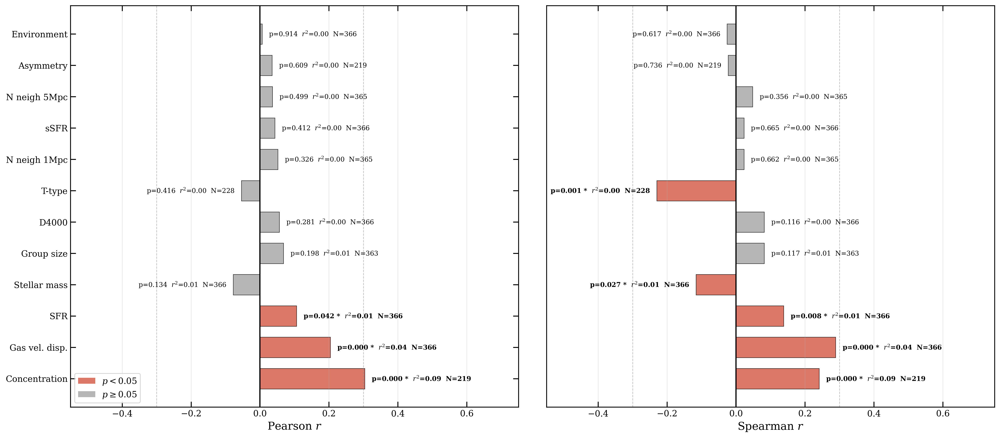
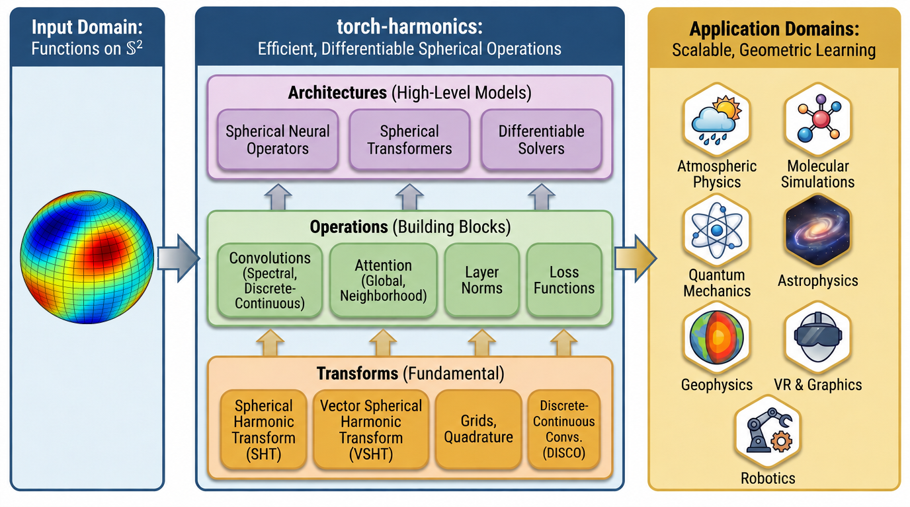
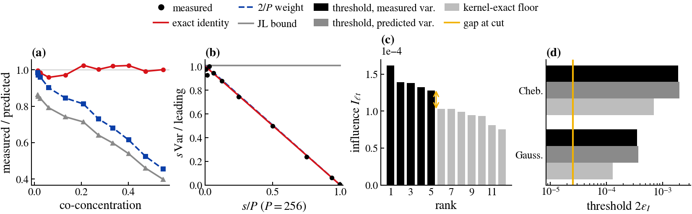

# arXiv Digest — 2026-10-01

- **Interest file used:** interests/2026.10.md (current month)
- **Categories pulled:** astro-ph.CO, astro-ph.EP, astro-ph.GA, astro-ph.HE, astro-ph.IM, astro-ph.SR, cs.LG, stat.ML, physics.data-an, hep-ph
- **Papers scanned:** 451 (96 astro-ph new/cross + 355 from extras)
- **After first filter:** 29 candidates reviewed with full text
- **Final selected:** 19 papers across 2 tiers

---

## Tier 1 — Highly relevant

### [Towards breaking the degeneracy between stellar ages and unresolved multiplicity](http://arxiv.org/abs/2609.39907v1)

Friedrich Anders, Anna B. A. Queiroz, Sagar Malhotra, et al.

**Primary category:** astro-ph.SR | also: astro-ph.GA

This IAU proceedings paper reviews the StarHorse Bayesian isochrone-fitting lineage (500k to 217M stars across Gaia/APOGEE/GALAH) and identifies unresolved stellar multiplicity as a major unaddressed systematic in stellar age inference, biasing $T_{\rm eff}$ by **~300 K** and [Fe/H] by **~0.1 dex** for the ~50% binary fraction among distant solar-type stars. It previews forthcoming work using **simulation-based inference (SBI)** to jointly infer stellar age, mass, and binary mass ratio from spectroscopic+photometric+astrometric data, reaching **10,000 posterior samples/sec** on a single CPU. The authors argue current age uncertainties (~7% precision, ~10-15% accuracy) are dominated by this unmodeled binarity alongside stellar-physics and extinction systematics.

---

### [Internal Structure, Not Environment, Shapes Metallicity Gradients in Low-Mass Galaxies from MaNGA](http://arxiv.org/abs/2609.39689v1)

Anuroop Dasgupta, Namrata Roy, Saumyadip Samui, et al.

**Primary category:** astro-ph.GA

The authors assemble the **largest spatially-resolved spectroscopic sample of dwarf galaxies** to date from MaNGA DR17 (382 star-forming galaxies, $7.2\leq\log(M_\star/M_\odot)\leq9.1$), measuring radial gas-phase metallicity gradients and a residual metallicity $\Delta Z$ after removing the local stellar-mass-surface-density dependence. Gradients are **flat on average** (median slope $-0.007$ dex $R_e^{-1}$), with **light concentration** the strongest predictor of residual gradient shape (Pearson $r=0.304$), while large-scale environment shows **no significant correlation**. The result is robust to resolution cuts, supporting the conclusion that internal structure, not environment, primarily shapes metal distribution in this mass regime.

*Correlation coefficients between the residual metallicity gradient and each tested physical property: light concentration stands out as the strongest and most significant driver, while environment shows no effect.*

---

### [AGC 322753: a Dark Galaxy Candidate detected by ALFALFA and FASHI](http://arxiv.org/abs/2609.39152v1)

Marco Monaci, Duncan A. Forbes, Warrick J. Couch, et al.

**Primary category:** astro-ph.GA

The authors report **AGC 322753**, an HI source independently confirmed by both the ALFALFA and FASHI blind HI surveys at consistent velocity, with **HI mass $\approx2\times10^9\,M_\odot$** and a double-peaked profile indicating disc-like rotation. No optical counterpart is found in DESI Legacy Imaging down to a **deep low-surface-brightness limit (~27.5 mag/arcsec²)**, yielding $M_\star\lesssim5\times10^7\,M_\odot$ and $M_{\rm HI}/M_\star\gtrsim40$. Because this HI mass exceeds predictions for completely starless halos (RELHICs top out near $10^6$–$10^8\,M_\odot$), the authors conclude the object is likely not fully dark but may host a very faint, currently undetected stellar component.

*AGC 322753's position in the linewidth–HI-mass plane relative to the full ALFALFA/FASHI population and known dark-galaxy candidates, showing a notably higher HI mass than other nearby dark-galaxy candidates.*

---

### [Gestalt: a meta-foundation model for astronomy](http://arxiv.org/abs/2609.38312v1)

Michael J. Smith, Shashwat Sourav

**Primary category:** astro-ph.IM | also: cs.LG

The authors embed galaxy images through a "basket" of **22 frozen pretrained foundation models** spanning eight architecture families (ViT, CLIP, I-JEPA, AstroPT, etc.), then take a **randomised SVD of the concatenated embeddings** to form a 1024-d unsupervised meta-embedding requiring no further training. On HSC, JWST, and DESI Legacy imagery, the resulting model **beats every individual basket member on 19 of 21 tested metrics** (photo-$z$, $\log M_\star$, sSFR, morphology), with performance rising with basket diversity and transferring across held-out surveys. Assembling it costs minutes on one machine versus an estimated **$10^4$–$10^5$ A100-GPU-hours** for a comparable from-scratch pretrain.

*Linear-probe R² for the 22 individual foundation models versus the combined meta-embedding across COSMOS-Web redshift, stellar-mass, and sSFR tasks — the combined embedding beats every single constituent model.*

---

## Tier 2 — Adjacent / useful context

### [hAIthem: Searching for BSM Experimental Signatures with Large Lagrangian Models](http://arxiv.org/abs/2609.38309v1)

Ibrahim Elsharkawy, Victoria Knapp-Perez, Wahid Bhimji, et al.

**Primary category:** hep-ph | also: astro-ph.CO

The authors build **hAIthem**, combining a reinforcement-learning agent (an autoregressive transformer pretrained on ~1 billion tokens from ~10,000 Lagrangians) with competing LLM agents to search dark-matter-model parameter space and propose new experimental observables to break remaining degeneracies. The RL search is framed as a **Battleship-style game** against phenomenology tools (micrOMEGAs, SModelS) and **outperforms a differential-evolution baseline**, finding more and physically diverse viable regions for single dark-scalar-multiplet models. The LLM agents independently surface known-but-underused observable combinations, including a halo-independent kinematic ratio applicable to paleo-detectors.

*Pipeline of the hAIthem framework: symbolic Lagrangians feed the Large Lagrangian Model, which searches parameter space via RL, after which a decision tree routes degenerate regions to competing LLM agents for new signature proposals.*

---

### [A machine learning-based method for populating dark matter halos in N-body simulations with substructure](http://arxiv.org/abs/2609.40066v1)

Milad Noorikuhani, Jeremy Tinker

**Primary category:** astro-ph.CO

The authors present a fast **ML-based subhalo-population method**: a decision-tree classifier predicts whether a halo hosts subhalos above a mass threshold, then a nearest-neighbor mapping transplants subhalo populations from a matched halo in a high-resolution reference box. Applied to Uchuu/mini-Uchuu catalogs, the method reproduces subhalo abundances and clustering statistics with **percent errors generally below 5%**, using only a few CPU-hours per realization — a cheap route to realistic substructure (and satellite/dwarf-galaxy population statistics) in low-resolution boxes.

*Predicted versus actual average subhalo counts as a function of host-halo mass, peak mass, $V_{\rm max}$, concentration, half-mass scale, and spin — the method reproduces subhalo-abundance trends to within a few percent.*

---

### [When Streams Curve Away: a Test of Dark Matter from Extragalactic Stellar Stream Populations](http://arxiv.org/abs/2609.40057v1)

Nathaniel Starkman, Jacob Nibauer, Sarah Pearson, et al.

**Primary category:** astro-ph.GA | also: astro-ph.CO

The authors develop a purely geometric **stream-convexity diagnostic**: a projected stellar-stream segment curving away from its host's projected center of mass rules out any static, axisymmetric potential using only the on-sky track — no kinematics or potential fitting required. Because **halo triaxiality** sets the convexity rate, and CDM (triaxial) versus SIDM (rounder) halos predict different rates, a population-level stream catalog becomes a dark-matter test. Forecasts show upcoming survey-scale catalogs (Euclid/Rubin/Roman) could discriminate **CDM from SIDM at up to 5σ**.

*Number of streams needed to distinguish CDM from SIDM at a given significance — survey-scale catalogs of a few hundred streams can reach 3–5σ discrimination between the two dark-matter models.*

---

### [The orbital dynamics of the LMC and SMC about the Milky Way](http://arxiv.org/abs/2609.38277v1)

Gurtina Besla, Nitya Kallivayalil

**Primary category:** astro-ph.GA

This review synthesizes the evolving picture of the LMC/SMC's orbital history, driven by high-precision Gaia/HST proper motions and improved cosmological dark-matter-halo models. It concludes the Clouds are most consistent with being a **long-lived binary pair on first infall** to the Milky Way (LMC virial mass $>10^{11}M_\odot$), having undergone a **recent (<200 Myr) close LMC-SMC encounter**, with the choice of kinematic center the dominant remaining systematic. The authors argue full time-evolving N-body models are now required to correctly interpret the Clouds' stellar, HI, and dark-matter structure.

---

### [The assembly history of NGC 1365 through chemical archaeology](http://arxiv.org/abs/2609.40160v1)

Lisa J. Kewley, Kathryn Grasha, Alex Garcia, et al.

**Primary category:** astro-ph.GA

Using the TYPHOON/PrISM survey, the authors derive gas-phase oxygen abundances for **4546 spaxels** across NGC 1365 at **175 pc resolution**, finding three distinct metallicity-gradient zones. Matching to the highest-resolution **IllustrisTNG50** volume, they identify a close simulated analog and use its merger history to argue the main-disk gradient formed earliest (11.9–12.5 Gyr ago) via **mergers with multiple dwarf galaxies**, while the flat outer disk assembled recently (5.9–8.6 Gyr ago) via a minor merger with a $10^9\,M_\odot$ dwarf.

*Radial oxygen-abundance profile for NGC 1365's spaxels and HII regions compared to the matched TNG50 simulated galaxy, showing the three-zone gradient structure that the simulation match is used to interpret.*

---

### [Learning Gaia: A Generative Model Trained on the Gaia Data Release 3 Source Catalog](http://arxiv.org/abs/2609.38326v1)

John Soltis

**Primary category:** astro-ph.GA

The author trains a **conditional flow-matching generative model** on positions, photometry, and astrometry of ~579 million Gaia DR3 sources, using probabilistic masking so the model can generate mock sources or impute missing parameters under arbitrary conditioning. The model reproduces large-scale structure (Milky Way disk, Magellanic Clouds) and shows modest skill imputing missing radial velocities, but **fails to reproduce small, distinct subpopulations** like $\omega$ Centauri even when conditioned on exact position — framed as a first step toward a full Gaia foundation model ahead of DR4, with TARP-based calibration diagnostics quantifying where it is and isn't reliable.

---

### [PTED: A multi-dimensional two-sample test for scientific inference and generative machine learning](http://arxiv.org/abs/2609.38388v1)

Connor Stone

**Primary category:** astro-ph.IM | also: physics.data-an

The author presents **PTED**, a permutation test on the energy distance that yields an exact, high-dimensional two-sample test usable on raw data or learned features, with a landmark-based approximation giving **linear scaling** in dimension and sample size. Across Gaussian, two-moons, and MNIST sensitivity tests against KS-test, PQM, MMD, FID, and FLD, **PTED is the only method sensitive to all tested failure modes**, and it additionally supports single-element coverage testing useful for SBI posterior-calibration checks.

---

### [Diffusion Models for Polarimetric Reconstruction of Circumstellar Environments in Correlated Speckle Noise](http://arxiv.org/abs/2609.38229v1)

Quentin Villegas, Laurence Denneulin, Simon Prunet, et al.

**Primary category:** astro-ph.IM

The authors extend the RHAPSODIE inverse-problem framework for polarimetric disk imaging to handle **spatially correlated speckle noise**, deriving a Fourier-domain preconditioner that gives a **5x speedup** in conjugate-gradient convergence. A diffusion model trained only on synthetic disk images serves as the learned prior for **Score-based Annealed Langevin Dynamics** posterior sampling under this noise model, reaching **43.2 dB PSNR** versus 25.5 dB for Tikhonov regularization at high disk-to-star contrast.

*True disk intensity and a raw stellar-contaminated detector frame (top) versus the diffusion-based reconstruction (bottom), showing recovery of fine ring structure despite the measurement being visually dominated by stellar residuals.*

---

### [Two bits about lossy compression: On the limits of compression in cosmology](http://arxiv.org/abs/2609.40239v1)

Hurum Maksora Tohfa, Matthew McQuinn

**Primary category:** astro-ph.IM

The authors derive rate-distortion limits for lossy compression of cosmological simulation outputs, comparing a Gaussian water-filling scheme, the SZ3 compressor, and a custom **autoregressive-transformer neural compressor**. The neural approach **matches or beats SZ3 on every field tested** and lands **9–27% below the Gaussian-optimal coder** at fixed distortion; a model trained only on weak-lensing convergence transfers zero-shot to $N$-body density fields and even to real **Rubin Observatory DP1 coadds** (4.0 bits/pixel, 27% below Gaussian).

---

### [MAGiDiff: Sampling the Photospheric Vector Field from UV/EUV Filtergrams](http://arxiv.org/abs/2609.40043v1)

Ruoyu Wang, David Fouhey

**Primary category:** astro-ph.SR | also: cs.CV

MAGiDiff is a **latent diffusion model** that estimates disambiguated photospheric vector magnetograms from SDO/AIA UV/EUV filtergrams alone, sidestepping polarimetric Stokes-vector inversion. An explicit "polarity prior" raises **overall polarity agreement from 86.7% to 92.7%**, the model generalizes across solar cycles, and because inference is **stochastic sampling**, generating multiple realizations per input yields per-pixel uncertainty estimates.

*UV/EUV inputs, Hinode ground-truth, and MAGiDiff-predicted vector magnetogram components with pixel-level agreement plots, showing dominant magnetic structures are recovered without polarimetric data.*

---

### [Which Tasks Survive Self-Supervised Learning?](http://arxiv.org/abs/2609.38393v1)

Achleshwar Luthra, Lucas Bryant, Tracy Zhu, et al.

**Primary category:** cs.LG

The authors develop a theory of "**semantic recoverability**" — how much of a downstream task's posterior score is captured by an SSL representation's function space — proving a single scalar exactly determines few-shot nearest-centroid error and the joint geometry of multiple recovered tasks. For a canonical two-view SSL objective, the learned subspace is shown to span the leading eigenmodes of a cross-view operator, giving a **closed-form spectral criterion** for which tasks an SSL encoder will or won't preserve, validated on CelebA attributes across several SSL methods (VICReg, Barlow Twins, I-JEPA).

*Decomposition of a downstream task's posterior score into a component captured by the SSL-selected subspace plus an orthogonal residual, illustrating that a task is "recoverable" exactly to the degree it overlaps the subspace SSL selects.*

---

### [A library for differentiable signal processing and machine learning on the sphere](http://arxiv.org/abs/2609.39737v1)

Thorsten Kurth, Max Rietmann, Mauro Bisson, et al.

**Primary category:** cs.LG | also: physics.ao-ph

The authors present **torch-harmonics**, an open-source PyTorch library with efficient, differentiable spherical harmonic transforms, spectral convolutions, and spherical attention for ML on the 2-sphere, with custom CUDA kernels enabling training at previously prohibitive resolutions. It already underlies production architectures like the Spherical Fourier Neural Operator and FourCastNet3, and a bundled **differentiable shallow-water-equation solver** demonstrates end-to-end gradient-based parameter estimation through the spherical layers — directly reusable infrastructure for differentiable, all-sky astronomical modeling.

*Overview of how the library's spherical signal-processing primitives feed into higher-level spherical neural operators and differentiable PDE solvers.*

---

### [BAM! Bayesian Anything Model: a foundation model for generative computational imaging](http://arxiv.org/abs/2609.39660v1)

Alessio Spagnoletti, Charlesquin Kemajou Mbakam, Jonathan Spence, et al.

**Primary category:** cs.CV | also: stat.ML

The authors introduce **BAM**, a lightweight (36M-parameter) foundation model for few-step, **physics-aware Bayesian posterior sampling** in computational imaging: the forward operator (blur kernel, mask, etc.) is supplied at inference time via a conditional flow map rather than fixed during training. BAM draws calibrated posterior samples in just **3 steps** with no likelihood approximation or guidance-weight tuning, outperforming specialized and zero-shot diffusion baselines on super-resolution, deblurring, and inpainting at a fraction of the compute — the authors explicitly name astronomy as a natural next domain, given known forward operators and scarce ground truth.

*An observation paired with a BAM posterior sample across six different inverse-imaging tasks, showing one small physics-conditioned network handles all of them in just three sampling steps.*

---

### [Certified Approximation for Interpretable Representer Landmarks](http://arxiv.org/abs/2609.38901v1)

Jayanta Mukherjee, Shourya Verma, Mengbo Wang, et al.

**Primary category:** cs.LG

The authors introduce **CAIRN**, which certifies representer-based explanations for self-supervised models by propagating the error of four stacked kernel approximations through to the final top-K ranking of influential training examples. They derive an **exact closed-form variance** for the sketched neural-tangent-kernel matching measurement within **4%** (versus up to 2.5x error for Johnson–Lindenstrauss bounds), and a residual-greedy landmark-selection scheme cuts worst-case class-coverage excess from 8.5x to 1.55x versus k-means++ — turning the reliability of SSL explanation methods into a certifiable, measurable quantity rather than a heuristic.

*The derived variance formula matches measured kernel error far more tightly than standard Johnson–Lindenstrauss bounds, and the resulting "fit floor" can be tens of times larger than the score gap between top landmarks — showing when no added kernel budget can certify an explanation's ranking.*

---

### [A Data-Free Physics-Informed Neural Operator for Level-Set Interface Advection](http://arxiv.org/abs/2609.38195v1)

Muhammad Akbar Khan

**Primary category:** cs.LG | also: physics.flu-dyn

The author trains a neural operator for interface advection using only the **physics residual and a geometric (eikonal) constraint** — no reference solutions enter training at all. Compared head-to-head against supervised and hybrid baselines under identical architecture and budget, the data-free operator reaches **1.614% ± 0.067%** relative $L^2$ error on a reversed-vortex benchmark (versus 0.369% supervised), but where the geometric constraint holds it **conserves enclosed area 2.7x better** than the supervised baseline despite larger pointwise error, and a hybrid variant using only 8 labeled examples beats a supervised variant using 16.

*Schematic of the operator mapping an initial interface to its full spacetime trajectory under a prescribed flow, trained from the transport residual and eikonal term alone with no reference solution.*
