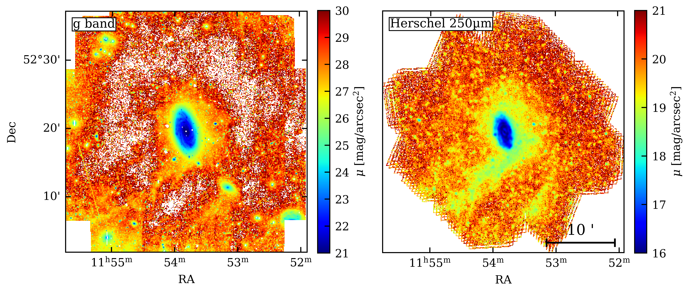
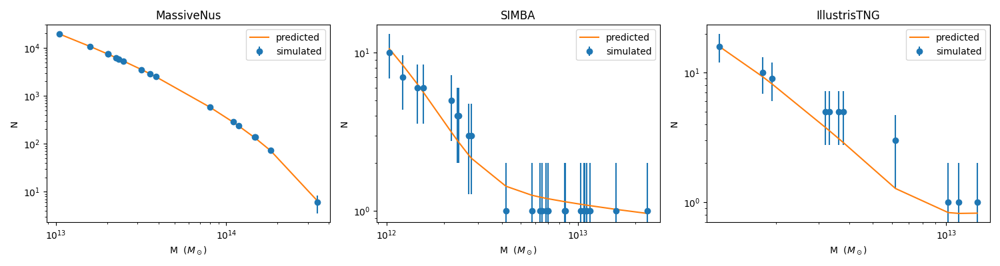
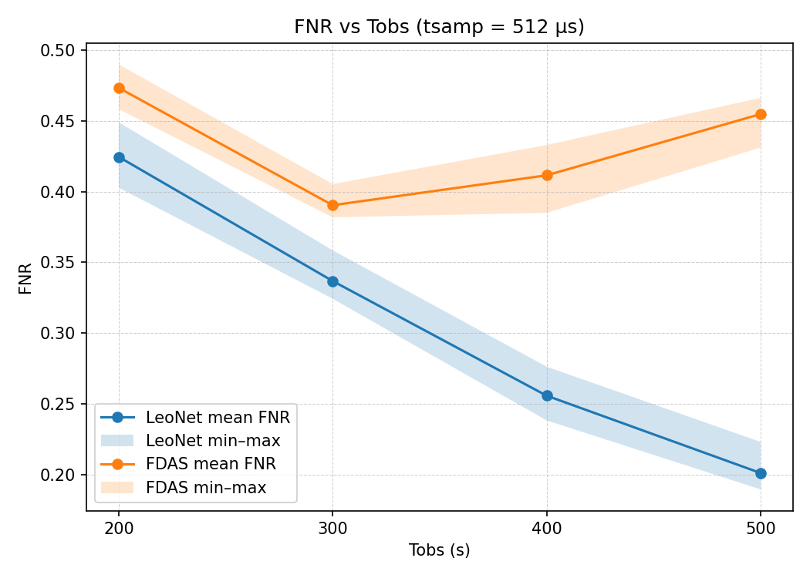
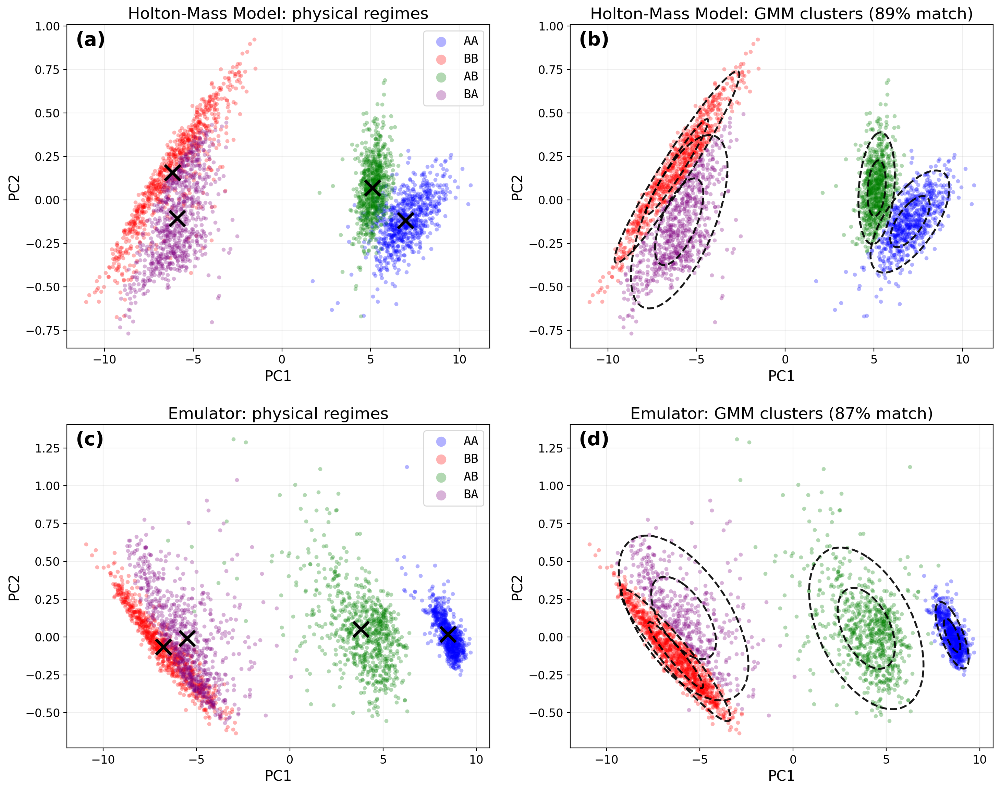

# arXiv Digest — 2026-10-02

- **Interest file used:** interests/2026.10.md (current month)
- **Categories pulled:** astro-ph.CO, astro-ph.EP, astro-ph.GA, astro-ph.HE, astro-ph.IM, astro-ph.SR, cs.LG, stat.ML, physics.data-an, hep-ph
- **Papers scanned:** 540 (85 astro-ph new/cross + 455 from extras)
- **After first filter:** 20 candidates reviewed with full text
- **Final selected:** 19 papers across 4 tiers

---

## Tier 1 — Highly relevant

### [The Impact of Simulation Resolution on Dwarf Galaxy Stellar Stream Populations in FIRE](http://arxiv.org/abs/2610.00578v1)

Yasmine J. Meziani, Nondh Panithanpaisal, Robyn E. Sanderson et al.
**Primary category:** astro-ph.GA

Using two FIRE-2 cosmological zoom-in simulations of the same Milky-Way-mass galaxy (m12i) that differ only in particle mass resolution, the authors show that higher resolution resolves a much larger population of **dwarf-galaxy stellar streams** (45 vs. 19 candidates above a shared mass cutoff), concentrated at **small galactocentric radii below 50 kpc** that the lower-resolution run under-resolves. Matched streams in the higher-resolution run disrupt at smaller pericenters and survive intact for longer, bringing the simulated population into closer agreement with the observed Milky Way satellite population. The result indicates that **limited numerical resolution, not just tidal field strength**, drove the previously reported mismatch between FIRE streams and Milky Way observations.

*Cumulative radial distribution of streams and satellites at present day: the higher-resolution Triple Latte run (gold) produces far more streams at small radii than the standard-resolution Latte run (blue), showing that resolution sets how many close-in dwarf streams survive to be resolved.*

---

### [Which Milky Way Streams Make the Best Dark Matter Detectors?](http://arxiv.org/abs/2610.00456v1)

Vedant Chandra, Charlie Conroy, Risa Wechsler et al.

**Primary category:** astro-ph.GA

The authors couple a semi-analytic model of **Milky Way dark-matter subhalos** (`galacticus`, including tidal stripping by the disk) to dynamical models of 24 known globular-cluster stellar streams, forecasting which are most likely to show gravitational perturbations from low-mass subhalos. The ten most-perturbed streams, led by **Jet, AAU, GD-1, and Palomar 5**, are predicted to each encounter 2-12 subhalos with velocity kicks above 0.1 km/s over their lifetimes, and the relevant subhalos are found to be **twice as compact and more tidally stripped** than earlier work assumed. The ranking gives a concrete target list for sub-km/s-precision spectroscopic stream surveys aiming to probe dark subhalos below the galaxy-formation threshold.

*Schematic of the three-stage pipeline: cosmologically realistic subhalo populations from `galacticus` are combined with stream models fit to known Milky Way streams to characterize their predicted subhalo encounters.*

---

### [LIGHTS. Limitations of Far-Infrared Tracers for Galactic Cirrus Mitigation in the Era of Ultra-Deep Imaging](http://arxiv.org/abs/2610.00463v1)

Ouldouz Kaboud, Ignacio Trujillo, Ignacio Ruiz Cejudo et al.

**Primary category:** astro-ph.GA | also: astro-ph.CO

Using the LIGHTS survey's ultra-deep *g/r* imaging of NGC 3953 alongside Herschel 250 μm maps, the authors test whether far-infrared data can trace and subtract **Galactic cirrus contamination** at the faint surface brightnesses relevant to **low-surface-brightness science**. They find optical cirrus emission is only ~0.1% of the FIR flux, and that Herschel's coarse resolution causes source confusion that limits robust cirrus removal to **μ_V ≈ 28 mag/arcsec²** — substantially shallower than the ~30.5 mag/arcsec² ten-year LSST/LIGHTS coadd depth. The result flags a fundamental limitation that current FIR tracers impose on deep optical surveys and argues for **higher-resolution cirrus tracers** to fully exploit next-generation imaging depth.

*Scattered-light-subtracted optical g-band image (left) versus the Herschel 250 μm map (right) of the same field, showing the diffuse emission features that spatially coincide in both bands and confirm Galactic cirrus as the dominant faint background.*

---

### [LACHESIS: Robust stellar parameters through Bayesian model averaging of isochrone grids](http://arxiv.org/abs/2610.01931v1)

Jose I. Vines, Austin T. Ware

**Primary category:** astro-ph.SR

LACHESIS infers stellar masses, radii, and ages by combining **five independent isochrone grids** via nested sampling and Bayesian model averaging, explicitly folding the choice-of-model-grid systematic into the reported uncertainty instead of fitting a single grid. Validated against 76 Kepler asteroseismic benchmarks, it recovers **masses to ~4% and radii to ~2% scatter**, while ages carry a **~9% grid-to-grid systematic floor** that single-grid pipelines silently omit. Model averaging is shown to be better calibrated than picking any one grid, with credible intervals approaching nominal coverage — a direct tool for building more reliable **stellar template libraries** for population studies.

*Recovery of mass, radius, and age against the asteroseismic benchmark sample: mass and radius recover within the statistical floor, while age recovery is limited by photometry plus a subdominant isochrone-model floor.*

---

### [ROBIN-PIP: Robust Bayesian Field-Level Inference with Physics-Informed Priors](http://arxiv.org/abs/2610.00674v1)

Ludvig Doeser, Simon Ding, Guilhem Lavaux et al.

**Primary category:** astro-ph.CO | also: astro-ph.IM

ROBIN-PIP introduces **physics-informed priors derived from high-fidelity simulations** to regularize an otherwise overparameterized, poorly constrained galaxy bias model inside gradient-based Bayesian field-level inference of galaxy surveys. Applied to a mock universe, the added prior **reduces posterior standard deviations on bias parameters by up to 20%** and roughly halves the MCMC autocorrelation length, increasing effective sample sizes, without biasing the recovered cosmic initial conditions. The approach is a template for folding simulation-derived physical knowledge into inference pipelines that cannot otherwise ingest simulations directly — a strategy transferable to physics-informed modeling of resolved stellar or galaxy properties more generally.

---

### [hyprfine: simulating the 21-cm signal from the Dark Ages through to the Epoch of Reionization on a GPU](http://arxiv.org/abs/2610.01865v1)

Harry T. J. Bevins

**Primary category:** astro-ph.IM | also: astro-ph.CO

`hyprfine` is presented as the first **GPU-native, fully differentiable** analytic simulator of the sky-averaged 21-cm signal across cosmic time, written in JAX. Benchmarked against the established `zeus21` code, it reproduces the same signal while running in a fraction of a second and parallelizing efficiently across GPU hardware, remaining **differentiable through the Dark Ages (z ≥ 35)**. This **differentiable-simulation** design makes `hyprfine` directly usable inside gradient-based inference pipelines, a pattern applicable well beyond 21-cm cosmology to any physics-incorporated emulator that needs exact gradients.

*Left: an example 21-cm signal from hyprfine overlaid on the equivalent zeus21 signal. Right: hyprfine's per-signal runtime on three hardware platforms compared to zeus21, showing its large GPU speed advantage.*

---

### [Emulation of the Halo Mass Function with Neural Networks](http://arxiv.org/abs/2610.00725v1)

Olive Ross, Nicholas Battaglia

**Primary category:** astro-ph.CO

The authors build a **neural-network emulator of the halo mass function** that maps cosmological and astrophysical parameters directly to a cumulative halo count, avoiding the information loss from binning used by prior emulators, and crucially returns a **self-estimated uncertainty calibrated in units of Poisson shot noise** alongside every prediction. Validated with leave-one-out tests across three independent simulation suites (MassiveNus, CAMELS-IllustrisTNG, CAMELS-SIMBA) spanning 1.2×10⁶ held-out predictions, **88% of predictions have model bias at or below the shot-noise floor**. Because the emulator is retrainable on arbitrary simulation suites, it offers a general, **physics-constrained, uncertainty-aware** tool for cosmological and astrophysical inference.

*Simulated versus predicted cumulative halo-count distributions for a held-out cosmology in each of the three simulation suites, with the network's predictions tracking the simulated counts within their Poisson shot-noise error bars.*

---

### [A comprehensive simulation framework for multi-modal kilonova observations from all-sky surveys](http://arxiv.org/abs/2610.02088v1)

Felipe Fontinele Nunes, Andrew Toivonen, Farhana Taiyebah et al.

**Primary category:** astro-ph.IM

The authors introduce `kilonova-multimodal-emulator`, a pipeline that generates realistic, **multimodal kilonova training data** — photometry, spectra, and images together — by combining radiative-transfer kilonova models with the real cadence, depth, and instrument response of ZTF's Bright Transient Survey. Because confirmed kilonova detections remain extremely rare, this synthetic dataset is explicitly built to train the **large AI models** that upcoming alert streams from Rubin and other all-sky surveys will need to flag kilonova candidates in real time. An example injection sequence chains Pan-STARRS host-galaxy photometry, radiative-transfer spectral templates, and a realistic noisy spectrum extraction, illustrating the full simulation-to-detector pipeline.

*Example data-generation chain for a simulated kilonova injected near NGC 772: archival host-galaxy imaging (a), the underlying model spectral sequence (b), the same sequence combined with the reconstructed host spectrum (c), and the resulting flux-calibrated, noisy, host-subtracted spectrum a real spectrograph would record (d).*

---

## Tier 2 — Adjacent / useful context

### [LeoNet: A Machine Learning Method for Binary Pulsar Classification](http://arxiv.org/abs/2610.00908v1)

Zhaocheng Gong, Jack White, Zeyu Yang et al.

**Primary category:** astro-ph.IM

LeoNet is a **convolutional neural network** that replaces the computationally expensive Fourier-domain acceleration/jerk search used to detect Doppler-smeared binary pulsar signals, learning **ten convolutional templates** that compress the search into a compact feature map read by a classifier. Against the standard PRESTO FDAS pipeline, LeoNet cuts the false-negative rate by a **mean of 55.5%** across sampling intervals for 500 s observations, while running roughly **499 times faster** on GPU (milliseconds vs. ~1.8 s per observation). The speed and sensitivity gains make LeoNet a practical real-time candidate-identification stage for next-generation pulsar search pipelines.

*False-negative rate versus observation time at a 512 μs sampling interval: LeoNet (one curve) sustains a lower false-negative rate than the classical FDAS search once observations exceed about 300 seconds.*

---

### [XClass: An Automated Multiwavelength Machine-Learning Pipeline for Classification of Extragalactic X-ray Sources. I. Pipeline Description](http://arxiv.org/abs/2610.00459v1)

Blagoy Rangelov, Nicholas Moore, Haley Dutton et al.

**Primary category:** astro-ph.HE | also: astro-ph.GA

XClass classifies extragalactic Chandra X-ray point sources into seven physical classes despite a core **domain-adaptation problem**: training data are Galactic sources in ground-based filters, while targets are extragalactic sources imaged by HST in a disjoint filter system. The pipeline bridges this gap by fitting class-appropriate **SED models** to each training source and convolving them through HST filter curves to build a common feature space, then classifying with an **asymmetric two-stage Random Forest**. On an 11,374-source training baseline the pipeline reaches **99.6% accuracy** with excellent calibration (ECE = 0.002), and will next be applied to M31 and M33.

*End-to-end schematic of the XClass pipeline, from training-set construction and cross-matching through the SED-translation step and the two-stage Random Forest classifier, to application on real HST photometry.*

---

### [Bayesian Image Reconstruction with Spatially Variant PSFs in X-ray Astronomy](http://arxiv.org/abs/2610.02062v1)

Vincent Eberle, Matteo Guardiani, Margret Westerkamp et al.

**Primary category:** astro-ph.IM

The authors apply **Bayesian inference grounded in information field theory** to recover the posterior mean and **uncertainty** of X-ray flux images while jointly modeling the telescope's spatially variant point spread function, using a fast patch-based convolution representation of the PSF. Benchmarked on synthetic data, the method outperforms three variants of the standard Richardson-Lucy deconvolution algorithm on SSIM, RMSE, and likelihood metrics; applied to real Chandra observations of Cassiopeia A, it yields a visibly sharper reconstruction whose residuals are consistent with pure noise. The framework's principled **uncertainty quantification** opens a path toward cross-calibrating images from different X-ray instruments.

*Side-by-side deblurring comparison on high- and low-signal synthetic test images, showing the observed data, ground truth, and reconstructions from the information-field-theory method against Richardson-Lucy variants.*

---

### [Normalizing Flow Emulator for Gravitational Wave Detection Probability in the LIGO/Virgo/KAGRA O4 Observing Run](http://arxiv.org/abs/2610.00306v1)

Julius Gassert, Ignacio Magaña Hernandez, Ariel J. Amsellem et al.

**Primary category:** gr-qc | also: astro-ph.HE

The authors train an ensemble of **normalizing flows** to emulate the detection probability of gravitational-wave events for an O4-like LIGO/Virgo/KAGRA network, replacing the expensive Monte Carlo injection campaigns conventionally needed to estimate detection efficiency for every candidate population model. Across a wide range of population models, including ones with sharp features, the emulator's detection-efficiency estimates agree with direct Monte Carlo importance sampling to a **median relative deviation of ~1.2%**, and can be more precise when the number of effective Monte Carlo samples is small. The publicly released, trained emulator is proposed as a drop-in replacement for the costliest step of gravitational-wave population inference.

*Estimated detection efficiency from Monte Carlo importance sampling versus the normalizing-flow emulator across many population models, with residuals shown below; the two methods agree within their combined uncertainties in essentially all cases.*

---

### [Adaptive Conformal Prediction for Image Regression Models with Application to an Inertial Confinement Fusion Emulator](http://arxiv.org/abs/2610.00535v1)

Carrie J. Lei-Cramer, Michael S. Jones, Laura J. Wendelberger

**Primary category:** stat.ML | also: cs.LG

ACPNN is a **conformal-prediction** method for image-regression models that produces locally **input-adaptive uncertainty intervals**, learning a Gaussian-process-informed nearest-neighbor metric over the image feature space rather than assuming uniform calibration everywhere. Applied to a diffusion-model emulator of **inertial confinement fusion** simulations trained on 90,000 images, ACPNN achieves the target coverage while widening its intervals correctly in input regions where the underlying model is less accurate. The method offers a general, low-overhead recipe for adding **calibrated, locally adaptive uncertainty quantification** to any black-box image-to-value scientific emulator.

*Violin plots of predictive-uncertainty magnitude across input bins (defined by a principal component of the training images), showing how ACPNN's uncertainty estimate grows in the sparser, harder-to-predict regions of input space.*

---

## Tier 3 — Outside my area but notable

### [Group-Invariant Statistics Determine Embedding Geometry: Harmonic Analysis of Representations from Bach to the Night Sky](http://arxiv.org/abs/2610.00647v1)

Liam Storan, Andreas Tolias, Nina Miolane

**Primary category:** cs.LG

Building on the observation that LLMs represent months as circles, the authors prove a general theorem: whenever the co-occurrence statistics of a concept family are invariant under a group *G*, the learned embeddings must consist of the **irreducible representations of G** — Fourier modes for cyclic groups, but richer geometries for other symmetries. They verify this across three settings: months (cyclic group → circle), Bach chord progressions (dihedral group, unifying the "circle of fifths" with music theory), and, strikingly, **celestial objects**, whose previously reported spherical embedding in LLMs turns out to be exactly the **spherical-harmonic representation** predicted by the rotation group. The result gives a first-principles explanation for *why* specific symmetric embedding geometries emerge, directly relevant to work that tries to constrain or interpret embedding spaces built from physically structured data.

*Months, Bach chords, and celestial objects embed in three distinct latent geometries — a circle, a dodecagonal-prism-like structure, and a sphere — each dictated by the symmetry group of the corresponding co-occurrence statistics.*

---

### [AI Emulation of Stochastic Sudden Stratospheric Warming with Interpretable Latent Structure](http://arxiv.org/abs/2610.02069v1)

C. Daniel Boscu, Daniel Hernandez, Fabio Alvarez Ventura et al.

**Primary category:** physics.ao-ph | also: cs.LG

The authors train a conditional variational autoencoder to emulate the stochastic Holton-Mass model of stratospheric polar-vortex dynamics, a system with two metastable regimes and rare noise-triggered transitions resembling sudden stratospheric warmings. The emulator reproduces the physical model's short- and long-term statistics, including **rare transition rates and the transition committor function**, and a PCA of its 32-dimensional latent space reveals, **without any supervision, four physically interpretable clusters** that cleanly separate strong/weak vortex states from stable/transition-prone configurations. This emergent **interpretable latent structure** — typically hard to extract from deep generative models of high-dimensional stochastic systems — is proposed as the basis for an operational early-warning diagnostic for rare extreme-event dynamics.

*Latent mean vectors projected onto their first two principal components for both the physical model (top) and the emulator (bottom): coloring by true physical regime (left) closely matches an unsupervised four-cluster fit to the latent space alone (right).*

---

### [Close Pulsar Pairs See Dark Matter Substructure through the Gravitational-Wave Background](http://arxiv.org/abs/2609.38305v1)

Abhiram Cherukupalli, Vincent S. H. Lee, Kim V. Berghaus et al.

**Primary category:** astro-ph.CO | also: hep-ph

The authors show that timing **sub-parsec-separated pulsar pairs** cancels out the nanohertz gravitational-wave background that otherwise swamps pulsar-timing-array sensitivity to nearby dark-matter subhalos, because the GWB imprints nearly identical residuals on both pulsars while a passing subhalo perturbs them differently. For pairs separated by **0.1 pc**, the improvement in sensitivity to subhalos of order 10⁻⁶ solar masses exceeds an order of magnitude relative to an array of widely separated pulsars, with dense globular clusters identified as natural hosts for many such close pairs. The technique offers a clever, concrete observational channel for probing the **low-mass end of the dark-matter subhalo mass function**.

*Minimum detectable dark-matter substructure density as a function of pulsar-pair separation: sensitivity improves as pairs get closer together (the "sweet spot"), until pairs become so close their Doppler-sensitive volumes overlap and the signal is suppressed again.*

---

### [Are We Recovering Mechanisms? Objective-Level Recovery Gaps in Mechanistic Interpretability](http://arxiv.org/abs/2610.02098v1)

Chuqin Geng, Li Zhang, Haolin Ye et al.

**Primary category:** cs.LG

The paper identifies a subtle failure mode in **mechanistic interpretability**: the standard "faithfulness" criterion used to discover and validate neural-network circuits can systematically prefer a circuit that reproduces the model's behavior *less* well, because replacing excluded components with donor activations distorts the computational context in ways that favor the wrong candidate. Across four human-reference tasks and the InterpBench benchmark, this **objective-level recovery gap** causes standard discovery methods to misrank **9.4-41.2% of candidate circuit pairs**, and restoring the distorted context repairs 96 of 100 persistent misrankings. The result is a cautionary finding for anyone using intervention-based faithfulness scores to interpret or trust a learned model's internal computations.

*Replacing excluded signals with donor activations, means, or zeros changes a circuit's computational context without changing its structure — this context distortion can make the faithfulness score prefer a worse-performing circuit over a better one of the same size.*

---

### [Robust Evidential Learning Through Latent Consistency](http://arxiv.org/abs/2610.01384v1)

Charmaine Barker, Daniel Bethell, Simos Gerasimou

**Primary category:** cs.LG

CLEAR is a lightweight, **post-hoc uncertainty-quantification** method for evidential deep learning that addresses a known weakness: evidential models can assign high confidence to out-of-distribution or adversarial inputs that are poorly supported by the learned representation. By characterizing each class's latent-space geometry from calibration data and measuring how strongly a test input's latent perturbations conflict with that geometry, CLEAR selectively **down-weights unsupported evidential strength** without retraining the base model. On ImageNet→CUB, CLEAR improves **OOD and adversarial AUROC by +8.29 and +5.01** while running 17.4 times faster than competing post-hoc methods, with gains validated across classification, regression, and object-detection tasks.

*CLEAR's pipeline: a frozen evidential model's latent representation is perturbed and compared against calibration-derived latent geometry, and the resulting conflict score is used to down-weight evidential strength on unsupported (e.g., OOD) inputs while preserving it on well-supported ones.*

---

## Tier 4 — Meta-research about the field

### [Best practices in software citation](http://arxiv.org/abs/2610.00528v1)

Phil R. Van-Lane, Floor S. Broekgaarden, Daniel S. Katz et al.

**Primary category:** cs.DL | also: astro-ph.IM

Drawing on a NASA-funded community workshop, the authors assess why **software citation** remains inconsistent and rarely machine-actionable compared to paper and data citation, despite software being both a foundational tool and a primary output of modern computational — including astronomical — research. They organize findings into four themes: cultural barriers, the need for clearer community norms, gaps in technical infrastructure, and the **emerging challenges AI-assisted research poses for attribution**, assigning concrete interventions to specific stakeholder groups (authors, journals, publishers, funders). Journal editors and publishers are identified as the **highest-leverage point** for making correct citation the path of least resistance within researchers' existing workflows.
