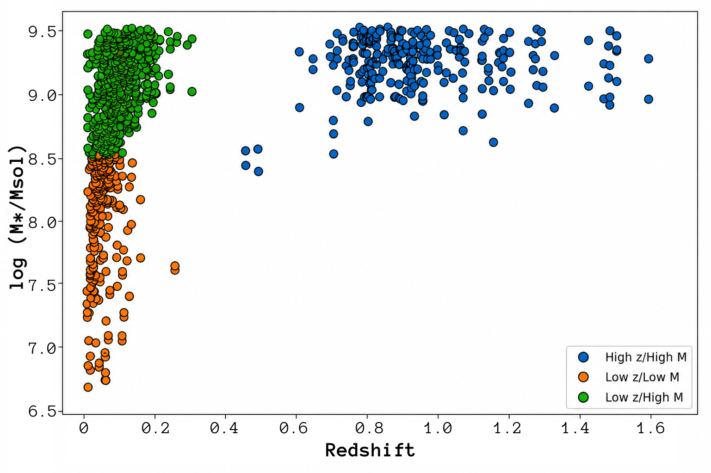
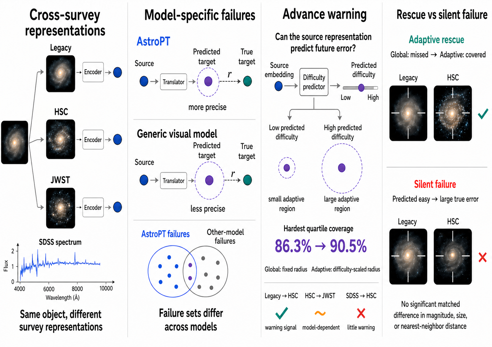
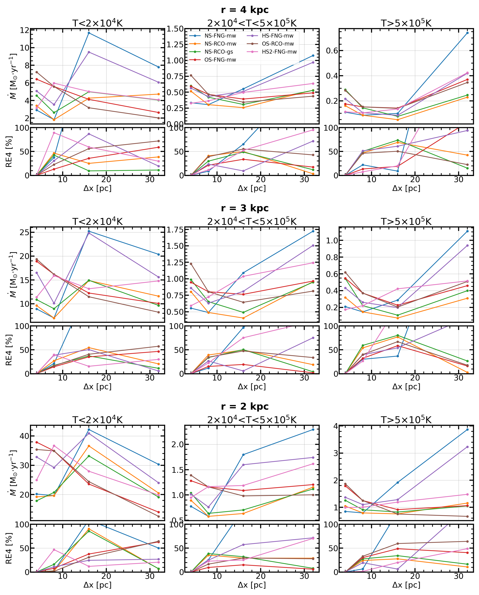
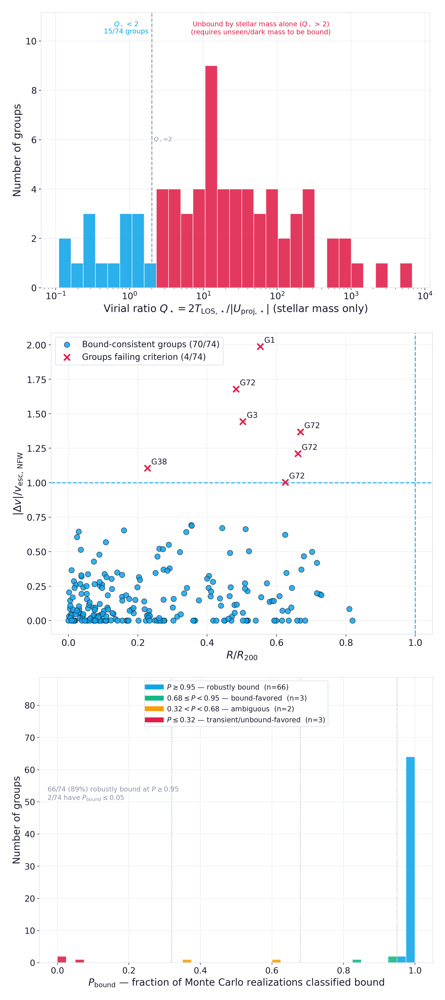
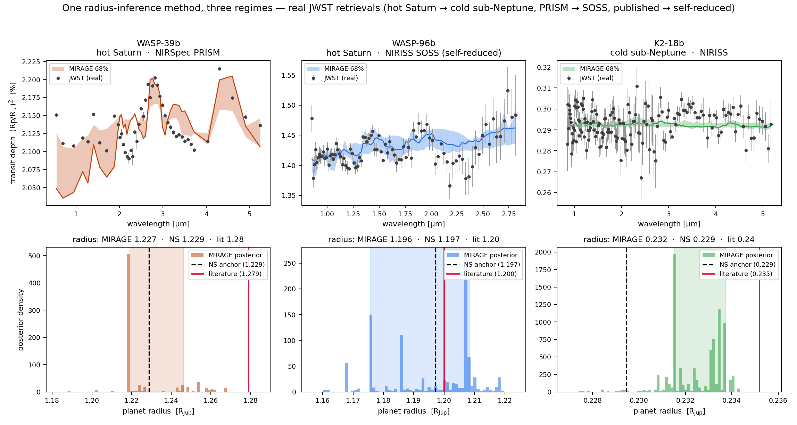

# arXiv Digest — 2026-10-05

- **Interest file used:** interests/2026.10.md (current month)
- **Categories pulled:** astro-ph.CO, astro-ph.EP, astro-ph.GA, astro-ph.HE, astro-ph.IM, astro-ph.SR, cs.LG, stat.ML, physics.data-an, hep-ph
- **Papers scanned:** 372 unique (90 raw / 66 unique astro-ph across the six sub-categories, deduplicated against 306 unique from cs.LG 297 + stat.ML 31 + physics.data-an 6 + hep-ph 28)
- **After first filter:** 25 candidates reviewed with full text
- **Final selected:** 20 papers across 4 tiers

---

## Tier 1 — Highly relevant

### [DESI Interacting Dwarfs Survey: Multiple Evolutionary Channels of Dwarf Galaxies Driven by Major Dwarf Interactions](http://arxiv.org/abs/2610.02583v1)

Marko Mićić, Sugata Kaviraj
**Primary category:** astro-ph.GA

Using DESI Early Data Release spectroscopy, the authors construct the **largest sample to date of dwarf-dwarf galaxy pairs (1192 pairs, 72 groups; 461 major-mass-ratio pairs used)**, an order of magnitude larger than prior catalogs. Tracking star formation rate and five rest-frame colors against separation, mass, redshift, and tidal environment, they show dwarf-dwarf interactions follow **multiple distinct evolutionary channels rather than one universal pathway** — from dust-obscured compact starbursts at the smallest separations under isolation, to abrupt quenching under strong tides, to a gas-stripping-then-reaccretion sequence at high mass and high redshift. The low-mass compact dusty cores are linked to progenitors of blue compact dwarfs.

*Distribution of the ~460 major dwarf-dwarf interacting pairs in stellar-mass vs. redshift space, with the three analysis subsets marked in different colors, illustrating the unprecedented parameter-space coverage of the DESI sample.*

---

### [Do Astronomical Foundation Models Know When They Will Fail?](http://arxiv.org/abs/2610.02613v1)

Vaidehi Bulusu, Mehul Goyal, Md Rabius Sany Apu et al.
**Primary category:** astro-ph.IM

The authors build a conformal-prediction framework to audit whether astronomical foundation-model embeddings of the same galaxy stay consistent when transferred across surveys (Legacy↔HSC, HSC↔JWST, SDSS↔HSC), comparing the astronomy-specific **AstroPT** embedding against general-purpose vision backbones (DINOv2, ConvNeXt, I-JEPA, ViT). AstroPT gives **consistently lower cross-survey translation residuals and tighter conformal regions** than generic backbones, and an adaptive conformal scheme shows the source embedding **can sometimes warn of its own future translation failure** (Spearman ρ up to 0.42), though this signal vanishes for some survey pairs. A matched-control analysis further reveals "silent failures" — large representation shifts not explained by magnitude, size, or density — suggesting embedding failure is itself worth direct observational follow-up.

*Overview of the cross-survey representation audit: different foundation-model families transfer with different precision and fail on different objects, and adaptive conformal prediction tests whether the source embedding already signals which galaxies will be hard to transfer.*

---

### [Toward Resolution Convergence for Star Formation and Galactic Winds in Galaxy Simulations](http://arxiv.org/abs/2609.34336v1)

Xue-Fu Li, Weishan Zhu, Tian-Rui Wang et al.
**Primary category:** astro-ph.GA | also: astro-ph.SR

Running 3D hydrodynamic simulations of an M82-like low-mass starburst galaxy at 4–32 pc resolution, the authors introduce revised sub-grid prescriptions — a **fixed ~20 pc GMC-scale sink accretion volume with density-dependent star-formation efficiency**, and a **supernova feedback radius anchored to the physical cooling radius** — to curb numerical-resolution dependence of feedback-driven baryonic processes. These upgrades bring stellar-mass and kinetic-energy variation down to **~20% across the full resolution range**, and cut cool-phase mass-outflow-rate and X-ray luminosity errors to **below ~40%**, versus over 100% for the outflow rate previously; warm/hot wind phases remain comparatively less converged.

*Maximum mass outflow rates and their convergence errors across 4–32 pc resolution for the cool, warm, and hot outflow phases, showing the cool-phase rate converging to well under 40% error under the revised model.*

---

### [Baryonic Imprints on DM Halos: the concentration-mass relation and its dependence on 28 model parameters in the CAMELS suite](http://arxiv.org/abs/2610.03544v1)

Cami Delgado, Dhayaa Anbajagane
**Primary category:** astro-ph.CO | also: astro-ph.GA

Using **2048 IllustrisTNG CAMELS simulations**, the authors measure how the halo **concentration–mass relation** depends on 5 cosmological and 23 astrophysical (SNe + AGN feedback) parameters across $M_{\rm vir}\in[10^{11},10^{14.5}]\,M_\odot/h$, a 4–6x larger parameter set than the prior state of the art. Cosmology dominates at low (dwarf-scale) mass, SNe feedback dominates near Milky-Way mass, and AGN feedback dominates at group/cluster scales, with clear **non-linear SNe–AGN coupling**. The 23 astrophysical slopes compress into a **three-component PCA basis capturing ~95% of the variance**, enabling fast marginalization over baryonic uncertainty without tracking all parameters individually.

*Slopes of halo concentration with respect to all 28 CAMELS parameters as a function of halo mass, grouped by cosmology/SNe/AGN category — showing which processes dominate concentration at which mass scales.*

---

### [The Largest Catalog of Dwarf Galaxy Groups: Transient Structures or Building Blocks of the Universe?](http://arxiv.org/abs/2610.02587v1)

Marko Mićić
**Primary category:** astro-ph.GA

Using DESI Early Data Release spectroscopy, the author identifies **74 isolated dwarf galaxy groups (238 galaxies)** — the largest such catalog to date. Stellar mass alone fails to gravitationally bind most systems (only 15/74 pass a stellar virial test), but after assigning NFW dark-matter halos and propagating uncertainty via **5000 Monte Carlo realizations**, **69 of 74 systems (93%) are bound-favored**, with 66 (89%) at ≥95% confidence. Dynamical-friction estimates show these bound systems would merge within a Hubble time, suggesting they are active sites of low-mass hierarchical assembly rather than chance alignments.

*Three successive boundedness tests — stellar-mass-only virial ratio, velocity offset vs. NFW escape velocity, and Monte Carlo bound probability — showing that including dark matter flips the verdict from mostly unbound to mostly robustly bound.*

---

### [Super-resolving Polarized Dust Emission with Transformer-Based Multi-Tracer Fusion](http://arxiv.org/abs/2610.02575v1)

Minjie Lei, George Halal, S. E. Clark et al.
**Primary category:** astro-ph.GA

The authors build a hybrid CNN+**transformer super-resolution model ("dust ViT")** that fuses five tracer channels — Planck dust optical depth, HI polarization templates, and coarse Planck GNILC Q/U maps — via self-attention to deconvolve polarized dust emission to **20 arcmin resolution over the full high-latitude sky**, far beyond the ~1° limit of prior constraints. The predicted maps are **more coherent, anisotropic, and filamentary than the latest PySM d10 dust model**, and attention-map interpretability shows HI templates supply most of the filamentary structure and that the model behaves in a roughly scale-invariant way — establishing learned deconvolution as an alternative to statistic-matched dust simulation for CMB foreground work.

*Schematic of the dust ViT architecture: convolutional encoders map five tracer channels into feature maps, a transformer self-attention module fuses them, and a decoder outputs the high-resolution Q/U predictions.*

---

### [Point spread function requirements for dark matter subhalo detection with the Habitable Worlds Observatory](http://arxiv.org/abs/2610.02315v1)

Georgios N. Vassilakis, Susan F. Redmond, Jason D. Rhodes et al.
**Primary category:** astro-ph.CO | also: astro-ph.IM

Simulating strong-lensing exposures for HWO's planned High Resolution Imager, the authors forecast sensitivity to **dark-matter subhaloes below ~10⁸ M☉** via Fisher forecasts validated against fits across 965 simulated lens systems. Pre-selecting the best lenses by arc S/N lowers the median detectable subhalo mass by roughly an order of magnitude, to **6.6×10⁷ M☉** for the top 50. Sensitivity is fairly robust to physical PSF degradation, but **PSF *knowledge* error tolerance is tight — a median of just 5 nm RMS wavefront mismatch** before detectable sensitive area is lost, underscoring how essential accurate PSF characterization will be for an HWO subhalo program following up Euclid/Roman-discovered lenses.

*Fisher-forecast subhalo mass thresholds for the 12 highest-ranked lens systems as a function of RMS wavefront error, showing that correctly-modeled PSF degradation raises detection thresholds only modestly.*

---

## Tier 2 — Adjacent / useful context

### [A Missing Latent, Not a Missing Simulator: Radius-Augmented Inference for Real JWST Retrieval](http://arxiv.org/abs/2610.02245v1)

Angshuman Chakravertty, P V V Raj
**Primary category:** astro-ph.IM | also: astro-ph.EP

Diagnosing why an amortized simulation-based-inference retriever trained on radiative-transfer simulations collapses on real JWST transmission spectra (WASP-39b), the authors rule out forward-model fidelity fixes and instead find the culprit is a **missing latent (planet radius) rather than simulator misspecification**. Adding radius to the inferred parameters and calibrating against nested sampling (**MIRAGE**) drops WASP-39b's $\chi^2/N$ from 301 to 0.06 and raises coverage from 2/7 to 7/7, and the same unchanged method transfers across three real JWST targets and two instruments — a cautionary, generalizable lesson for any simulation-based-inference pipeline.

*The same radius-augmented, calibrated MIRAGE posterior applied unchanged to three real JWST targets, with recovered planet-radius posteriors matching the nested-sampling anchor and literature values in each case.*

---

### [Learning Approximate Isometric Embeddings for Efficient Template Placement](http://arxiv.org/abs/2610.02448v1)

Alexandra Wernersson, Jessica Irwin, Melissa Lopez et al.
**Primary category:** astro-ph.IM | also: astro-ph.HE

The authors train a normalizing flow (**isobank**) with a multi-scale distance-matching loss so that Euclidean distances in its latent space approximate the true metric on a curved gravitational-wave waveform manifold, turning expensive metric-based template placement into simple nearest-neighbor queries. On a challenging 5D eccentric-binary space, isobank reaches **96.6% coverage using 23% fewer templates** than the state-of-the-art stochastic placement code — the first use of a normalizing flow to learn an **approximately isometric coordinate map** rather than for density sampling.

*Cumulative distribution of fitting factors for isobank vs. the state-of-the-art code across two parameter spaces, with isobank's curve showing higher coverage with fewer templates in the harder eccentric case.*

---

### [Shining LIMelight into the dark: Probing Dark matter - baryon interactions with Line Intensity Mapping](http://arxiv.org/abs/2610.02311v1)

Durba Ghosh, Ranjini Mondol, Ranjan Laha
**Primary category:** hep-ph

The authors present the first forecast of **line intensity mapping** as a probe of dark matter–baryon elastic scattering, using upcoming COMAP CO surveys to constrain how momentum-transfer cross sections suppress small-scale structure and halo abundance. The voxel intensity distribution statistic alone **outperforms the power spectrum by roughly two orders of magnitude**, and the combined forecast **improves on the strongest existing bounds by factors of up to 4.66** for sub-GeV dark matter — establishing LIM as a new, complementary route to the same small-scale-structure/halo-counting regime that dwarf galaxy surveys probe.

*Projected upper limits on dark matter–proton scattering cross sections from COMAP compared against existing CMB, Milky-Way-satellite, Lyman-α, and JWST UVLF constraints, with LIM's voxel-intensity analysis surpassing all current bounds at sub-GeV masses.*

---

### [Counterfactual Predictions in Scientific Emulators Without Controlled Experiments](http://arxiv.org/abs/2610.02252v1)

Dingling Yao, Kahaan Gandhi, Valentin Duruisseaux et al.
**Primary category:** cs.LG | also: stat.ML

The authors introduce **ReRoute**, a framework for making reliable counterfactual predictions from pretrained scientific emulators when training data contain only correlated drivers and no intervention data exist, backed by a **Lean-verified causal identification proof**. Applied to the ACE2 climate emulator under severe distribution shift, ReRoute **cuts aggregate error by 18–32%** while preserving skill under normal conditions, and on real reanalysis data it restores physically-expected warming signal that a naive counterfactual query would otherwise erase — a directly transferable recipe for trustworthy what-if queries on any trained scientific emulator, including simulation-calibration problems in astrophysics.

*Mean per-realization climate emulator error for the baseline vs. ReRoute across standard, mild-shift, and severe distribution-shift scenarios, showing ReRoute's advantage growing to a 31.8% error reduction under the most severe shift.*

---

## Tier 3 — Outside my area but notable

### [Do ResNets Route? Sparse Interaction Experts in Residual Networks](http://arxiv.org/abs/2610.02907v1)

Liang Yan, Siying Chen, Kaijie Chen et al.
**Primary category:** cs.LG

Treating a trained ResNet as a set function over binary residual-branch masks, the authors apply **Boolean Möbius inversion** to exactly decompose its output into individual corrections and all higher-order interactions between blocks — reconstructing logits to numerical precision where naive mask-averaging fails outright. On ImageNet ResNets, **interaction "mass" peaks at orders 5 and 10** (not at low orders, meaning short structural paths don't imply simple interactions), and a small subset of "implicit residual experts" dominates each prediction and varies systematically by input/class — evidence of **"implicit soft routing" emerging with no explicit router at all**.

*Schematic showing how a densely-executed ResNet is reinterpreted via Möbius inversion as an exact sum of interaction coefficients across residual-branch subsets, illustrating the paper's "implicit soft routing" concept.*

---

### [Operator-informed initialization for Fourier features physics-informed neural networks](http://arxiv.org/abs/2610.03378v1)

Juan Molina, Paris Perdikaris, Mircea Petrache et al.
**Primary category:** cs.LG

Working in the Neural Tangent Kernel regime, the authors derive a frequency-domain evolution equation showing PINN convergence at each frequency is governed by the product of the **PDE operator's Fourier symbol** and the spectral density of the initialization weights — frequencies where the symbol vanishes converge slowest, driving spectral bias. Their proposed **operator-informed initialization**, which concentrates sampled frequencies near the low-symbol regions, **consistently reduces frequency bias, speeds convergence, and improves accuracy** across eight benchmark PDEs at no extra training cost, with the largest gains on transport/wave/Helmholtz equations.

*Frequency-domain error dynamics for the 2D Helmholtz and 1D transport equations, showing the largest residual errors persist exactly where the PDE's Fourier symbol is small — the empirical basis for the operator-informed initialization.*

---

### [The AI Theorist reveals excitonic structure in α-RuCl3](http://arxiv.org/abs/2610.02417v1)

Hongjian Zhou, Xianfan Nie, Sean Wu et al.
**Primary category:** cs.LG | also: cond-mat.mtrl-sci

**AI Theorist**, a multi-agent LLM system (hypothesis, calculation-design, execution, and critique agents), autonomously designs and runs first-principles calculations to build microscopic physical models from data rather than just fitting equations to it. Applied to unpublished spectra of α-RuCl₃, it independently developed a model attributing the material's optical features to **three distinct bound excitonic states with contrasting polarization selection rules**, corroborated by an independent human theorist — presented as the first case of an AI system autonomously connecting unpublished measurements to a validated, predictive physical model, the kind of genuinely hypothesis-generating agentic science this researcher tracks.

*Architecture and workflow of AI Theorist: human scientists set research direction while the system iterates through hypothesis generation, calculation design, execution, and critique, applied here to the α-RuCl₃ excitonic-structure problem.*

---

### [S²-PINN: Stochastic Separable Physics-Informed Neural Networks](http://arxiv.org/abs/2610.03303v1)

Zhendong Li, Akwum Onwunta
**Primary category:** cs.LG | also: math-ph

The authors propose **S²-PINN**, which represents the solution of a random PDE as a low-rank tensor coupling a spatial dictionary, Fourier temporal features, and a polynomial-chaos stochastic basis, with a theoretical guarantee that its mini-batch residual estimator needs only $O(\log G)$ samples to control error across $G$ stochastic modes. Across nine baselines and multiple random-PDE benchmarks, S²-PINN **matches or beats mean/variance accuracy and calibration using ~28x fewer parameters** than a vanilla PINN — a direct, dual hit on both the **physics-informed** and **uncertainty quantification** themes this researcher tracks, albeit outside astrophysics.

*S²-PINN architecture: spatial, temporal, and stochastic branches coupled through a low-rank tensor core, trained with a hybrid PDE-residual and stochastic-projection loss that decouples spatial cost from the size of the stochastic basis.*

---

### [S2S-JEPA: Predicting the Predictable at Subseasonal-to-Seasonal Timescales](http://arxiv.org/abs/2610.03106v1)

Chenyu Dong, Gianmarco Mengaldo
**Primary category:** physics.ao-ph | also: cs.AI, cs.LG

The authors adapt the **Joint-Embedding Predictive Architecture (JEPA)** — a self-supervised representation-learning paradigm from computer vision — to subseasonal-to-seasonal weather forecasting, training an encoder-predictor to forecast only the **latent representation** of future weekly states rather than reconstructing fine-grained fields argued to be fundamentally unpredictable at this horizon. Benchmarked against the operational 101-member ECMWF ensemble, **S2S-JEPA matches or significantly exceeds ECMWF's skill by weeks 5–6**, running on a single GPU versus a dedicated ensemble supercomputer — a striking demonstration of the embedding/contrastive-style architecture this researcher tracks, transplanted well outside its native computer-vision domain.

*Schematic of S2S-JEPA's two-stage training: one-step latent prediction from an EMA target encoder, extended to autoregressive six-week latent rollouts — the architectural core of the latent-space forecasting approach.*

---

### [Extending the Pulsar radio population through Quantum Vacuum Cherenkov Emission](http://arxiv.org/abs/2610.02429v1)

Tales A. O. Gomes, Sergei V. Bulanov, Jaziel G. Coelho et al.
**Primary category:** astro-ph.HE

The authors propose that **quantum vacuum Cherenkov emission**, a strong-field QED effect, provides an extra electron-positron pair-production channel in pulsar polar-cap gaps that remains efficient even where the standard curvature-radiation and inverse-Compton mechanisms shut off. The resulting death lines **extend well beyond the classical death valley**, offering a physical mechanism for continued coherent radio emission in long-period pulsars previously thought radio-dead, with a predicted gamma-ray signature **testable by SKA/ngVLA**.

*P–Ṗ diagram showing observed pulsars against the classical death valleys, with the new quantum-vacuum-Cherenkov death line extending the theoretically viable region for radio emission into previously "dead" parameter space.*

---

## Tier 4 — Meta-research about the field

### [Comment on: "The Preprint Evolution: The Rise of Unreviewed Drafts on arXiv and its Implications for Astronomy"](http://arxiv.org/abs/2610.02273v1)

Noam Soker
**Primary category:** astro-ph.IM

Soker rebuts a proposal to split arXiv astro-ph into a peer-reviewed stream and an unreviewed "discussion draft" stream, calling it a **"slippery slope"** toward narrower gatekeeping by journal impact factor that would threaten open scientific discussion, since preprinting lets the wider community catch errors beyond a single referee. He proposes the opposite: that refereed journals **require arXiv posting for at least a week before final acceptance**, making arXiv a central, not peripheral, part of the publication process.

---

### [BootLoops: an LLM-driven toolkit for exact quantitative science](http://arxiv.org/abs/2610.02286v1)

Matthew D. Schwartz
**Primary category:** hep-ph

Schwartz presents **BootLoops**, an LLM-operated toolkit — built almost entirely by an AI coding agent — that pools exact computational methods from particle physics and numerical analysis (integral-reduction bootstrap methods, exact Bayesian evidence, rigorous ball arithmetic) and lets an agentic LLM cross-apply them to unrelated fields like genomics, ecology, and regulatory statistics. The core thesis is that an **LLM's cross-field breadth lets it connect a known method in one discipline to an unsolved problem in a distant one** that few human specialists would ever think to connect, with every numeric result produced and checked by deterministic code rather than model judgment — a direct data point on how agentic AI is starting to change the practice of research itself.
