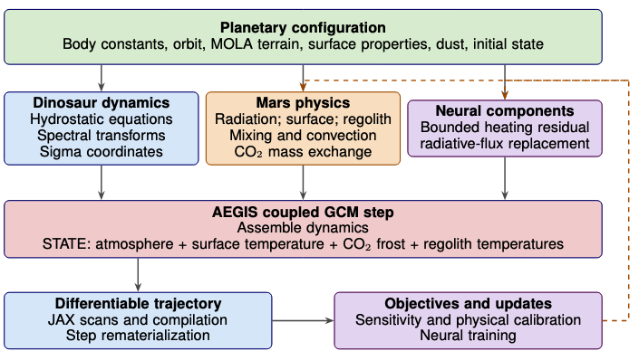

# arXiv Digest — 2026-10-06

- **Interest file used:** interests/2026.10.md (current month)
- **Categories pulled:** astro-ph.CO, astro-ph.EP, astro-ph.GA, astro-ph.HE, astro-ph.IM, astro-ph.SR, cs.LG, stat.ML, physics.data-an, hep-ph
- **Papers scanned:** 830 (129 astro-ph new/cross + 701 from extras)
- **After first filter:** 33 candidates reviewed with full text
- **Final selected:** 18 papers across 4 tiers

---

## Tier 1 — Highly relevant

### [Shared Geometry Is Not Shared Physics: A Layerwise Test of the Platonic Representation Hypothesis in Astronomy](http://arxiv.org/abs/2610.04130v1)

Kshitij Duraphe, Aravind Kannappan, Dun Li Chan et al.
**Primary category:** astro-ph.IM | also: cs.LG

Tests whether 36 pretrained vision/vision-language foundation models (AstroPT, CLIP, DINO, DINOv3, ViT, LLaVA, PaliGemma, etc.) that show geometrically aligned representations across cross-matched HSC, DESI, Legacy Survey, JWST, and COSMOS-Web observations also encode a survey-invariant physical encoding. All 139 model-survey comparisons show significant local-neighborhood alignment at some network depth, but **alignment does not increase monotonically with depth**, and a layer chosen purely by cross-survey geometric alignment underperforms a label-selected layer in every image-transfer test (R^2 loss up to 3.62). Most strikingly, every aligned HSC-COSMOS-Web model pair has **positive within-survey redshift R^2 (mean 0.50) but negative cross-survey R^2 (mean -2.98)** — models can recover a shared geometry among galaxies without recovering a transferable physical predictor.

*Shows that choosing a network layer by cross-survey geometric alignment loses accuracy versus choosing by the physical label itself, and that aligned final-layer HSC-COSMOS-Web representations still give negative R^2 when transferring a redshift predictor across surveys even though within-survey prediction works well — geometric alignment does not imply a survey-invariant physical encoding.*

---

### [Tracing the evolution of galaxy environments with manifold learning](http://arxiv.org/abs/2610.03850v1)

Ana Sofía M. Uzsoy, Claire Lamman, Peixin Zhu et al.
**Primary category:** astro-ph.IM

Introduces SONDE, an Isomap/MDS-based manifold-learning embedding of a galaxy's local neighborhood geometry, plus a method to project different simulation snapshots into the same embedding space for cross-redshift comparison. Applied to the TNG100 simulation at z=0-5, the **first embedding dimension outperforms the standard neighbor-count density metric** at predicting halo mass, central/satellite status, and quenching (e.g., halo-mass R^2 of 0.76 vs 0.57), and the top three dimensions **match the information content of a ten-bin radial density profile**. Star formation rate, in contrast, is essentially unpredictable from environment alone (R^2 ~0.04), suggesting SFR is set largely by internal rather than environmental properties.

*Shows that SONDE's low-dimensional neighborhood embedding correlates strongly with galaxies' quenched fraction, star formation rate, halo mass, and satellite fraction across the TNG100 snapshots from z=5 to z=0, demonstrating that the embedding dimensions track real, evolving physical properties rather than being purely descriptive geometry.*

---

### [Stellar parameters and abundances for 3.2 million DESI DR1 spectra using machine learning](http://arxiv.org/abs/2610.04294v1)

Nagaraj Vernekar, Michael Hayden, Sara Lucatello
**Primary category:** astro-ph.SR | also: astro-ph.GA

Presents a Payne-style neural-network pipeline trained on ~370,000 synthetic FGK spectra that fits directly to the **flux-calibrated, un-normalized spectral energy distribution** of each DESI spectrum, rather than to a continuum-normalized spectrum as DESI's official pipeline does. Validated against 6,719 APOGEE and 3,455 GALAH stars, the method recovers **T_eff and log g with smaller systematic offsets** than DESI's official Stellar Parameter pipeline and matches or exceeds it on 12 elemental abundances, while additionally reporting four abundances (Mn, V, Ba, Y) the official pipeline does not provide. The pipeline is applied to deliver a public catalogue of stellar parameters and abundances for **3.2 million DESI DR1 stars**.

---

### [The Merian Survey: A Statistical Census of Bright Satellites of Sub-Milky Way-Mass Galaxies](http://arxiv.org/abs/2610.03981v1)

Lucas S. Mandacarú Guerra, Jiaxuan Li, Yue Pan et al.
**Primary category:** astro-ph.GA

Uses the Merian Survey's medium-band imaging (isolating Hα and [OIII] at 0.07<z<0.09) to build the first statistical census of bright, star-forming satellite galaxies around **357 sub-Milky-Way-mass hosts (10^9.5-10^10.5 Msun)**, a host-mass regime previously sparsely sampled between dwarf and MW-mass satellite surveys. After statistically subtracting foreground/background contamination, they identify **148±7 satellites down to M*~10^7.5 Msun**, with ~60% of hosts having fewer than one massive satellite; satellite abundance rises with host stellar mass, extending the dwarf-to-MW trend and broadly matching TNG50 predictions. The radial distribution of satellites around these lower-mass hosts is statistically similar to that around MW-mass hosts.

*Shows the background-subtracted distribution of satellite counts per sub-Milky-Way-mass host, with most hosts having zero-to-one bright satellite and a declining tail toward richer systems, benchmarked against the Milky-Way-mass satellite census of Pan et al. 2026.*

---

## Tier 2 — Adjacent / useful context

### [Baryonic Imprints on DM Halos: characterizing the full concentration-mass probability distribution with CAMELS](http://arxiv.org/abs/2610.03946v1)

Elisa J. Gao, Dhayaa Anbajagane
**Primary category:** astro-ph.CO | also: astro-ph.GA

Uses normalizing flows trained on 1000 CAMELS IllustrisTNG simulations to model the full halo concentration-mass probability distribution — not just its mean — as a function of halo mass, redshift, and six cosmological/astrophysical parameters, down to Milky-Way and sub-MW halo masses (10^11-10^14.5 Msun/h). The **scatter in concentration shows non-monotonic, baryon-fraction-driven behavior at the Milky Way mass scale**, while the skewness of the distribution is highly sensitive to the baryon fraction but largely insensitive to supernova/AGN feedback parameters. Results from the independent ASTRID galaxy-formation model show qualitatively similar behavior, suggesting the higher-moment signatures are not an artifact of one subgrid-physics implementation.

---

### [Cusps, cores, and one acceleration: dark-matter haloes versus modified dynamics across the full SPARC sample](http://arxiv.org/abs/2610.05871v1)

Mikhael Da Silva
**Primary category:** astro-ph.GA

Fits all 175 SPARC disk galaxies with identical priors and methodology under three models — a free NFW halo, an NFW halo constrained to the ΛCDM concentration-mass relation, and MOND — to directly compare dark-matter and modified-gravity explanations for rotation curves. By the Bayesian information criterion the free halo wins 96 galaxies to MOND's 79, but this advantage **evaporates once the halo is required to follow the ΛCDM concentration-mass relation** (86 to 89), because the fitted halo concentrations sit a median **0.24 dex below the ΛCDM prediction, with 53% of galaxies more than 2σ low** — the core-cusp problem expressed as a population-wide scaling offset. The radial acceleration relation from the full sample gives **a0 = (1.13±0.02)×10^-10 m/s^2** with 0.14 dex scatter, even though the MOND acceleration scale inferred galaxy-by-galaxy spans more than a decade.

*Shows that fitted NFW halo concentrations across the full SPARC sample sit systematically (median -0.24 dex) below the ΛCDM concentration-mass prediction at essentially all halo masses — the core-cusp problem expressed as a population-level scaling-relation offset rather than individual anecdotes.*

---

### [Cross-Modal Solar Image Synthesis: Adapting the Surya Foundation Model from He I 10830 Å to EUV Translation and Coronal Hole Segmentation](http://arxiv.org/abs/2610.04553v1)

Marco Marena, Andrés Muñoz Jaramillo, Qin Li et al.
**Primary category:** astro-ph.SR | also: cs.CV

Adapts the 366M-parameter Surya solar foundation model, via a convolutional input adapter and LoRA backbone updates, to synthesize SDO/AIA 94/193/304 Å EUV images and coronal-hole probability maps from a single ground-based He I 10830 Å observation, aiming to extend EUV-like morphology back before the AIA era. On held-out test data the model achieves **disk-restricted correlation coefficients of 0.82, 0.89, and 0.84** for the three AIA channels and an IoU of 0.44 for coronal holes; a patch-based residual refiner then improves agreement with independent SOHO/EIT references on three historical pre-SDO dates, raising **CC from 0.65 to 0.71** for synthetic AIA 304 Å. The results support using helium-conditioned EUV proxies to reconstruct solar morphology for dates that predate direct EUV imaging.

---

### [AI-assisted super-resolution cosmological simulations V: Cosmology-aware super-resolution](http://arxiv.org/abs/2610.06710v1)

Xiaowen Zhang, Patrick Lachance, Rupert A. C. Croft et al.
**Primary category:** astro-ph.CO

Trains a single cosmology-conditioned GAN that jointly super-resolves displacement and velocity fields of Quijote N-body simulations from 512^3 to 1024^3 particles, conditioned on five ΛCDM parameters. On ten held-out test cosmologies the model reproduces the matter power spectrum to **3.6% mean maximum error** and FoF halo abundances to **within 15%** below 10^14.8 Msun/h, though satellite subhalo abundances and occupation numbers retain larger, mass-dependent biases (occupation suppressed to 30-50% of the true value at cluster scales). A bias correction measured at one fiducial cosmology and applied blindly to the other nine removes most of this shared systematic and reduces parameter shifts in a power-spectrum-based inference test.

---

### [AEGIS: Differentiable Mars Climate Model with Neural Closures](http://arxiv.org/abs/2610.04081v1)

Sameera S Kashyap, Victor Cruz, Angel Yepez et al.
**Primary category:** astro-ph.EP | also: cs.AI

Introduces AEGIS, a fully differentiable Mars general circulation model built on the Dinosaur spectral dynamical core (shared with NeuralGCM), coupling Mars-specific radiation, surface, and CO2 frost physics with an interface for neural closures, in contrast to existing Mars GCMs written in non-differentiable legacy Fortran. The model runs **stable ten-Mars-year simulations** that conserve the CO2 inventory, reproduce the seasonal CO2 cycle, and match MOLA surface-pressure/topography structure, with gradients through the coupled trajectory verified against finite differences. This gives the Mars-atmosphere community a gradient-based tool for physical calibration and machine-learning parameterization that existing GCMs cannot provide.

*Diagrams how AEGIS couples the differentiable Dinosaur dynamical core with Mars-specific physics operators (radiation, surface, frost) and optional neural closures, with gradients flowing back through the full coupled trajectory to support physical calibration and neural training.*

---

### [Fast and Differentiable MHD Surrogate for Solar Wind using Neural Operator](http://arxiv.org/abs/2610.05657v1)

Prateek Mayank, Enrico Camporeale, Thomas E. Berger et al.
**Primary category:** astro-ph.SR | also: physics.space-ph

Presents SNOW, a differentiable neural-operator surrogate for global MHD solar-wind simulations that combines a rotational ballistic approximation with a spherical-harmonic neural operator to autoregressively propagate all eight MHD variables from 20 to 240 solar radii. Trained on AWSoM simulations spanning a solar cycle, SNOW **remains stable across full rollouts** and reproduces fast/slow wind streams, magnetic polarity sectors, and field-line connectivity, while keeping magnetic-divergence diagnostics comparable to the reference MHD solution. The full 3D solution is generated in **under one second on a single GPU**, versus the much higher cost of the underlying MHD solver, while retaining differentiability for future calibration or data-assimilation use.

---

### [Learning Astrophysical Uncertainties in Dark Matter Direct Detection with Simulation-Based Inference](http://arxiv.org/abs/2610.06159v1)

Felix Kahlhoefer, Niklas Reus
**Primary category:** hep-ph | also: hep-ex

Applies neural ratio estimation (NRE), a simulation-based-inference technique, to WIMP direct detection with a realistic XENONnT detector simulation, training a classifier to approximate the likelihood ratio for WIMP mass and spin-independent coupling. By including multiple halo models directly in the training data, **astrophysical (dark-matter halo) uncertainties are marginalized implicitly at no extra inference cost**, and even under extreme ±5σ Standard Halo Model misspecification the method recovers well-calibrated posteriors. The resulting exclusion limit is quantitatively consistent with the official XENONnT sensitivity, establishing NRE as a scalable alternative to profile-likelihood methods for folding in astrophysical nuisance parameters as experiments probe deeper into the neutrino fog.

---

### [When Are Concept Bottleneck Model Explanations Faithful and Compact?](http://arxiv.org/abs/2610.06285v1)

Stefano Teso, Emanuele Marconato, Steve Azzolin et al.
**Primary category:** cs.LG | also: stat.ML

Shows formally that for widespread concept bottleneck model (CBM) architectures, including recent vision-language-model-based variants, a **faithful explanation must include every concept in the bottleneck** — compact explanations are necessarily unfaithful once the bottleneck is large, a result that holds for both heuristic and faithful-by-construction formal explanations. To recover compact faithful explanations in practice, the authors propose modeling concepts as **probabilistic binary/categorical variables rather than logits** and applying per-concept **group-lasso sparsification** during training rather than standard elastic-net regularization, and extend formal-explainability algorithms to CBMs that outperform natural heuristics on both guarantee strength and explanation size. The work is a direct warning against taking a CBM's apparent interpretability at face value.

---

### [ConEx: Human-Interpretable Saliency Maps via Concept-Aware Attribution](http://arxiv.org/abs/2610.04605v1)

Yehonatan Elisha, Oren Barkan, Ziv Weiss Haddad et al.
**Primary category:** cs.CV | also: cs.LG

Introduces ConEx, a framework that bridges pixel-level saliency maps with concept-based reasoning by automatically discovering class-specific concept activation vectors (CAVs) without manual supervision, using an architecture-specific masking mechanism to reduce segmentation-mask noise and improve concept purity. ConEx generates saliency maps that show both where each concept appears in an image and how much it contributes to the prediction, and the authors introduce two new metrics (Vector-Concept Match and Concept-Class Match) to quantify how well learned concepts align with ground truth. Across multiple benchmarks ConEx achieves **state-of-the-art faithfulness, segmentation, and concept-quality scores** relative to existing concept-based and saliency explanation methods.

---

### [Latent Score-Based Bayesian Cramér-Rao Bound Estimation for High-Dimensional Imaging Systems](http://arxiv.org/abs/2610.03956v1)

Evan Scope Crafts, Thomas Wynn, Seonyeong Park et al.
**Primary category:** stat.ML | also: cs.LG

Proposes a data-driven method for estimating the Bayesian Cramér-Rao bound (a fundamental uncertainty-quantification limit) in high-dimensional imaging inverse problems with complex, non-Gaussian priors, by reformulating the problem in the latent space of a pretrained autoencoder and mapping the resulting bound back to image space via a change-of-variables. The latent prior score is learned with a new **"Bochner-space sliced score matching"** objective that penalizes errors in the score's spatial gradients, suppressing high-frequency artifacts that otherwise corrupt bound estimates. Validated on a quantitative photoacoustic tomography problem with **over one million unknown parameters** using a Stable-Diffusion-derived foundation autoencoder, the method yields stable, artifact-free uncertainty bounds that reveal how strongly the learned prior affects different imaging-system design choices.

---

## Tier 3 — Outside my area but notable

### [Stars Would Remember a Recent Gravitational Transition: Testing G-step Resolutions of the Hubble Tension with Red Dwarfs](http://arxiv.org/abs/2610.04048v1)

Jeremy Sakstein, Harry Desmond
**Primary category:** astro-ph.CO | also: astro-ph.SR

Tests the "G-step" proposal — that Newton's gravitational constant jumped by ~4-11% some 73-130 Myr ago to resolve the Hubble tension — using the fact that fully convective red dwarfs below ~0.35 Msun have thermal (Kelvin-Helmholtz) relaxation timescales comparable to that look-back time, so they would retain a measurable radius "memory" of the transition. Comparing numerical stellar-evolution simulations under a G-step against mass-radius measurements of **eight red dwarfs in detached eclipsing binaries**, the authors find the two G-step scenarios proposed in the literature are **excluded at 3.1σ and 4.0σ**, respectively. It is a clean, independent falsification of a cosmological fix using ordinary stellar astrophysics rather than cosmological data.

---

### [APOD: reasoning-guided agentic population ordinary differential equation discovery for pharmacological digital twins](http://arxiv.org/abs/2610.06227v1)

Romain Ferrara, Martin Soucail, Victor Gertner et al.
**Primary category:** q-bio.QM | also: cs.AI

Introduces APOD, a reasoning-guided LLM agent that discovers population-level ODE models (a shared mechanistic structure plus between-subject variability) for pharmacological "digital twins" directly from sparse, noisy clinical data, iterating over fit diagnostics and biological plausibility rather than searching a fixed model library. On synthetic pharmacokinetic and tumor-dynamics benchmarks APOD **recovers the true generating ODE structure in 94-100% of runs**, 4.5-24x faster than an established library-based search tool; on real cohorts it converges to clinically sensible models and, with no existing mechanistic precedent, proposes a population digital twin of **radioligand-therapy-induced platelet dynamics that forecasts thrombocytopenia from first-cycle data** and simulates safer alternative dosing schedules.

*Shows APOD's closed loop in which a reflexion LLM agent proposes candidate population-ODE structures, a Monolix estimation engine fits them to data, and an evaluation agent critiques goodness of fit, parameter identifiability, and plausibility before deciding whether to iterate or return the final model.*

---

### [AgentDiscover: Autonomous Discovery with Minimal Search Scaffolding](http://arxiv.org/abs/2610.05334v1)

Mahdi Farahbakhsh, Ilan Sela, Fatemeh Doudi et al.
**Primary category:** cs.AI | also: cs.LG

Argues that hand-designed search algorithms (MAP-Elites, MCTS) are themselves the kind of fixed structure that general learning approaches eventually outscale, and introduces AgentDiscover, a coding agent that plans its own open-ended search using a shared database of past attempts as long-term memory, reducing classical search heuristics to database queries the agent can use, combine, or replace. Across kernel engineering, biology, algorithm design, and mathematics tasks, AgentDiscover is **more cost-efficient than prior discovery frameworks** while reaching better scores, and its programs **would have placed first among human competitors in seven past AtCoder heuristic contests** and improved the best published bound on the first autocorrelation inequality. The result is offered as evidence that letting an LLM agent own its search strategy can outperform an algorithm a human designs in advance.

---

## Tier 4 — Meta-research about the field

### [AI Agents as a Research Team: A Human-Supervised Case Study in Stellar Spectroscopy](http://arxiv.org/abs/2610.05424v1)

Marwan Gebran, Ian Bentley
**Primary category:** astro-ph.SR | also: astro-ph.IM

Presents a qualitative case study of a human-supervised team of specialized AI agents (orchestration, numerical implementation, data curation, spectroscopy critique, literature search, and manuscript editing, built on Grok) collaborating on a real stellar-spectroscopy project: extending CondGen, a deterministic label-to-spectrum network, to five individual elemental abundances. The agent team reports a baseline **mean absolute error of 0.0037 in continuum-normalized flux** across 21,657 synthetic test spectra, produces diagnostics showing error depends on effective temperature and abundance, and flags a **non-monotonic cool-star magnesium response** that the authors say still needs a dedicated SYNSPEC abundance sweep to confirm as physical rather than a model artifact. The authors are explicit that no human-team control was run, so the reported under-a-week turnaround cannot be read as a demonstrated productivity gain — the paper's value is as a documented illustration of agentic task delegation, critique, and correction under human supervision in a live research pipeline.
