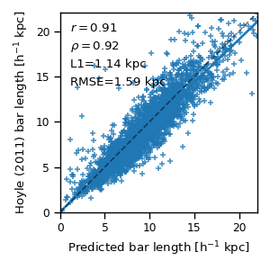
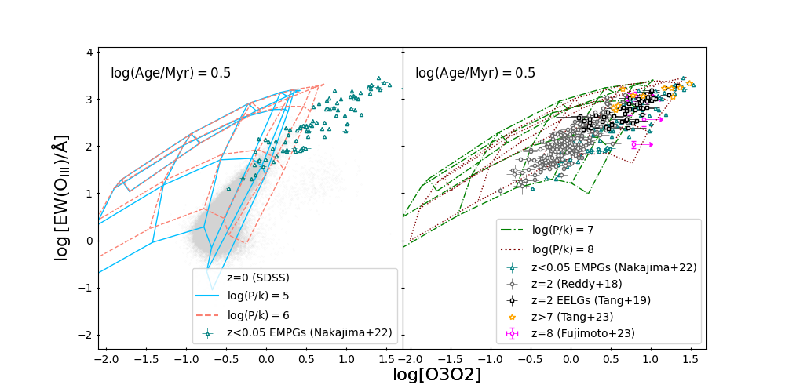
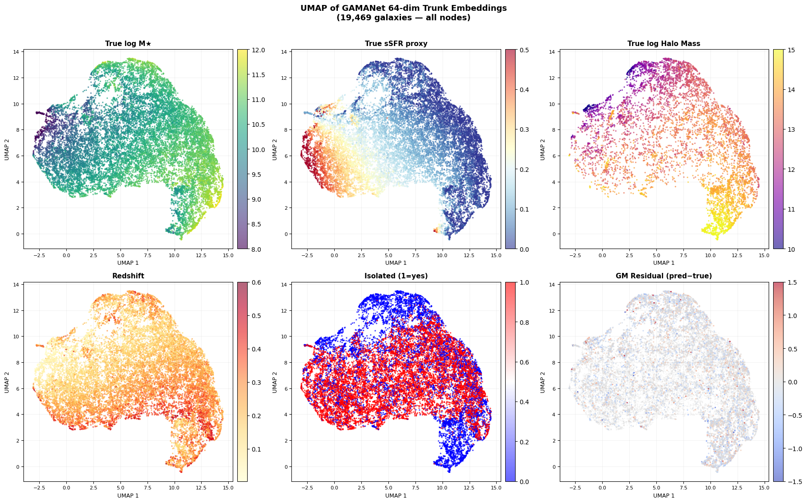
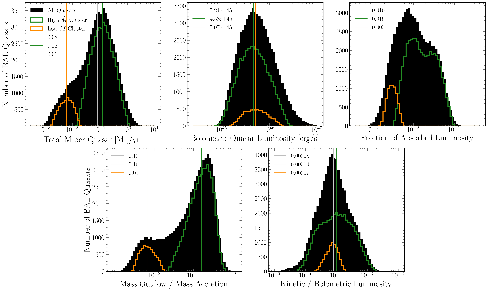
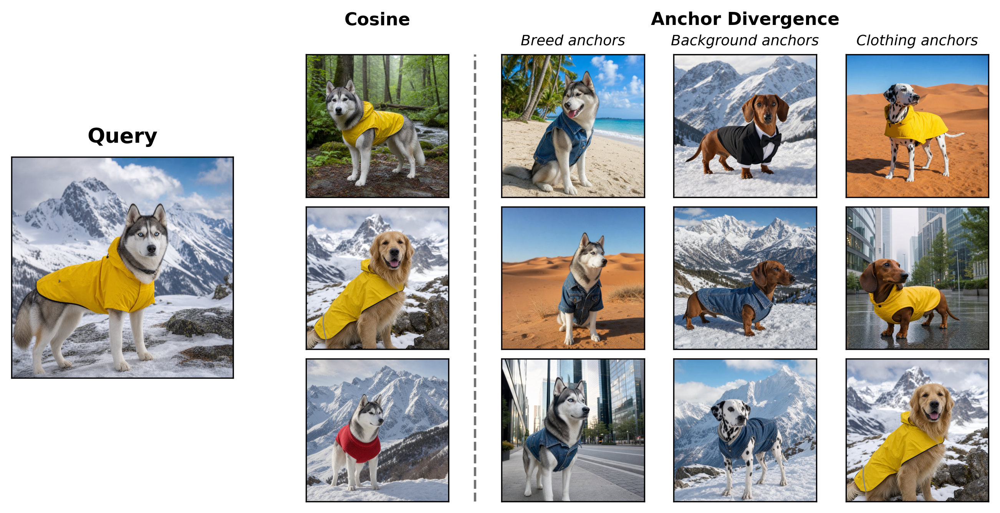

# arXiv Digest — 2026-10-07

- **Interest file used:** interests/2026.10.md (current month)
- **Categories pulled:** astro-ph.CO, astro-ph.EP, astro-ph.GA, astro-ph.HE, astro-ph.IM, astro-ph.SR, cs.LG, stat.ML, physics.data-an, hep-ph
- **Papers scanned:** 517 unique (161 astro-ph + 467 extras: cs.LG 355, stat.ML 64, hep-ph 45, physics.data-an 3; raw per-category counts before cross-listing dedup, 111 papers overlapped across pulled categories)
- **After first filter:** 29 candidates reviewed with full text
- **Final selected:** 20 papers across 3 tiers

---

## Tier 1 — Highly relevant

### [BRAHMa: a YOLO-based oriented-bounding-box detector for galactic bars](http://arxiv.org/abs/2610.07410v1)

Rajit Shrivastava, Narendra Nath Patra, Keerthi K
**Primary category:** astro-ph.GA

The authors build BRAHMa, an **oriented-bounding-box YOLO11x detector** trained on Galaxy Zoo 3D bar masks (DESI Legacy imaging) that outputs a bar's centre, length, width and position angle directly, with no segmentation mask or post-hoc fit needed. A per-galaxy CLAHE contrast enhancement tuned by maximizing the m=2 Fourier amplitude feeds the network, which reaches **mAP50 = 0.99** and reproduces independent Hoyle et al. bar lengths with **MAE = 1.14 kpc** after a linear calibration — close to the ~0.99 kpc floor set by disagreement between two human catalogues themselves. Accuracy is comparable to a published U-Net segmentation approach but runs far faster and generalizes zero-shot to WISE images of NGC 1300/3627, making it well suited to measuring bar geometry at LSST/Euclid scale.

*Calibrated BRAHMa bar lengths plotted against the independent Hoyle et al. catalogue lengths for the full 3150-galaxy sample, with the dashed one-to-one line showing the detector tracks the human catalogue closely across the full length range.*

---

### [DELVE spectroscopy of three new ultra-faint Milky Way satellites: Boötes V, Leo Minor I, and DELVE 2](http://arxiv.org/abs/2610.07182v1)

W. Cerny, M. Geha, J. D. Simon et al.

**Primary category:** astro-ph.GA

DELVE presents the first multi-object spectroscopy (Keck/DEIMOS, Magellan/IMACS) of three extremely small, ultra-faint Milky Way satellites whose star-cluster-vs-dwarf-galaxy classification had been ambiguous given their small half-light radii (**20-26 pc**). All three show clear metallicity spreads (**$\sigma_{\rm [Fe/H]}$ up to 0.57 dex**) that confidently classify Boötes V and Leo Minor I as dwarf galaxies, with DELVE 2 "most likely" one as well, and orbital modeling confirms for the first time that DELVE 2 is a long-term bound LMC satellite. The paper distills these and prior results into an empirical classification boundary (**$r_{1/2}>15$ pc, $\mu_{V,1/2}>26.5$ mag arcsec$^{-2}$ implies dwarf galaxy**) intended to guide probabilistic classification of the faint satellites Rubin, Roman, and Euclid will soon discover.

*Absolute magnitude vs. half-light radius for globular clusters, dwarf galaxies, and ultra-faint compact satellites, with Boötes V, Leo Minor I, and DELVE 2 marked as sitting at the ambiguous intermediate sizes that motivate the spectroscopic follow-up.*

---

### [Armillary: a label-free, multidimensional coordinate system for stellar spectra](http://arxiv.org/abs/2610.07112v1)

Yuan-Sen Ting, Serat Saad
**Primary category:** astro-ph.IM | also: astro-ph.GA, astro-ph.SR

Armillary generalizes the "Sequencer" from a single ordering to a full **label-free, multidimensional coordinate system for stellar spectra**, built by measuring a Wasserstein distance between stars' signed absorption profiles, propagating that distance along a nearest-neighbor graph, and refining coordinates with a locally-linear-embedding-style regularizer — no deep learning required. On **202,932 APOGEE DR17 stars**, just 32 training stars recover ASPCAP $T_{\rm eff}$, $\log g$ and [M/H] to 100 K/0.18/0.083 dex, and the method's coordinates are shown to be more linear in the physical parameters than PCA, t-SNE, UMAP, or an autoencoder, transferring comparably well to DESI spectra down to S/N~20. It is a highly interpretable, constrained-embedding alternative to deep representation learning for stellar population work, with public code released.

*The Kiel diagram recovered by a linear probe applied to Armillary's coordinates versus PCA, t-SNE, UMAP, the Sequencer, and an autoencoder, each scored by the variance of $T_{\rm eff}$ and $\log g$ explained; Armillary recovers more of the variance than any competing representation.*

---

### [Ionizing-photon leakage couples HII regions to the diffuse ionized gas across PHANGS-MUSE disks](http://arxiv.org/abs/2610.07163v1)

Dalya Baron, Kathryn Kreckel, Gwen C. Rudie et al.
**Primary category:** astro-ph.GA

Using 50-100 pc resolution **PHANGS-MUSE** observations of 19 nearby galaxies, the authors show that HII regions and the diffuse ionized gas (DIG) form one continuous photoionization sequence, with fainter HII regions and the DIG showing progressively harder, not softer, ionizing conditions as star-formation activity rises — the opposite of what aging stellar populations alone would predict. They build a radiative-transfer model in which ionizing photons escape HII regions and propagate through the diffuse ISM with geometric dilution and spectral hardening, finding **escape fractions of ~0.4-0.6 and photon mean free paths of ~0.5-1 kpc** reproduce the HII region luminosity function and DIG surface brightness jointly. The result identifies ionizing-photon leakage as an underappreciated **non-local feedback channel** coupling compact star-forming sites across galaxy disks.

*Results of the fiducial radiative-coupling model (escape fraction 0.5, mean free path ~1 kpc), illustrating how leaked radiation from luminous HII regions ionizes their fainter neighbors.*

---

### [Calibrating [OIII] equivalent width as an ionization-parameter diagnostic with BPASS binary populations](http://arxiv.org/abs/2610.08427v1)

Dian P. Triani, Lisa J. Kewley
**Primary category:** astro-ph.GA

Using the **MAPPINGS photoionization code** fed with **BPASS** single-star and binary-inclusive stellar population spectra, the authors calibrate the equivalent width of [OIII]λ5007 (EWO3) as an ionization-parameter diagnostic that needs only a narrow wavelength window, unlike the O32 ratio which requires broad coverage and dust corrections unavailable at high redshift. They find binary-inclusive populations sustain hard ionizing spectra and strong [OIII] emission to **later ages** than single-star models, and that EWO3 is less sensitive to gas pressure than O32 in the metal-poor, high-ionization regime. Local SDSS galaxies are best matched by **$\log(P/k)=6$** models while intermediate- and high-redshift galaxies require **$\log(P/k)=7$**, implying evolving ISM pressure conditions across cosmic time; metallicity- and pressure-dependent EWO3 calibrations are provided.

*EWO3 versus O32 model grids compared against SDSS star-forming galaxies, showing that intermediate stellar-population-age models best reproduce the observed distribution, forming the basis of the paper's EWO3 calibration.*

---

### [A dark-matter-dominated dwarf hiding in the NGC 1052 "bullet dwarf" trail](http://arxiv.org/abs/2610.07467v1)

Daniel Vaz, Arsen Levitskiy, Duncan Forbes et al.
**Primary category:** astro-ph.GA

Using Keck/KCWI integral-field spectroscopy, the authors obtain the first stellar velocity dispersion for LEDA 4014647, a compact dwarf spatially aligned with the NGC 1052 trail of dark-matter-deficient galaxies (DF2, DF4, DF9), measuring **$\sigma=15.8\pm2.0$ km/s** and a dynamical mass **~3x the stellar mass**, implying a dark matter fraction **$f_{\rm DM}=0.7\pm0.1$** at the half-light radius. Full-spectrum stellar population fitting gives an old (~13 Gyr), metal-poor population predating the proposed collision epoch, directly contradicting the DM-free shock-compressed-gas formation channel that produced DF2/DF4/DF9. The authors conclude LEDA cannot be a trail DMDG and is instead either a chance projection or a surviving DM-rich progenitor remnant of the dwarf-dwarf collision.

*Comparison of LEDA's and the three trail DMDGs' observed velocity dispersions against stars-only versus NFW-halo dynamical model predictions, showing the stars-only model reproduces DF2/DF4/DF9 but fails entirely for LEDA, which requires a dark matter halo.*

---

### [A three-component ultralight fermionic dark matter model for the core-cusp problem](http://arxiv.org/abs/2610.07367v1)

Fabian Hernandez-Gutierrez, Juan Barranco
**Primary category:** astro-ph.GA | also: hep-ph

The authors model galactic dark matter halos as **three gravitationally-coupled ultralight fermion species** rather than one, each transitioning from a degenerate core to an NFW or perfect-fluid outer halo, directly targeting the **core-cusp problem**. Fitting 175 SPARC rotation curves, a single-fermion analysis first identifies three characteristic mass scales (~20, ~40, ~65-70 eV) via a Gaussian mixture model, which then set data-informed priors for the full three-fermion Bayesian fit. The three-component model improves the raw fit for **94.9% of galaxies**, but after penalizing the extra parameters with AICc/BIC, only about **51-65% of galaxies favor the added complexity**, with preference growing for galaxies with larger radial extent and more complex rotation-curve morphology.

*Representative SPARC rotation-curve fits comparing the one- and three-fermion models, grouped by whether information criteria favor the single- or three-fermion model, showing the three-fermion model's added flexibility for complex curves.*

---

### [Tracking the open baryon cycle across cosmic time in TNG, EAGLE, and SIMBA](http://arxiv.org/abs/2610.07140v1)

Mohammadreza Ayromlou, G. Mark Voit, Thomas H. Reiprich, Cristiano Porciani, Dominique Eckert
**Primary category:** astro-ph.CO | also: astro-ph.GA

Using the **TNG, EAGLE, and SIMBA** cosmological hydrodynamical simulations plus their dark-matter-only counterparts, the authors quantify how baryonic feedback decouples gas from dark matter across 13 Gyr of cosmic time, finding that at z=0 **less than 30% of cosmic baryons reside in halos** versus ~45% of the dark matter, leaving over 70% in the IGM. They introduce two new characteristic scales — the compensation radius and the closure/compensation envelopes — and show galaxy groups drive the largest baryon redistribution, setting a closure envelope that reaches **~2-6.5 Mpc at z=0**. The compensation envelope's growth is shown to coincide with the scale at which the matter power spectrum recovers its gravity-only form, linking baryon redistribution directly to feedback's imprint on large-scale structure.

*Fraction of cosmic baryons and dark matter residing inside halos (and in the IGM) versus cosmic time for TNG, EAGLE, and SIMBA, compared against FRB-based observational estimates — the paper's headline baryon-budget result.*

---

### [GAMANet: a graph attention network predicting halo and stellar mass from observed GAMA galaxies](http://arxiv.org/abs/2610.07836v1)

Sandeep Aashish, Abhay V Hegde, Aditya Prakash Gupta, Ashmit Verma, Md Saif et al.
**Primary category:** astro-ph.GA | also: gr-qc

The authors build **GAMANet**, a multi-task **graph attention network (GATv2)** trained directly on 19,469 observed GAMA DR4 galaxies, representing galaxies as graph nodes connected by spatial proximity and Friends-of-Friends group membership so the attention mechanism can weight environmentally informative neighbors. The model simultaneously predicts halo mass, stellar mass, and an SSFR proxy, achieving **R² = 0.958, 0.985, and 0.982** respectively — notably trained on real observations rather than simulations, unlike prior GNN halo-mass estimators. An ablation shows that adding group-aware (non-local) edges produces the single largest gain in halo-mass accuracy, and a UMAP projection of the learned embeddings shows the network implicitly recovers physically meaningful structure despite never training on it directly.

*UMAP projection of the model's learned 64-dimensional embeddings, colored by physical properties (stellar mass, SSFR proxy, halo mass), showing smooth gradients that indicate the network has learned a physically meaningful, continuous latent representation of the galaxy population.*

---

## Tier 2 — Adjacent / useful context

### [elf: an auto-differentiable one-loop galaxy power spectrum code in JAX](http://arxiv.org/abs/2610.08023v1)

Yosuke Kobayashi, Kazuyuki Akitsu
**Primary category:** astro-ph.CO

The authors release **elf**, a JAX implementation of the one-loop galaxy power spectrum in the effective field theory of large-scale structure, covering both Eulerian and Lagrangian perturbation theory with full automatic differentiation with respect to cosmology, bias, and counterterm parameters. The code computes power spectra in **milliseconds on a GPU** after JIT compilation, achieves **~0.01% relative numerical error** versus brute-force integration, and is presented as the first auto-differentiable one-loop Lagrangian implementation, enabling gradient-based cosmological parameter inference.

---

### [Leave-one-out cross-validation as an interpretability tool for radial-velocity exoplanet analysis](http://arxiv.org/abs/2610.07181v1)

Matthew C. Nixon, Ritvik Basant, Rafael Luque, Luis Welbanks, Pierrot Lamontagne
**Primary category:** astro-ph.EP | also: astro-ph.IM

The authors demonstrate **leave-one-out cross-validation (LOO-CV)**, computed via Pareto-smoothed importance sampling, as a model-criticism tool for radial-velocity exoplanet analysis, extending it to **Gaussian-process (correlated-noise) likelihoods** for the first time in this context. Across three case studies they show the anomalously high mass of HD 119130 b was driven by just **two individual CARMENES measurements**, that LOO-CV prefers an eccentric single-planet model over a two-planet model for GJ 4276, and that LOO-CV finds **no predictive support for a fourth planet** in GJ 357 despite moderate Bayesian-evidence support. The paper positions per-data-point predictive diagnostics as a general-purpose complement to Bayesian evidence for model selection in precision RV work.

*CARMENES RV time series for HD 119130, with points colored by their per-point LOO predictive-density difference between the multi-instrument and CARMENES-only fits, visually identifying the measurements responsible for the system's originally inflated planet mass.*

---

### [POSYDON predicts a distinct ~13 M⊙ feature in the Galactic black-hole population](http://arxiv.org/abs/2610.07152v1)

Ilia Kiato, Pierson Lipschultz, Vicky Kalogera, Jeff J. Andrews, Max M. Briel et al.
**Primary category:** astro-ph.HE | also: astro-ph.GA

Using the detailed **MESA-grid-based binary population-synthesis code POSYDON**, the authors predict the present-day Galactic stellar-mass black hole population and test its robustness to core-collapse physics, natal kicks, common-envelope efficiency, metallicity, and initial binary distributions. They find most Galactic BHs are isolated and identify a **distinct, narrow BH-mass feature at ≈13 M⊙** produced by wind-driven evolution of massive Wolf-Rayet progenitors that persists across model variations but is strongly metallicity-dependent. Embedding the populations in a Galactic kinematic model, they compute BH-BH microlensing predictions and find a robust stable-mass-transfer channel for Gaia-detectable BH-luminous-companion systems that is largely absent from rapid population-synthesis predictions.

---

### [First weak-lensing convergence maps from a stratospheric balloon telescope](http://arxiv.org/abs/2610.07244v1)

Sayan Saha, Maya Amit, Jacqueline E. McCleary et al.
**Primary category:** astro-ph.CO

The SuperBIT collaboration presents the **first weak-lensing convergence maps reconstructed from stratospheric balloon imaging**, using three-band photometry from six galaxy clusters observed during SuperBIT's 2023 science flight. They develop a novel pixel-based color-color classifier to separate foreground/background galaxies and apply Kaiser-Squires inversion to recover convergence maps reaching **SNR up to ~7**, cross-validated against X-ray emission and red-sequence galaxy density. This demonstrates balloon-borne near-space imaging as a ~1000x cheaper alternative to space telescopes for weak-lensing science, paving the way for the successor mission GigaBIT.

*Composite optical/X-ray/mass maps for the six sampled clusters, with shading showing the weak-lensing convergence signal and X-ray emission from the intracluster medium, demonstrating spatial agreement between lensing mass and baryonic tracers.*

---

### [Line locking confirms radiation pressure drives quasar winds, but they are far too weak for AGN feedback](http://arxiv.org/abs/2610.07624v1)

Braden Seefeldt-Gail, Lluís Mas-Ribas, Norman Murray
**Primary category:** astro-ph.GA

Using 81,388 CIV broad-absorption-line troughs from SDSS-IV DR16 quasars, this paper reports a **definitive detection of "line locking"** — a unique spectral signature of radiation-pressure-driven winds — in **60-70% of BAL troughs**, proving that line-driving dominates quasar wind acceleration over magnetic, dust, or thermal mechanisms. Despite this, the measured median wind kinetic luminosity is only **~0.01% of bolometric luminosity — 50-500x below** the level that cosmological simulations require for AGN feedback to quench massive-galaxy star formation. The result directly challenges the sub-grid "quasar-mode" feedback assumption baked into most galaxy-formation simulations, implying ultra-fast X-ray outflows or radio jets must supply the missing feedback energy instead.

*Distributions of mass outflow rate and kinetic-to-bolometric luminosity ratio for the quasar sample, showing the median kinetic luminosity falling 50-500x short of the feedback threshold needed in simulations.*

---

### [N-body evidence that omega Centauri is the stripped nuclear star cluster of Gaia-Sausage-Enceladus](http://arxiv.org/abs/2610.07581v1)

Axel Mannu, Chervin F. P. Laporte, Matthew D. A. Orkney et al.
**Primary category:** astro-ph.GA

Testing the hypothesis that omega Centauri is the stripped nuclear star cluster of the Gaia-Sausage-Enceladus (GSE) merger remnant, the authors run N-body simulations in time-evolving Milky Way bar potentials and show the retrograde 3:2 bar resonance can shift GSE debris and omega Cen's orbital energy within **0.5-1 Gyr**, well inside the bar's lifetime. They identify a population of N-rich, aluminum-enhanced stars forming a trailing "corridor" in energy-angular-momentum space connecting omega Cen to the GSE debris centroid, which they argue is **the best evidence yet** for the nuclear-star-cluster origin. They further show omega Cen/M54's internal chemical-enrichment trends do not follow galaxy-wide scaling relations, implying globular cluster chemistry is a cluster-scale rather than galaxy-scale physics problem.

*Energy-angular-momentum map showing omega-Cen-compatible N-rich stars forming a trailing corridor linking omega Cen's present position to the GSE debris, interpreted as the dynamical trail of material stripped by the bar.*

---

## Tier 3 — Outside my area but notable

### [Gan Jiang: a self-learning agentic system for X-ray diffraction analysis](http://arxiv.org/abs/2610.07862v1)

Bin Cao, Huichi Zhou, Runyu Yang et al.
**Primary category:** cond-mat.mtrl-sci | also: cs.AI

"Gan Jiang" is a self-learning agentic system for powder X-ray diffraction analysis that couples physics-constrained whole-pattern modeling engines with a reflective-learning loop that diagnoses failures and **rewrites its own executable "skills"** without retraining the underlying LLM, validating each revision on held-out data before adoption. Skill-learning experiments show held-out refinement scores improving substantially after self-revision, and on a new benchmark the agent reaches **96.30%/81.78%/40.83% top-1 phase-ID accuracy** across three test sets versus 58.00/58.47/26.45% for the strongest comparator, while also resolving a 5-phase ancient-Egyptian-cosmetic mixture. This is a strong example of agentic AI doing genuine evidence-governed scientific reasoning — candidate-hypothesis screening, evidence-gated refinement, and transferable self-improvement — rather than simple assistant/code-generation use.

*The agent's executable architecture, separating LLM planning, specialized numerical engines, and explicit evidence-gated acceptance policies across candidate retrieval, inspection, and refinement stages.*

---

### [Anchor Divergences: steerable, information-geometric similarity for contrastive embeddings](http://arxiv.org/abs/2610.06919v1)

Akash Kannan, Kiho Park, Victor Veitch
**Primary category:** cs.AI | also: cs.CV

The authors show that contrastive vision-language models like CLIP admit a family of context-specific similarity geometries rather than one fixed cosine metric, by modeling a user-chosen distribution over semantic "anchors" and linking it, via information geometry, to a **Bregman divergence** on the fixed image embeddings. On chest X-ray retrieval and ImageNet/CUB benchmarks, these anchor divergences let a user steer retrieval toward a specific semantic axis, and an empirical-Bayes adaptation scheme cuts the number of target anchors needed by **a full order of magnitude**. This is a principled, training-free method for constraining and interpreting the geometry of an already-trained embedding space.

*Retrieval rankings for the same query image under breed-, background-, and clothing-specific anchor sets, showing that changing only the anchor distribution reorders which neighbors are retrieved.*

---

### [AnyBottle: compact, task-adaptive concept bottleneck models without human annotation](http://arxiv.org/abs/2610.08552v1)

Wolfgang Stammer, Sukrut Rao, Hevra Petekkaya et al.
**Primary category:** cs.AI | also: cs.LG

AnyBottle builds compact, task-specific **concept bottleneck models** without human concept annotations, iteratively adding sparse-autoencoder-derived concepts that best resolve disagreement between a frozen black-box teacher and the current bottleneck, then training a nested-dropout head so inference spends fewer concepts on easy samples and more on hard ones. Across six vision and two text datasets, the resulting bottlenecks match or exceed teacher accuracy while using **16-60x fewer concepts** than a full SAE-dictionary linear probe, with higher concept consistency than four annotation-free baselines.

*AnyBottle reaching black-box teacher accuracy with orders-of-magnitude fewer concepts than baselines across six datasets, while also matching or exceeding baseline concept consistency.*

---

### [Mechanistic interpretability finds and causally verifies atmospheric-river concepts inside GraphCast](http://arxiv.org/abs/2610.07583v1)

Madelyn Mathai, Timothy B. Higgins, Kevin M. Grise et al.
**Primary category:** cs.LG | also: cs.AI

The authors train sparse autoencoders, including **Matryoshka SAEs**, on the internal activations of the GraphCast weather-forecasting GNN to search for mechanistic representations of atmospheric rivers, grounding discovered concepts in integrated vapor transport (IVT) even though IVT is never an explicit model input or target. They find GraphCast computes AR intensity as a stable internal variable, organized hierarchically in the Matryoshka dictionary, and confirm causality with direct activation-steering interventions that **weaken real ARs globally when the concept is removed and intensify their precipitation when it is amplified**. This demonstrates mechanistic interpretability tools — concept dictionaries plus causal interventions — applied to a physical-science foundation model and grounded against a known physical quantity.

*Region-mean activation of a Matryoshka-SAE concept tracked against region-maximum integrated vapor transport across four AR-prone regions worldwide, showing the discovered internal concept closely follows the known physical measure of atmospheric river intensity.*

---

### [Decomposing the Fréchet distance to explain what drives FID/FVD generative-model scores](http://arxiv.org/abs/2610.05518v1)

Yunghee Lee, Jaeyeon Kim
**Primary category:** cs.AI | also: cs.LG

This paper decomposes the scalar Fréchet distance (FID/FVD/Protein-FID) into per-direction contributions — the **directional Fréchet distance** — by projecting the optimal-transport displacement onto an orthonormal feature basis and tying the top eigenvectors to interpretable CLIP concepts. Applied to a known paradox on COCO where more diffusion sampling steps raise ImageReward yet worsen FID, they find **two-thirds of the FID increase lies along a single direction** tied to "composition simplicity," and perform analogous decompositions explaining FVD's flicker/appearance bias and the Protein FID structural-regularity gap. The method turns a widely-used but opaque scalar generative-model metric into an interpretable, concept-attributable diagnostic.

*Directional Fréchet distance of the top three fixed eigenvectors regressed against total FID across an eight-step diffusion sampling sweep; the top eigenvector's slope shows it carries most of the FID change while the next two stay nearly flat.*
