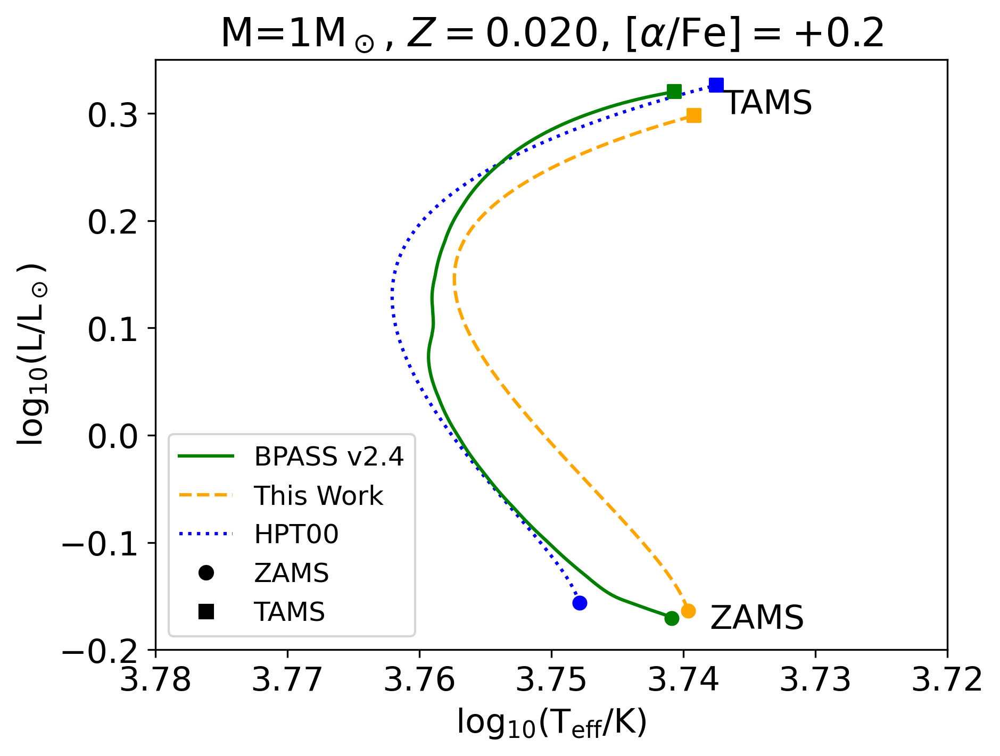
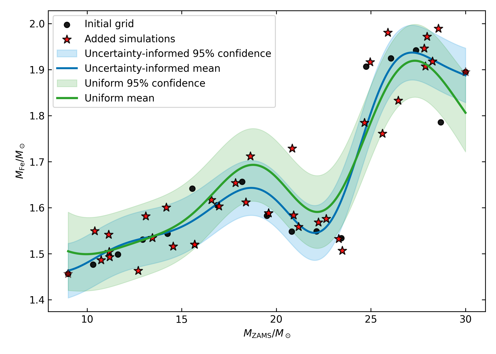

# arXiv Digest — 2026-10-08

- **Interest file used:** interests/2026.10.md (current month)
- **Categories pulled:** astro-ph.CO, astro-ph.EP, astro-ph.GA, astro-ph.HE, astro-ph.IM, astro-ph.SR, cs.LG, stat.ML, physics.data-an, hep-ph
- **Papers scanned:** 467 (82 astro-ph new/cross + 385 from extras)
- **After first filter:** 27 candidates reviewed with full text
- **Final selected:** 20 papers across 3 tiers

---

## Tier 1 — Highly relevant

### [KDG 162: A Nearby Isolated Star-forming Dwarf Galaxy](http://arxiv.org/abs/2610.08905v1)

Gagandeep S. Anand, Igor D. Karachentsev, Meredith J. Durbin et al.
**Primary category:** astro-ph.GA

New HST/ACS imaging resolving stars 3 mag below the tip of the red giant branch gives a **TRGB distance of D = 3.48 ± 0.12 Mpc** to the dwarf galaxy KDG 162, revising it farther than prior estimates and showing it is **not gas-rich** (M_HI/M* = 0.5, not >1 as previously claimed) and **more massive than Leo P**, sitting at the edge of first infall onto the M81 group rather than deep in the Local Group. CMD-based star-formation-history fitting finds only modest, sustained star formation (~3×10⁻³ M☉/yr, declining) over the last ~500 Myr, with minimal current Hα-traced SFR. This resolves a debate over whether KDG 162 is an ultra-faint, gas-rich Leo P analog, concluding it is not.

### [Re-calibrated analytic stellar evolution formulae for the main sequence: Extension to massive stars and variations in [α/Fe]](http://arxiv.org/abs/2610.08930v1)

Conor M Byrne, Elizabeth R Stanway, Jan J Eldridge
**Primary category:** astro-ph.SR | also: astro-ph.GA

The authors re-derive the classic **Hurley, Pols & Tout (2000)** analytic main-sequence formulae underlying most rapid population-synthesis codes, fitting them to **19,287 BPASS v2.4.0 single-star tracks** spanning masses up to 316 M☉ and 74 metallicity/[α/Fe] combinations. The new fits extend reliable analytic coverage to **massive stars (M ≳ 50–100 M☉)** and, for the first time, to **[α/Fe]-enhanced compositions**, cutting errors to **<10% or 0.05 dex** for most luminosity/radius relations where the old equations badly diverge above ~100 M☉. They recommend an **iron-equivalent metallicity Z′** for α-enhanced populations, since iron dominates main-sequence opacity — a direct upgrade to the stellar building blocks underlying SPS and massive-star population modeling.

*Core-hydrogen-burning tracks for a 1 M☉ and a 100 M☉ star comparing BPASS, the original Hurley et al. (2000) formula, and this work's new fit; for the 100 M☉ star the old formula evolves in a qualitatively wrong direction while the new fit tracks BPASS well.*

### [ASTRAL: A Framework for Optimal Placement and Emulation of Stellar Evolution Models](http://arxiv.org/abs/2610.09531v1)

Trevor Gravely, Marko Ristić, Brandon Barker
**Primary category:** astro-ph.SR | also: astro-ph.GA

ASTRAL builds **Gaussian-process surrogate models** of sparse, expensive stellar-evolution grids (MESA, KEPLER) and uses GP predictive uncertainty to actively decide **where to place the next expensive simulation**, rather than sampling uniformly. On a MESA test grid this uncertainty-informed placement cuts the averaged 95% credible-interval width by **~20-30%** relative to uniform sampling, and on a downstream supernova grid it matches uniform-sampling uncertainty using only **42% of the full simulation library**. The GP emulators are well-calibrated (K-fold R²≈0.90) and the approach is directly extensible to denser stellar template/isochrone libraries across metallicity and rotation.

*GP regression fits of iron-core mass vs. zero-age main-sequence mass for an uncertainty-informed grid (blue) versus a uniform grid (green) of the same size; the uncertainty-informed grid gives a systematically thinner 95% confidence band, especially near parameter-space boundaries.*

### [SAGE26 Paper I: Modelling the baryon cycle from cosmic dawn to the present day](http://arxiv.org/abs/2610.09564v1)

Michael Bradley, Darren J. Croton, Robert Adriel Mostoghiu Paun et al.
**Primary category:** astro-ph.GA

SAGE26 updates the semi-analytic galaxy model SAGE with distinct **circumgalactic-medium and hot-halo physics**, molecular-hydrogen-regulated star formation, FIRE-calibrated supernova feedback, and **feedback-free burst (FFB)** galaxies at high redshift. The model **substantially reduces the long-standing overproduction of quiescent dwarf galaxies** (z=0 quiescent fraction at m*=10^8.5 M☉ drops from 52% to 27% once H2-regulated star formation is included), while FFB raises the abundance of massive z>6 galaxies by **0.21-0.65 dex** to match JWST counts, and the stellar mass function now matches observations to a median offset of just **0.20 dex**. Code, calibration tool, and visualizer are public.

*z=0 stellar mass function split into star-forming and quiescent galaxies for SAGE26 vs. the previous SAGE16; SAGE26 strongly reduces the earlier model's spurious excess of quiescent dwarfs at the low-mass end.*

### [Star Formation in the Low Surface Brightness Galaxies: a Comparison with the Outer Regions of Normal Galaxies](http://arxiv.org/abs/2610.09803v1)

Anatoly Zasov, Natalia Zaitseva, Anna Saburova
**Primary category:** astro-ph.GA

Comparing HI and star-formation radial profiles of **low surface brightness (LSB) galaxies** with the extended outer disks of normal galaxies, the authors find that **star formation efficiency vs. disk brightness** follows the same relation in both populations, with no systematic LSB/HSB offset, out to disk brightnesses of **26-27 mag/arcsec²**. Both LSB disks and HSB outskirts sit close to marginal gravitational stability (Toomre Q≈1-3) over tens of kpc. The central conclusion is that this persistence of normal SFE scaling at such low densities implies the **outer/LSB disk density is likely underestimated** by current photometric+HI mass budgets, hinting at a missing disk-mass component.

*Star formation efficiency vs. disk surface brightness for LSB galaxies, THINGS HSB galaxies, and HI-rich HSB galaxies; all three fall on the same relation with no systematic LSB/HSB offset.*

### [MUSE-ALMA Haloes XVI: a census of the condensed baryons in z~0.5 HI absorption-selected galaxies](http://arxiv.org/abs/2610.10117v1)

T. O'Beirne, C. Péroux, M. Zwaan et al.
**Primary category:** astro-ph.GA

Using the full 79-galaxy MUSE-ALMA Haloes sample (HST+MUSE+ALMA), the authors build a **condensed-baryon census** and find molecular-gas fraction declines more steeply with stellar mass than HI fraction, and galaxies with **high stellar surface density have the highest baryon fractions** (Spearman r=0.7, p<1e-5), consistent with baryonic feedback flattening inner dark-matter profiles. Comparing dark-matter fractions across cosmic time against TNG50, **a few low-mass MUSE-ALMA galaxies are consistent with being the baryon-dominated descendants of dark-matter-dominated z~6 JWST/JADES dwarfs**, while most of the sample remains more dark-matter dominated than those simulated descendants.

*Dark matter fraction vs. redshift for MUSE-ALMA Haloes galaxies against TNG50 evolutionary tracks of JWST/JADES-like z~6 dwarf analogues; most sources stay more dark-matter-dominated than the simulated dwarf-descendant track, with only a few consistent with it.*

---

## Tier 2 — Adjacent / useful context

### [The BUFFALO Survey: The Subhalo Mass Function for Abell 2744 with Strong+Weak Gravitational Lensing](http://arxiv.org/abs/2610.08919v1)

Nency R. Patel, Mathilde Jauzac, Anna Niemiec et al.
**Primary category:** astro-ph.CO

Combining HST/BUFFALO and JWST/UNCOVER strong+weak lensing, the authors build a new mass model of merging cluster Abell 2744 and derive its **subhalo mass function**, comparing it to **BAHAMAS CDM/SIDM hydrodynamical simulations**. Abell 2744 shows a systematic **excess of detected substructures** relative to all simulated dark-matter models, even after normalizing by host mass, which they attribute primarily to the cluster's exceptionally disturbed, multi-merger state rather than tension with ΛCDM or self-interacting dark matter. A larger sample across dynamical states is needed to confirm this.

### [Early onset of the hot circumgalactic medium around Milky Way galaxies](http://arxiv.org/abs/2610.08931v1)

Víctor Rufo-Pastor, Oscar Agertz, Santi Roca-Fábrega et al.
**Primary category:** astro-ph.GA | also: physics.comp-ph

Using the **VINTERGATAN** cosmological zoom-in simulations of Milky Way-mass haloes, the authors show that **stellar feedback, not gravitational accretion shocks, drives the early formation of the hot circumgalactic medium**, producing a hot corona by **z ≈ 3**, much earlier than the z ≲ 1 predicted by the classical virial-shock model. CGM "virialisation" tracks hot-corona formation but can proceed inside-out, outside-in, or simultaneously depending on whether feedback or shocks dominate, with feedback driving a rapid (**≲0.5 Gyr**) transition. They also identify a **"CGM pseudo-evolution"** analogous to dark-matter-halo pseudo-evolution that can masquerade as genuine gas evolution.

### [Euclid Quick Data Release (Q1). Exploring the complexity of quenching processes across time, environment, and mass through recently quenched galaxies](http://arxiv.org/abs/2610.08999v1)

Euclid Collaboration, Z. Mao, L. Pozzetti et al.
**Primary category:** astro-ph.GA

Using Euclid Q1 colours and SED-fit star-formation histories, the authors classify galaxies at **0.2<z<3.0** into star-forming, quiescent, and **recently quenched** populations, split into fast- (τ<0.1 Gyr) and slow-quenching (τ~1 Gyr) types. Quenching efficiency and the recently-quenched fraction both **decrease with cosmic time**, fast quenching shifts from massive to low-mass galaxies over time, and morphological/environmental analysis **rules out mergers as the primary quenching mechanism**. Comparison to the GAEA semi-analytic model shows large discrepancies in predicted fast-quenching fractions.

### [(Monty Python and the) HoliGRALE: A Hybrid GRALE Lens Inversion Methodology Diagnostically Evaluated with Synthetic and Real Data](http://arxiv.org/abs/2610.09014v1)

Derek Perera, Jori Liesenborgs, John H. Miller et al.
**Primary category:** astro-ph.GA

HoliGRALE extends the free-form genetic-algorithm lens-inversion code GRALE by embedding physically motivated parametric components for cluster member galaxies within its free-form grid. Validated against synthetic IllustrisTNG clusters, it achieves a **projected-density error budget of <5% for simple clusters and ~5-10% for complex multi-component clusters**. Applied to real lenses it predicts the next SN Requiem image arrival at **4346.61⁺⁴⁹⁰·²⁷₋₈₁₈·₃₆ days** and recovers a dark-matter **core radius of 89.9 ± 33.2 kpc** in Abell S1063, consistent with prior core-cusp studies.

### [DSReg: Provably Recovering Individual World Latents without Reconstruction](http://arxiv.org/abs/2610.09457v1)

Yujia Zheng, David Klindt, Randall Balestriero et al.
**Primary category:** cs.LG | also: cs.AI, stat.ML

This theory paper proves individual latent variables of a world model can be recovered **without any decoder, reconstruction, or labels**, closing a known gap where joint-embedding predictive architectures only identify latents up to a linear mixing. The sufficient condition, **Structural Diversity** (distinct latent factors leave distinct dependency footprints on observations), is proven strictly weaker than prior identifiability conditions in the ICA/causal-representation literature. Their method, **DSReg**, applies post hoc to any linearly-identified checkpoint and empirically disentangles mixed latents with no loss in dense-prediction performance — a borrowable technique for constraining the embedding space of visual encoders.

### [SpatialUQ: Post-Hoc Uncertainty Quantification from Spatial Consistency in Black-Box Vision Models](http://arxiv.org/abs/2610.09498v1)

Md Kawsher Mahbub, Milon Biswas, Mirza Niaz Morshed et al.
**Primary category:** cs.CV | also: cs.AI, cs.LG

**SpatialUQ** is a fully post-hoc uncertainty-quantification method for frozen "black-box" vision classifiers needing no retraining or internals access: it compares a model's global prediction against five fixed spatial crops across six forward passes, using Jensen-Shannon divergence as the uncertainty score. On a chest X-ray benchmark it reaches **0.784 failure-detection AUC versus 0.664 for MC-Dropout (p<10⁻⁶)** at one-fifth the compute, beating even a 5-member ensemble after supervised fusion, though reliability **breaks down under severe distribution shift** — a useful, cheap UQ technique for deployment-friendly black-box CV pipelines on survey imaging.

### [Light curve spectral energy distribution fitting of 13 carbon-rich Mira variables stars in the Small Magellanic Cloud](http://arxiv.org/abs/2610.09537v1)

A. Liberatori, M. Trabucchi, D. Hatzidimitriou et al.
**Primary category:** astro-ph.SR | also: astro-ph.GA

The authors perform **phase-resolved SED fitting** of 13 carbon-rich Mira variables in the SMC, extracting 14 independent SEDs per star across the pulsation cycle and fitting them with the **ATHENA-C** atmosphere+dust grid. They recover **peak-to-peak effective-temperature variations of ~100 K to over 1000 K** and a strong anti-correlation between dust optical depth and luminosity, while the headline conclusion is that **static (time-averaged) SED fitting substantially underestimates the true dynamic range** of AGB stellar/circumstellar parameters — relevant since AGB carbon stars are major dust/IR contributors to intermediate-age stellar populations.

### [Scalable Logistic Gaussian Process Density Regression with Kinetic Langevin Sampling](http://arxiv.org/abs/2610.09591v1)

Daniel Paulin, Ádám Jung, András A. Benczúr
**Primary category:** stat.ML | also: cs.LG

Motivated explicitly by **per-galaxy photometric redshift estimation**, the authors develop a scalable Bayesian **logistic Gaussian process** density regression estimator, sampling the latent field directly with **kinetic Langevin dynamics** rather than a Laplace/variational approximation, giving provably bounded-bias marginal-likelihood gradients. On photo-z benchmarks with **up to 3.9 million training galaxies** (SDSS, DESI) on a single GPU, the estimator is **competitive with state-of-the-art tabular foundation models (TabPFN-3.5)** on density and calibration, though it fails in low-density extrapolation regions outside the training support — a scalable, well-calibrated density-estimation tool for Rubin/DESI/Euclid-scale catalogs.

### [DisParQ: Self-Supervised Part Concepts for Interpretable Vision Foundation Models](http://arxiv.org/abs/2610.09802v1)

Adam Pardyl, Siddhartha Gairola, Sukrut Rao et al.
**Primary category:** cs.CV | also: cs.AI, cs.LG

**DisParQ** decomposes a frozen vision foundation model's (DINOv2) patch features into a sparse, discrete dictionary of spatially-grounded "part concepts" plus quantized per-concept attributes, learned with **no class labels and no language supervision**. It nearly matches its frozen teacher on ImageNet linear probing (**83.2% vs 83.4% top-1**) and produces concepts that are **more consistent across images than language-aligned baselines**, preserving part identity across categories and enabling cross-category part retrieval — a candidate technique for learning interpretable, label-free substructure concepts in galaxy-morphology or dwarf/LSB-galaxy imaging pipelines.

### [MUSE-ALMA Haloes XV: Cold molecular, ionised, and stellar kinematics of HI-rich galaxies at z ~ 0.5](http://arxiv.org/abs/2610.10113v1)

C. Barfety, N. M. Förster Schreiber, C. Péroux et al.
**Primary category:** astro-ph.GA

Using joint ALMA CO(2-1) and MUSE Hβ kinematics plus stellar kinematics for six z~0.5 HI-absorption-selected galaxies, the authors find four are rotating disks with elevated gas velocity dispersions relative to z~0 disks and a measured **average dark matter fraction ⟨f_DM⟩ = 0.42 ± 0.14**. Ionised-gas velocity dispersions are **~1.7× higher than the cold molecular gas**, and the turbulence favors a "feedback + radial transport" disk model over feedback alone, consistent with other dark-matter-fraction measurements at similar epochs and masses.

### [Revisiting Explainable AI through Model-Independent Concept Dictionaries](http://arxiv.org/abs/2610.10301v1)

Thomas Schnake, Doreen Schöppenthau, Alexander Meyer et al.
**Primary category:** cs.LG | also: stat.ML

**DictXAI** defines explainability "concepts" directly in the input domain via a predefined, human-inspectable, overcomplete dictionary (e.g. Gabor filters, reference spectra) rather than probing opaque internal network activations, attributing predictions to sparse-coding coefficients over dictionary atoms. Demonstrated on removing a "Clever Hans" shortcut from a contaminated MNIST classifier and auditing ECG and mass-spectrometry classifiers, the method gives **more architecture-agnostic, actionable explanations** than latent-space concept methods or classical pixel attribution — a model-agnostic approach plausibly transferable to attributing galaxy-image classifications to physically-named dictionary elements.

### [ROSE (Red-giant Oscillations Spectra Estimator): A Modular Machine-Learning Framework for Automated Asteroseismic Characterisation. I. ν_max and Δν from TESS](http://arxiv.org/abs/2610.10312v1)

Nipun Ghanghas, Dinil B. Palakkatharappil, Rafael A. Garcia, Shravan Hanasoge
**Primary category:** astro-ph.SR | also: astro-ph.IM

ROSE is a modular neural-network pipeline for automated asteroseismic characterisation of red giants that **returns full probability distributions rather than point estimates**, giving each measurement a calibrated, asymmetric uncertainty and reliability index. Applied to 274,721 TESS red-giant candidates, it delivers reliable ν_max for 56,224 stars and Δν for 39,939 at **8 ms per star**, with dispersions of 1.4-4.4% (ν_max) and 0.35-1.3% (Δν). The design deliberately decouples the two measurements so the network cannot "cheat" by exploiting their known correlation — a clean example of **uncertainty-quantified, bias-aware ML** for stellar time-series.

### [SciExam for ENSO: Can AI Agents Build Climate Models?](http://arxiv.org/abs/2610.10513v1)

Yinling Zhang, Langchen Liu, Dongbin Xiu et al.
**Primary category:** cs.AI | also: physics.ao-ph

LLM agents are given six hours and raw ocean/atmosphere observations to build their own low-order stochastic dynamical model of El Niño-Southern Oscillation **from scratch, with no known correct answer**, then graded by hidden tests of climate statistics, variable reconstruction, and forecast skill against a real published reference model. **Six of twelve tested agent systems outscored the published reference model**, mainly via better reconstruction and forecasting, and the stronger agent-built models' simplified structures aligned with one of two competing, still-debated physical explanations of ENSO's warm-cold asymmetry — a question the task never told the agents about.

*(a) Schematic of the five-variable stochastic ENSO model agents must build; (b) final benchmark scores for the twelve agent systems, with six exceeding the dashed line marking the published reference model's score (0.378).*

---

## Tier 3 — Outside my area but notable

### [Debye cooling of ultramassive white dwarfs](http://arxiv.org/abs/2610.08916v1)

David Barba-González, Sivan Ginzburg
**Primary category:** astro-ph.SR

Using analytic theory and MESA models, the authors study **Debye cooling** — quantum suppression of crystal heat capacity — in ultramassive white dwarfs, finding cooling accelerates sharply below **L ≲ 10⁻⁴ L☉** only through the combined action of Debye cooling and convective coupling of the core to the surface, with neither effect alone sufficient. Strong magnetic fields that suppress this coupling instead give an almost flat **cooling-time scaling τ ∝ L^(1/7)**. Comparing to the recently observed sample of cold IR-faint white dwarfs, the declining number density is tentatively consistent with standard Debye cooling, suggesting larger samples could probe both magnetism and crystallized-interior microphysics.
