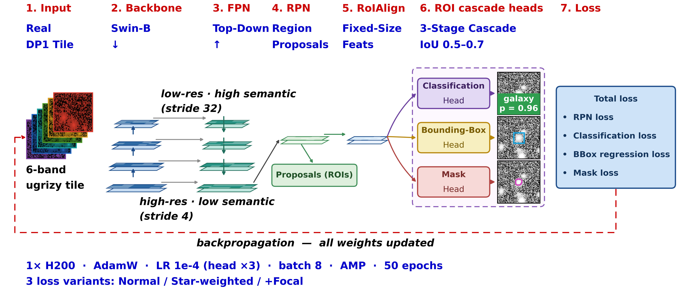
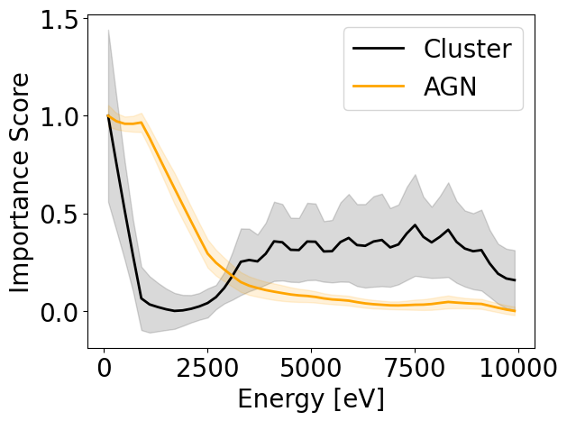
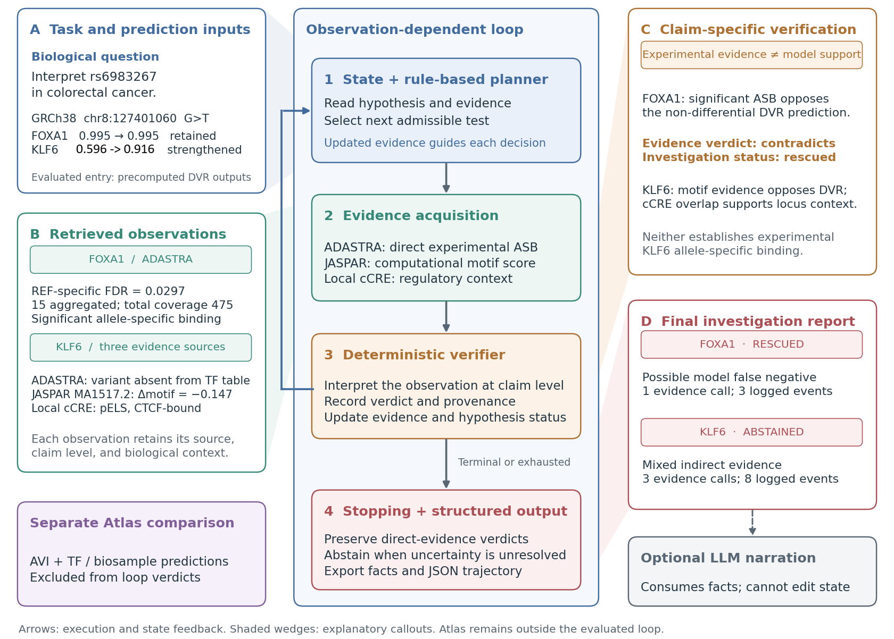

# arXiv Digest — 2026-10-09

- **Interest file used:** interests/2026.10.md (current month)
- **Categories pulled:** astro-ph.CO, astro-ph.EP, astro-ph.GA, astro-ph.HE, astro-ph.IM, astro-ph.SR, cs.LG, stat.ML, physics.data-an, hep-ph
- **Papers scanned:** 476 unique (107 astro-ph new/cross + 431 from extras: 324 cs.LG, 51 stat.ML, 3 physics.data-an, 53 hep-ph; raw pull was 538 before removing cross-listed duplicates)
- **After first filter:** 27 candidates reviewed with full text
- **Final selected:** 11 papers across 3 tiers

---

## Tier 1 — Highly relevant

### [DeepDISC on LSST Data Preview 1: Scene-Level Detection, Deblending, and Star/Galaxy Classification in the ECDFS and EDFS Fields](http://arxiv.org/abs/2610.10986v1)

Prince Yadav, Yaswant Sai Ejjagiri, Xin Liu et al.
**Primary category:** astro-ph.IM

The LSST DESC team deployed **DeepDISC** — a Swin-Transformer-backboned Cascade Mask R-CNN that jointly detects, deblends, and classifies sources in a single forward pass — on real Rubin LSST Data Preview 1 coadds for the first time. A two-stage fine-tuning protocol raised galaxy/star completeness from a zero-shot 40%/13% to **84%/49%** on real DP1 data, with star/galaxy classification accuracy (97.4%) landing within about one percentage point of a published photometry-based Random Forest. Cross-matching against deeper HST/CANDELS imaging shows **~95% true purity**, establishing DeepDISC as a viable image-based complement to the production Rubin Science Pipelines catalog ahead of full LSST operations.

*Architecture/data-flow diagram tracing a single forward pass through the six-band input, Swin-B backbone, FPN, RPN, RoIAlign, and the three-stage detection cascade down to a real detected source's class/box/mask outputs.*

---

### [Feedback-Conditional 3D Reconstruction of Cosmic Baryons with Flow Matching](http://arxiv.org/abs/2610.10741v1)

Maryam Hussaini, Aizhan Akhmetzhanova, Carolina Cuesta-Lazaro et al.
**Primary category:** astro-ph.CO

The authors built a **flow-matching** generative model (a 3D conditional U-Net) that reconstructs the posterior over 3D gas-density fields from galaxy density fields, conditioned on cosmological parameters and the **baryon suppression power spectrum $sP(k)$** as a feedback-strength proxy, trained on CAMELS50 (IllustrisTNG) boxes. The model recovers individual dispersion-measure sightlines (**Spearman $\rho=0.857$**) with calibrated **uncertainty quantification**, and its predicted gas morphology responds in the physically correct direction when feedback strength is varied. Despite training only on $(50\,h^{-1}\mathrm{Mpc})^3$ boxes, the fully convolutional network generalizes to TNG300-1 volumes **~$4^3$ times larger**, offering a path to constrain astrophysical feedback models using Fast Radio Burst dispersion measures.

*A 3x3 panel showing the input galaxy field, true vs. reconstructed 3D gas/DM maps, and quantitative validation (reconstructed-vs-true DM scatter, DM distribution overlay, scale-dependent correlation), showing both reconstruction fidelity and where it breaks down at small scales.*

---

### [Data Representation Matters: Optimizing Machine Learning for X-ray Source Classification by Leveraging Spatio-Spectral Information](http://arxiv.org/abs/2610.12317v1)

Maggie Lieu, Ivan Valtchanov, Marguerite Pierre et al.

**Primary category:** astro-ph.IM

The authors benchmark 1D, 2D, 2D+1D, and 3D CNNs on simulated XMM-Newton event cubes to classify galaxy clusters vs. AGN, finding a **3D CNN** operating directly on spatio-spectral cubes gives the most consistent cross-validated performance. Applying **3D-GradCAM interpretability analysis**, they find the model's spectral attention is physically meaningful: clusters derive **~46% of their classification signal from the hard X-ray band (6–10 keV)**, where the thermal intracluster-medium continuum differs from AGN power-law emission, while AGN classification is driven almost entirely (70%) by the soft-band point-source PSF — showing the network autonomously learned to separate diffuse thermal emission from non-thermal point sources using physically interpretable features.

*Mean normalized Grad-CAM spectral-attention profiles across 0–10 keV for correctly classified clusters vs. AGN, showing clusters' bimodal (soft+hard) importance versus AGN's single soft-band peak.*

---

### [Central stellar depletion in the Draco dwarf from Subaru photometry](http://arxiv.org/abs/2610.10941v1)

Eduardo Vitral, Kyosuke S. Sato, Jorge Peñarrubia et al.
**Primary category:** astro-ph.GA | also: astro-ph.IM

Applying a Fourier-based statistical formalism to deep Subaru/HSC photometry of **~10⁴ resolved stars in the Draco dwarf spheroidal**, with artificial-star-test completeness weighting folded into the likelihood, the authors detect a **central stellar depletion surrounded by a ring-like excess** relative to a best-fit Plummer model. The low-frequency residual feature is detected at **S/N = 6.0**, and an independent $\alpha\beta\gamma$-profile fit gives a declining central surface density at **>99.9% confidence**. While not yet robust evidence for dark-matter subhalo perturbations, the result suggests such central depletion in dwarf spheroidals may be a genuine physical signature rather than a crowding artifact, with implications for equilibrium assumptions in dwarf-galaxy mass modeling.

*Four-panel figure showing the observed stellar density map, radial surface-density profile with Plummer fit and residuals, the Fourier power spectrum of the residual field, and the filtered map revealing the central-depletion/ring-excess pattern.*

---

### [Pushing Variability Searches to Extreme Dwarf Galaxies with the Vera C. Rubin Observatory Data Preview 2](http://arxiv.org/abs/2610.10755v1)

Fan Zou, W. N. Brandt, Elena Gallo et al.
**Primary category:** astro-ph.GA

Using Rubin Observatory **Data Preview 2** difference-imaging light curves for $6.2\times10^4$ **extreme dwarf galaxies** ($M_\star<10^8\,M_\odot$) in the ELAIS-S1 Deep-Drilling Field, the authors apply single-band and cross-band variability statistics to identify the first systematic sample of variable candidates in this previously inaccessible black-hole-demographics regime, reaching down to $i\approx24$ mag. Seven variable candidates survive vetting — two known X-ray AGN, three transient/supernova-like objects, two of ambiguous nature — for an apparent variable fraction of **$6.8^{+3.1}_{-2.1}\times10^{-4}$**. This proof-of-concept shows full LSST operations will yield a statistically meaningful sample of intermediate-mass black hole candidates two orders of magnitude below where variability-selected AGN searches have previously reached.

*Rubin $gri$ three-color 10″×10″ cutouts of the seven final variable candidates with their stellar masses and redshifts labeled.*

---

### [A "universal" supernova efficiency to drive the HI turbulence in nearby star-forming galaxies](http://arxiv.org/abs/2610.10698v1)

Lauri Sassali, Cecilia Bacchini, Aku Venhola et al.
**Primary category:** astro-ph.GA

Using resolved HI kinematics and star-formation-rate surface densities for 14 dwarf irregular galaxies, the authors apply **hierarchical Bayesian inference** to measure the fraction of supernova energy needed to sustain observed atomic-gas turbulence against dissipation. They find dwarfs require only $\lesssim3\%$ SN efficiency, and that a single **"universal" efficiency of $\approx2\%$** simultaneously explains HI turbulence across the combined dwarf+spiral star-forming main sequence — well within the ~10% ceiling predicted by supernova-remnant theory. The result supports a baryonic self-regulation picture that applies uniformly from dwarfs to spirals, directly informing subgrid feedback prescriptions in dwarf-galaxy simulations.

---

### [ACORN I. Massive Black Hole Seeding and Tidal Disruption Events from Star Clusters in Cosmological Simulations](http://arxiv.org/abs/2610.12398v1)

Yihao Zhou, Tiziana Di Matteo, Claire E. Williams et al.
**Primary category:** astro-ph.GA | also: astro-ph.HE

The authors introduce a subgrid model that seeds massive black holes via **runaway stellar collisions in dense star clusters**, self-consistently evolving the subgrid cluster population within a constrained cosmological simulation. Because seed mass and abundance are tied to the local cluster environment rather than a fixed value, the model produces a **more physically motivated $M_{\rm BH}$–$M_{\rm galaxy}$ relation for low-mass galaxies** ($M_{\rm galaxy}\sim10^{6-9}M_\odot$) than gas- or halo-based seeding, allows multiple MBHs to form in situ within a single halo, and predicts that **tidal-disruption-event flares** ($L_{\rm peak}\approx10^{42-45}\,\mathrm{erg\,s^{-1}}$) should make otherwise-undetectable low-mass seed black holes observable in dwarf galaxies.

*Number of MBHs and central MBH mass vs. galaxy mass at z=6, comparing the new star-cluster seeding model against gas-based and halo-based seeding, showing qualitatively different, more physical low-mass-galaxy behavior.*

---

## Tier 2 — Adjacent / useful context

### [Opening the Black Box: What Neural Networks Learn from Pulsar Timing Array Data](http://arxiv.org/abs/2610.12308v1)

James Alvey, Andrea Mitridate, Mauro Pieroni et al.
**Primary category:** astro-ph.IM | also: astro-ph.CO

To understand why simulation-based-inference classifiers reportedly outperform classical statistics at detecting **gravitational-wave-background anisotropy** in pulsar timing array data, the authors build an exactly-solvable toy PTA model where the optimal Bayes factor is known analytically. They prove the classifier loss drives any network toward the **log Bayes factor**, and show empirically that a simple linear network's learned weights match the analytic Neyman-Pearson-optimal weights up to normalization, with a nonlinear MLP needed once nuisance parameters must be marginalized. This gives a rare case where an ML "black box" is shown — not just argued — to have learned the provably optimal detection statistic.

*Overlay of the linear classifier's learned per-pulsar-pair weights against the analytically derived Neyman-Pearson-optimal weights, demonstrating the network recovered the known-optimal statistic.*

---

### [Unlocking the Regulatory Genome by ARGUS: An Evidence-Constrained Agentic Framework for Interpreting Single Nucleotide Variants](http://arxiv.org/abs/2610.12281v1)

Pratik Dutta, Matthew B. Obusan, Max Chao et al.
**Primary category:** q-bio.GN | also: cs.AI

Not astronomy, but a strong match on scientific-agent methodology: **ARGUS** strictly separates deterministic biological computation (458 transcription-factor-binding models) from LLM reasoning, wrapping them in a **hypothesis-directed, uncertainty-aware investigation loop** where a planner selects evidence sources based on current uncertainty and the path changes based on intermediate results rather than following a fixed script. On a real cancer-risk variant, the same planner produces genuinely divergent investigation trajectories for different transcription factors from real evidence — one rescued after 3 steps when allele-specific binding data reveals a masked false-negative, another abstaining after 8 steps on mixed evidence — demonstrating observation-dependent, auditable agentic hypothesis testing rather than a scripted pipeline.

*Three-panel architecture diagram: task inputs, the planner/evidence-acquisition/verifier/stopping-rule investigation loop, and a worked example showing two transcription factors reaching different verdicts via different trajectories from the same planner.*

---

### [Prior or Feedback? What an LLM Uses When Adapting Neural Operators](http://arxiv.org/abs/2610.12325v1)

Julian Chan, Javier Mora Jimenez
**Primary category:** cs.AI | also: physics.comp-ph

Studying an LLM agent that selects fine-tuning configurations for **Fourier Neural Operators** adapting across PDE families under a limited trial budget, the authors run controlled causal interventions rather than just comparing endpoint performance. Before seeing any validation score, the LLM's first proposed configuration already ranks near the top of a random-search pool, showing a useful task-dependent prior; reassigning validation scores among evaluated configurations (but not a meaning-preserving rewrite of them) **changes the agent's next proposal in every tested case**, showing genuine sensitivity to experimental feedback rather than just restating its prior. The interventional methodology itself — a template for verifying what a scientific LLM agent is actually doing, not just whether it works — is the paper's real contribution.

---

## Tier 4 — Meta-research about the field

### [Strategic Governance of AI Models in Earth Science](http://arxiv.org/abs/2610.10560v1)

Makoto Kelp, Amirhossein Arzani, Patricia Castellanos et al.
**Primary category:** physics.soc-ph

A position paper arguing that Earth-science **foundation models** (e.g., Prithvi WxC, Aurora, GraphCast) are being fine-tuned to downstream tasks far beyond what they were validated for, judged almost entirely by benchmark skill metrics that cannot distinguish a model that learned the governing physical processes from one that merely learned spurious correlations with reference data. Citing concrete evidence — sparse-autoencoder probes of GraphCast recovering grid/geography artifacts rather than physical features, and a fine-tuned Aurora model failing to preserve a known photochemical relationship it was never explicitly trained on — the authors propose **five evaluation priorities** (data attribution, fine-tuning practices, behavioral testing, mechanistic interpretability, output validation) directly relevant to how the same evaluation gaps apply to AI foundation models now emerging in astronomy.
